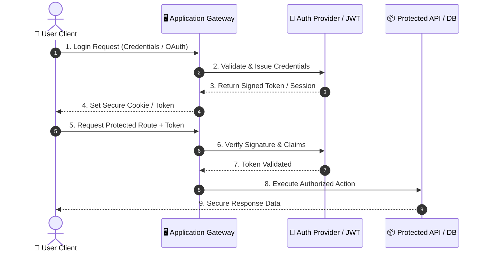
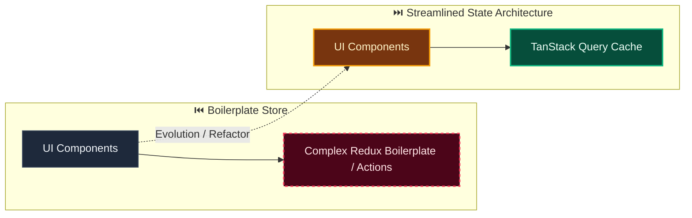

# Decision: Use routed protected shell with query-managed server state

**ID**: 0QR0XKZ86E1Y637NZK7SM6YG1Z
**Status**: accepted
**Category**: frontend-architecture
**Date**: 2026-10-07T16:03:09.250Z
**Author**: AI Agent + Human
**Governed Standards**: STD-A11Y-002, STD-A11Y-004, STD-ARCH-004, STD-SEC-004, STD-SOFT-001, STD-SOFT-003

## Context

Evidentia needs an extensible authenticated web shell for schemas, documents, review, and operations. The shell must restore cookie-backed sessions, preserve trusted tenant context, handle expiry consistently, remain accessible and responsive, and avoid duplicating server state in bespoke global stores.

**Project Type**: Web Application

**Profile**: web-app

**Relevant Tech Stack**:
- Frontend Framework: React 

## Decision

Use React Router data routing for /login and protected /app routes, with future capabilities nested below /app. Use TanStack Query in frontend for server state and mutations while keeping local interaction state in React. Keep opaque sessions in secure cookies, never browser storage; on expiry clear cached server state, redirect accessibly to login, retain only the intended internal route, and restore it after authorized login. Use a persistent top bar with tenant and operator controls, desktop sidebar, and accessible mobile drawer.

This decision was made based on:

- Project requirements and constraints
- Team expertise and preferences
- Industry best practices
- Long-term maintainability

## Architecture Diagram

## Architecture Mutation (Before vs After)

## Governing Standards

- **STD-A11Y-002**
- **STD-A11Y-004**
- **STD-ARCH-004**
- **STD-SEC-004**
- **STD-SOFT-001**
- **STD-SOFT-003**

## Consequences

### Positive
- (None documented)

### Negative
- (None documented)

### Neutral / Risks
- (None documented)

## Alternatives Considered

| Alternative | Description | Pros | Cons |
|-------------|-------------|------|------|
| Alternative | No description | (Add pros) | (Add cons) |
| Alternative | No description | (Add pros) | (Add cons) |
| Alternative | No description | (Add pros) | (Add cons) |
| Alternative | No description | (Add pros) | (Add cons) |

## Related Requirements

No directly related requirements documented.

## Related Decisions

No related decisions documented.

## Implementation Notes

### Suggested Implementation Steps

1. Define acceptance criteria
2. Create implementation plan
3. Implement with tests
4. Code review and merge
5. Update documentation

## Validation Criteria

- [ ] Decision reviewed by team
- [ ] Alternatives documented and evaluated
- [ ] Consequences understood and accepted
- [ ] Related requirements linked
- [ ] Implementation plan created

---

*Generated by Skyhook Auto-ADR on 2026-10-07T16:03:09.250Z*
*Review and update before marking as "accepted"*
