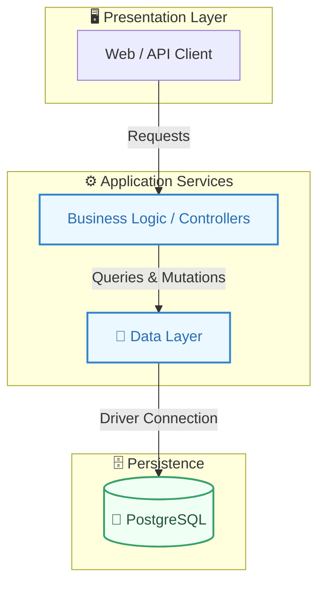
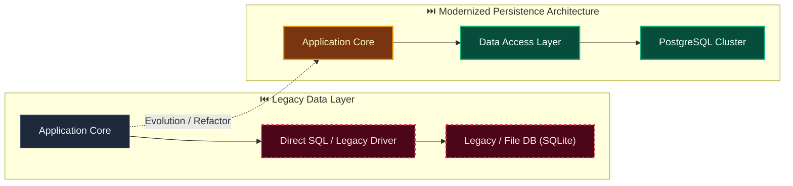

# Decision: Adopt a reproducible contract-first development toolchain

**ID**: 2GQD4NWDSA1Q4J9TQYCW291KR9
**Status**: accepted
**Category**: technology
**Date**: 2026-10-01T17:28:34.834Z
**Author**: AI Agent + Human
**Governed Standards**: STD-ARCH-001, STD-ARCH-002, STD-ARCH-004

## Context

Evidentia needs an extensible full-product engineering baseline for its Python backend, React frontend, PostgreSQL persistence, generated SDKs, and provider-neutral CI. The toolchain must preserve modular-monolith boundaries, expose API drift early, support production-equivalent integration testing, and avoid premature commitment to worker, realtime, CI-host, or cloud-provider implementations.

**Project Type**: Web Application

**Profile**: web-app

**Relevant Tech Stack**:
- Language: Python 
- Backend Framework: FastAPI 
- Language: TypeScript 
- Frontend Framework: React 
- Frontend Build Tool: Vite 
- Database: PostgreSQL 
- API: REST with OpenAPI 

## Decision

Use Python 3.14.x, Node.js 24 LTS, and PostgreSQL 18.x. Manage Python with a root uv workspace and lockfile and TypeScript with a root pnpm workspace and lockfile. Use FastAPI/Pydantic 2, SQLAlchemy 2 async with psycopg 3, and module-owned Alembic migrations. Gate backend code with Ruff, strict mypy, pytest/pytest-asyncio, Testcontainers, Import Linter, and architecture tests. Gate frontend code with strict TypeScript, type-aware ESLint plus accessibility and React rules, Prettier, Vitest/Testing Library, and Playwright. Commit a normalized FastAPI-generated OpenAPI 3.1 contract, use oasdiff for compatibility, generate TypeScript with openapi-typescript/openapi-fetch and Python with openapi-python-client, and reproduce generated artifacts in CI. Keep CI scripts provider-neutral and defer worker, realtime, hosted CI, orchestration, and external provider choices behind stable extension points.

This decision was made based on:

- Project requirements and constraints
- Team expertise and preferences
- Industry best practices
- Long-term maintainability

## Architecture Diagram

## Architecture Mutation (Before vs After)

## Governing Standards

- **STD-ARCH-001**
- **STD-ARCH-002**
- **STD-ARCH-004**

## Consequences

### Positive
- Standardizes technology stack across team
- Enables consistent tooling and practices

### Negative
- Team learning curve for new technology
- Migration cost if switching later

### Neutral / Risks
- Vendor/tool lock-in risk
- Community support and hiring pool considerations

## Alternatives Considered

| Alternative | Description | Pros | Cons |
|-------------|-------------|------|------|
| Alternative | No description | (Add pros) | (Add cons) |
| Alternative | No description | (Add pros) | (Add cons) |
| Alternative | No description | (Add pros) | (Add cons) |
| Alternative | No description | (Add pros) | (Add cons) |
| Alternative | No description | (Add pros) | (Add cons) |
| PostgreSQL | Robust, ACID-compliant, great JSON support | Mature; JSONB; Extensions | Operational overhead |
| MySQL | Wide adoption, good performance | Familiar; Good tooling | Weaker JSON |
| SQLite | Embedded, zero-config | Simple; Portable | No concurrency; No network |
| MongoDB | Document database, flexible schema | Flexible; Scales horizontally | No ACID (historically); Memory |

## Related Requirements

No directly related requirements documented.

## Related Decisions

- **M71RADRBCJCY0VBD3KEG9FA020**: Adopt the Evidentia application and deployment baseline (accepted)

## Implementation Notes

### Suggested Implementation Steps

1. Add dependency to package.json
2. Configure in application
3. Update CI/CD pipeline if needed
4. Document in team onboarding
5. Add to architecture decision log

## Validation Criteria

- [ ] Decision reviewed by team
- [ ] Alternatives documented and evaluated
- [ ] Consequences understood and accepted
- [ ] Related requirements linked
- [ ] Implementation plan created
- [ ] Dependency added to package.json
- [ ] TypeScript types available (if applicable)
- [ ] CI/CD updated if needed
- [ ] Security audit passed (if new dependency)

---

*Generated by Skyhook Auto-ADR on 2026-10-01T17:28:34.834Z*
*Review and update before marking as "accepted"*
