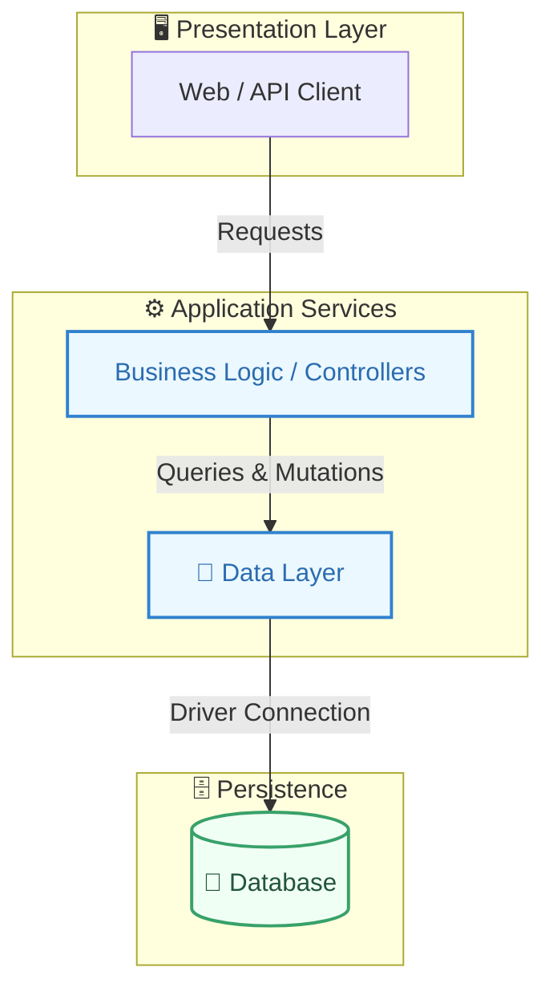
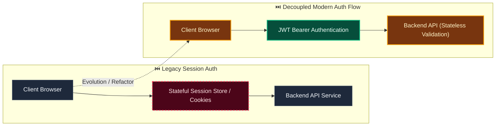

# Decision: Use uniform logical multi-tenancy across all deployment modes

**ID**: 3XX5TEDNT51SVF6XSXDX6SJCRR
**Status**: accepted
**Category**: architecture
**Date**: 2026-10-01T16:57:13.942Z
**Author**: AI Agent + Human
**Governed Standards**: NFR-002, CON-005

## Context

Evidentia must support self-hosted installations ranging from one organization to shared environments. Maintaining separate single-tenant and multi-tenant domain models would duplicate behavior and create migration and security risk.

**Project Type**: Web Application

**Profile**: web-app

**Relevant Tech Stack**:
- Database: PostgreSQL 
- Deployment: Docker Compose 
- Identity: OIDC 

## Decision

Use logical tenant isolation throughout the domain. Every owned aggregate, artifact, job, event, audit record, credential, configuration, cache key, and object-storage key carries tenant scope. Tenant identity comes from trusted authenticated or persisted job context, never solely from caller-provided identifiers. Database access and asynchronous processing enforce tenant predicates and reject cross-tenant references. A single-tenant deployment provisions one tenant and uses the same code paths and schema as a multi-tenant deployment. Additional database- or deployment-level isolation may be layered on without changing domain contracts.

This decision was made based on:

- Project requirements and constraints
- Team expertise and preferences
- Industry best practices
- Long-term maintainability

## Architecture Diagram

## Architecture Mutation (Before vs After)

## Governing Standards

- **NFR-002**
- **CON-005**

## Consequences

### Positive
- Improves system modularity and maintainability
- Enables independent scaling of components

### Negative
- Increased operational complexity
- Network latency between services

### Neutral / Risks
- Requires robust observability and monitoring
- Distributed tracing and debugging complexity

## Alternatives Considered

| Alternative | Description | Pros | Cons |
|-------------|-------------|------|------|
| Alternative | No description | (Add pros) | (Add cons) |
| Alternative | No description | (Add pros) | (Add cons) |
| Alternative | No description | (Add pros) | (Add cons) |
| Alternative | No description | (Add pros) | (Add cons) |
| PostgreSQL | Robust, ACID-compliant, great JSON support | Mature; JSONB; Extensions | Operational overhead |
| MySQL | Wide adoption, good performance | Familiar; Good tooling | Weaker JSON |
| SQLite | Embedded, zero-config | Simple; Portable | No concurrency; No network |
| MongoDB | Document database, flexible schema | Flexible; Scales horizontally | No ACID (historically); Memory |
| NextAuth.js | Full-featured auth for Next.js | Built-in providers; Type-safe; Secure defaults | Next.js only; Learning curve |

## Related Requirements

No directly related requirements documented.

## Related Decisions

- **9M0TE8Z5N6VWW459X5N1P7EG95**: Plan the complete Evidentia platform through capability gates (accepted)
- **74P7E9CAH91FZZ6PNFYNZPJ93T**: Use a pluggable approval boundary with optional Delibera integration (accepted)
- **QQAK9DE77WFYENB2474V7XJW8W**: Adopt an accessibility-first dense review interface (accepted)
- **4SWENJ85M4CKNH60Q071BFK2WW**: Use a bounded invoice benchmark with extensible document processing (accepted)
- **GNCDV7AB7331S5JN3FXTGB6QZJ**: Use schema-driven dynamic records with reproducible context resolution (superseded)

## Implementation Notes

### Suggested Implementation Steps

1. Create module/service boundaries
2. Define interfaces/contracts
3. Implement communication layer
4. Add observability (logging, metrics, tracing)
5. Update deployment configuration

## Validation Criteria

- [ ] Decision reviewed by team
- [ ] Alternatives documented and evaluated
- [ ] Consequences understood and accepted
- [ ] Related requirements linked
- [ ] Implementation plan created

---

*Generated by Skyhook Auto-ADR on 2026-10-01T16:57:13.942Z*
*Review and update before marking as "accepted"*
