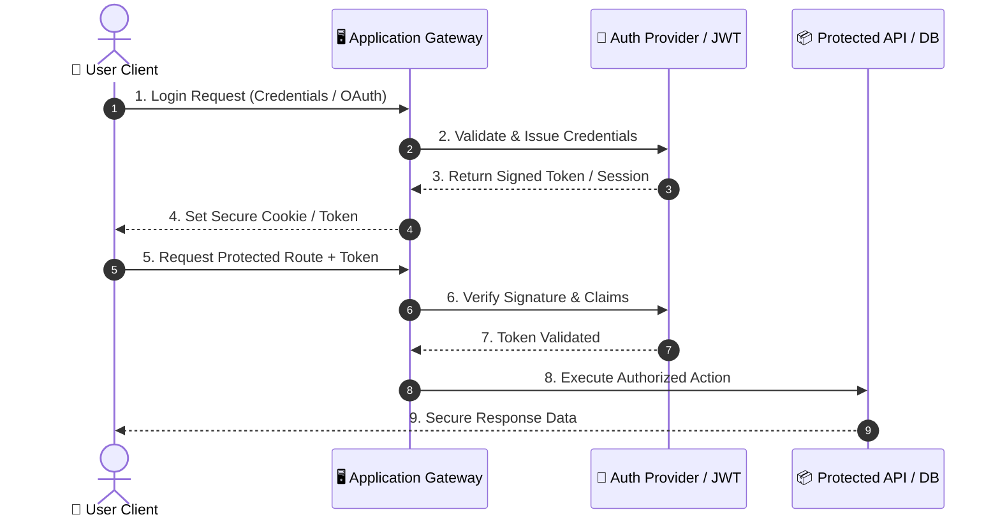
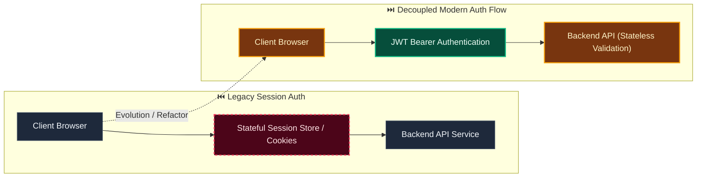

# Decision: Use versioned JCS snapshots and SHA-256 for authorization binding

**ID**: 8BXHCC2GBDHS6939MV0GTA4AR3
**Status**: accepted
**Category**: security
**Date**: 2026-10-01T17:16:52.642Z
**Author**: AI Agent + Human
**Governed Standards**: REQ-003, REQ-007, REQ-008, REQ-009, REQ-010, REQ-016, NFR-001, NFR-003, NFR-008, CON-003

## Context

Evidentia, local approval, optional Delibera integration, Python services, and JavaScript tooling must calculate the same digest for dynamic schema-driven content. Ordinary JSON serialization, binary floating-point values, or hard-coded invoice fields would produce ambiguous or inconsistent authorization binding.

**Project Type**: Web Application

**Profile**: web-app

**Relevant Tech Stack**:
- Language: Python 

## Decision

Adopt the versioned canonical snapshot contract in docs/architecture/canonical-revision-snapshot.md. Canonicalize the exact dynamic authorization payload using RFC 8785 JCS and initially digest it with SHA-256, encoded as unpadded base64url. Persist the exact payload, canonical representation, algorithm versions, and digest. Encode monetary and arbitrary-precision values as canonical decimal strings. Distinguish missing from null, treat array order as material unless a versioned schema normalization defines set semantics, and use schema-defined normalization before snapshot construction. Select material fields through published schemas and authorization policy. Include action and destination scope when they affect the authorized operation. Any material or scope change creates a new snapshot and approval submission; retries reuse the original stored payload and idempotency key.

This decision was made based on:

- Project requirements and constraints
- Team expertise and preferences
- Industry best practices
- Long-term maintainability

## Architecture Diagram

## Architecture Mutation (Before vs After)

## Governing Standards

- **REQ-003**
- **REQ-007**
- **REQ-008**
- **REQ-009**
- **REQ-010**
- **REQ-016**
- **NFR-001**
- **NFR-003**
- **NFR-008**
- **CON-003**

## Consequences

### Positive
- Reduces attack surface
- Compliance with security standards

### Negative
- May impact user experience (MFA, session timeouts)
- Implementation and maintenance overhead

### Neutral / Risks
- Regular security audits required
- Key rotation and secret management complexity

## Alternatives Considered

| Alternative | Description | Pros | Cons |
|-------------|-------------|------|------|
| Alternative | No description | (Add pros) | (Add cons) |
| Alternative | No description | (Add pros) | (Add cons) |
| Alternative | No description | (Add pros) | (Add cons) |
| Alternative | No description | (Add pros) | (Add cons) |
| Alternative | No description | (Add pros) | (Add cons) |

## Related Requirements

No directly related requirements documented.

## Related Decisions

No related decisions documented.

## Implementation Notes

### Suggested Implementation Steps

1. Define acceptance criteria
2. Create implementation plan
3. Implement with tests
4. Code review and merge
5. Update documentation

## Validation Criteria

- [ ] Decision reviewed by team
- [ ] Alternatives documented and evaluated
- [ ] Consequences understood and accepted
- [ ] Related requirements linked
- [ ] Implementation plan created
- [ ] Threat model updated
- [ ] Penetration test scheduled (if major change)
- [ ] Compliance requirements verified

---

*Generated by Skyhook Auto-ADR on 2026-10-01T17:16:52.642Z*
*Review and update before marking as "accepted"*
