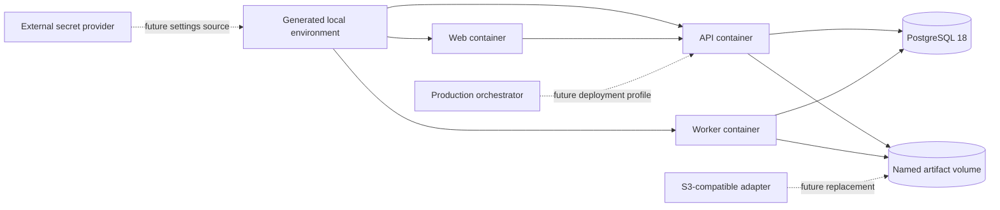

# Decision: Establish the configuration and local runtime baseline while deferring production adapters

**ID**: 8VC3FRAN1GRTK2F99NB459BWWJ  
**Status**: accepted  
**Category**: architecture  
**Date**: 2026-10-02  
**Authors**: Product owner and Codex  
**Governing standards**: STD-ARCH-004, STD-DEV-001

## Context

`STORY-009` must provide a secure and reproducible local runtime without coupling Evidentia prematurely to an object-storage product, external secret manager, or production orchestrator. The foundation must still preserve explicit seams for later storage and deployment work.

The approved choices are:

- shared base settings with service-specific settings;
- filesystem-backed local artifact storage;
- production-like multi-stage containers with a development override;
- generated local secrets and fail-closed production validation.

## Decision

Use `pydantic-settings` for typed configuration. Define a small shared base plus separately validatable API, worker, database, logging, and storage settings. Construct settings at composition roots and pass them to dependencies; do not expose a mutable or import-time global settings singleton.

Use a Docker named volume and filesystem-backed storage for the first supported local profile. Filesystem storage is an adapter choice and must not leak into domain contracts.

Build production-like multi-stage images for API, worker, and web. Use a separate Compose development override for source mounting and reload behavior so development convenience does not define release artifacts.

Commit only nonfunctional environment examples. Generate local credentials into ignored files. Development may use generated local credentials, while production configuration rejects missing values, known placeholders, and unsafe defaults.

## Runtime shape

## Deferred decisions and owners

| Future consideration | Owning Skyhook work | Trigger for evaluation | Constraints retained from this decision |
| --- | --- | --- | --- |
| S3-compatible artifact storage provider | `KMC5EK26PXNT868PT6W97RX06A` — Implement document and artifact storage adapters | When real document and artifact storage ports are implemented | Local filesystem remains supported; tenant-safe keys, checksums, metadata, retention, and adapter portability are mandatory |
| External secret manager integration | `99JY71R6GRKG8SXDWD92357XNV` — Create deployment, backup, and upgrade profiles, or a dedicated successor story if that scope becomes too large | When a production deployment profile requires secrets outside environment or mounted files | Typed service settings, fail-closed production validation, redaction, rotation support, and no secret material in domain state |
| Production orchestration platform | `99JY71R6GRKG8SXDWD92357XNV` — Create deployment, backup, and upgrade profiles | When a supported production deployment target is selected | Docker Compose remains the local baseline; artifacts stay independently runnable and configuration contracts remain portable |

Each deferred provider selection requires its own Skyhook decision. A future choice may change infrastructure adapters or deployment profiles but may not change bounded-context ownership, trusted tenant scope, secret redaction, or fail-closed validation.

## Consequences

### Positive

- Local setup has fewer services and remains easy to self-host.
- API and worker configuration share conventions without requiring identical settings.
- Production images are exercised early instead of being invented at release time.
- Storage, secrets, and orchestration remain replaceable infrastructure concerns.
- Later provider evaluations have explicit owners and non-negotiable constraints.

### Costs and risks

- A named filesystem volume does not emulate all S3 semantics.
- A multi-host deployment cannot use the local filesystem adapter without shared storage or replacement.
- Local generated secrets require careful idempotent tooling and file permissions.
- External secret rotation and workload identity remain deliberately unimplemented in `STORY-009`.

## Alternatives considered

1. **One global settings object** — rejected because it couples independently runnable services, encourages import-time side effects, and makes tests harder to isolate.
2. **S3-compatible service in Gate 0** — deferred because the document-storage port and its conformance requirements are not implemented yet.
3. **Development-only containers** — rejected because they would postpone release-image security and reproducibility problems.
4. **Manually supplied local secrets** — rejected because setup becomes inconsistent and encourages copied shared credentials.
5. **Select a cloud secret manager and orchestrator now** — deferred because no supported production deployment profile has been selected.

## Related requirements

- `REQ-014` — independently runnable and observable asynchronous processing
- `NFR-002` — tenant-scoped credentials and exclusion of sensitive data from routine logs
- `NFR-004` — self-hostability, local configurations, and replaceable infrastructure adapters
- `NFR-006` — structured logs, health information, and correlation-ready metadata
- `CON-004` — untrusted inputs cannot gain credential or command authority
- `CON-005` — storage and execution paths preserve trusted tenant scope

## Implementation boundary for STORY-009

`STORY-009` implements:

- typed base and service settings;
- development, test, and production validation;
- filesystem-backed local storage configuration and named volume;
- structured startup metadata and liveness/readiness semantics;
- multi-stage application images and a development override;
- generated local secrets, safe examples, startup, verification, and troubleshooting commands.

It does not implement document storage behavior, S3 adapters, cloud secret managers, Kubernetes manifests, backup and restore, production orchestration, or provider selection.

## Validation

- [x] Product owner approved all selected options.
- [x] Deferred alternatives have owning Skyhook stories.
- [x] Future selection triggers and retained constraints are documented.
- [x] STORY-009 scope is separated from future provider implementations.
