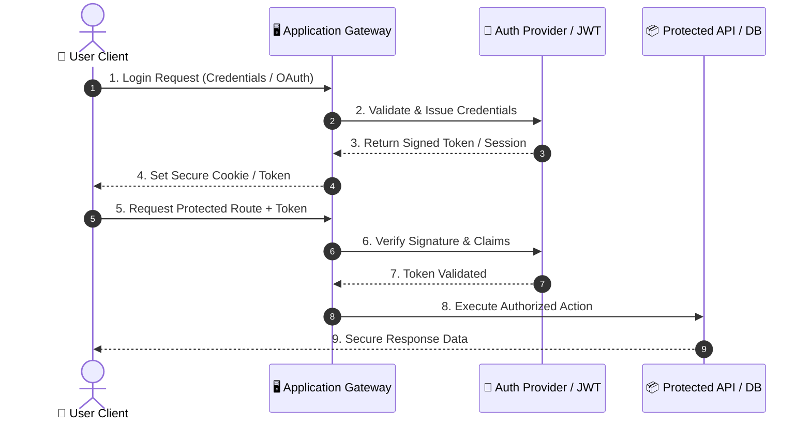
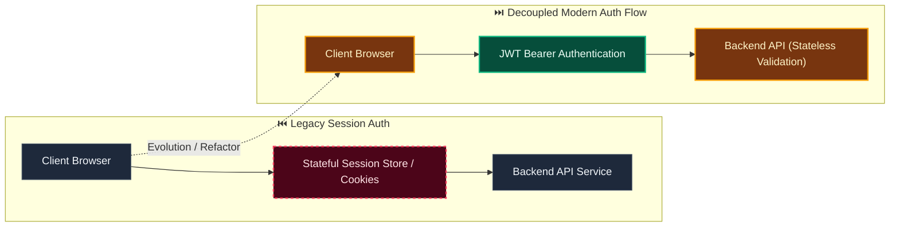

# Decision: Plan the complete Evidentia platform through capability gates

**ID**: 9M0TE8Z5N6VWW459X5N1P7EG95
**Status**: accepted
**Category**: architecture
**Date**: 2026-10-01T16:35:37.077Z
**Author**: AI Agent + Human
**Governed Standards**: NFR-001, NFR-003, NFR-008, NFR-009

## Context

Evidentia has a broad document-to-authorized-record vision. Narrow proof-of-concept architecture could omit evidence, versioning, recovery, extensibility, or lifecycle boundaries that become expensive to retrofit.

**Project Type**: Web Application

**Profile**: web-app

## Decision

Model the complete intended platform in requirements, architecture, and backlog from the outset. Deliver it incrementally through verifiable capability gates, while preserving the full domain model and extension boundaries in all architectural decisions.

This decision was made based on:

- Project requirements and constraints
- Team expertise and preferences
- Industry best practices
- Long-term maintainability

## Architecture Diagram

## Architecture Mutation (Before vs After)

## Governing Standards

- **NFR-001**
- **NFR-003**
- **NFR-008**
- **NFR-009**

## Consequences

### Positive
- Improves system modularity and maintainability
- Enables independent scaling of components

### Negative
- Increased operational complexity
- Network latency between services

### Neutral / Risks
- Requires robust observability and monitoring
- Distributed tracing and debugging complexity

## Alternatives Considered

| Alternative | Description | Pros | Cons |
|-------------|-------------|------|------|
| Alternative | No description | (Add pros) | (Add cons) |
| Alternative | No description | (Add pros) | (Add cons) |
| NextAuth.js | Full-featured auth for Next.js | Built-in providers; Type-safe; Secure defaults | Next.js only; Learning curve |
| Clerk | Managed auth service | Drop-in; MFA built-in; Admin dashboard | Cost; Vendor lock-in |
| Supabase Auth | Open-source auth with Postgres | Integrated with DB; Open source | Self-host complexity |
| Custom JWT | Roll your own with jsonwebtoken | Full control; No deps | Security risk; Maintenance burden |

## Related Requirements

No directly related requirements documented.

## Related Decisions

No related decisions documented.

## Implementation Notes

### Suggested Implementation Steps

1. Create module/service boundaries
2. Define interfaces/contracts
3. Implement communication layer
4. Add observability (logging, metrics, tracing)
5. Update deployment configuration

## Validation Criteria

- [ ] Decision reviewed by team
- [ ] Alternatives documented and evaluated
- [ ] Consequences understood and accepted
- [ ] Related requirements linked
- [ ] Implementation plan created

---

*Generated by Skyhook Auto-ADR on 2026-10-01T16:35:37.077Z*
*Review and update before marking as "accepted"*
