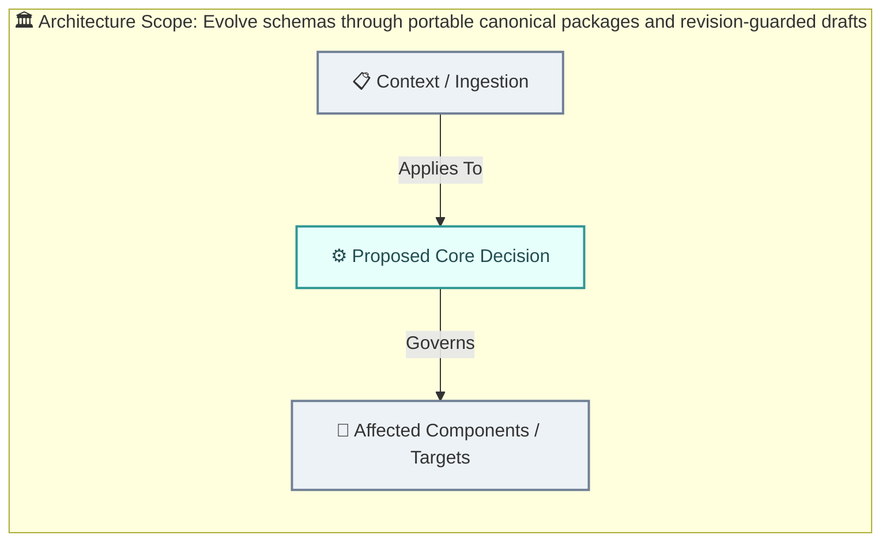
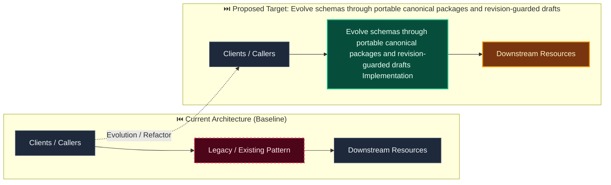

# Decision: Evolve schemas through portable canonical packages and revision-guarded drafts

**ID**: C0G6H4W34FE915CSVHGQXDVQHZ
**Status**: accepted
**Category**: architecture
**Date**: 2026-10-08T06:54:19.216Z
**Author**: AI Agent + Human
**Governed Standards**: STD-ARCH-001, STD-ARCH-002, STD-SOFT-003

## Context

Evidentia needs import, export, comparison, and safe schema evolution without trusting package identity, rewriting immutable publications, or prematurely introducing a separate import aggregate.

**Project Type**: Web Application

**Profile**: web-app

**Relevant Tech Stack**:
- Identity: OIDC 

## Decision

Use the existing versioned canonical draft and publication JSON envelopes as portable packages. Inspect and validate packages before mutation, derive editable content while treating package identity and provenance as informational, preview deterministic compatibility against the current target, and apply only by creating a server-identified draft or replacing a tenant-owned draft at an expected revision. Preserve recognized extension definitions round-trip without activating providers. Record import/export actions through correlated structured events and existing idempotent command receipts; do not add persistence or automatically migrate records in this story.

This decision was made based on:

- Project requirements and constraints
- Team expertise and preferences
- Industry best practices
- Long-term maintainability

## Architecture Diagram

## Architecture Mutation (Before vs After)

## Governing Standards

- **STD-ARCH-001**
- **STD-ARCH-002**
- **STD-SOFT-003**

## Consequences

### Positive
- Improves system modularity and maintainability
- Enables independent scaling of components

### Negative
- Increased operational complexity
- Network latency between services

### Neutral / Risks
- Requires robust observability and monitoring
- Distributed tracing and debugging complexity

## Alternatives Considered

| Alternative | Description | Pros | Cons |
|-------------|-------------|------|------|
| Alternative | No description | (Add pros) | (Add cons) |
| Alternative | No description | (Add pros) | (Add cons) |
| Alternative | No description | (Add pros) | (Add cons) |

## Related Requirements

No directly related requirements documented.

## Related Decisions

- **9M0TE8Z5N6VWW459X5N1P7EG95**: Plan the complete Evidentia platform through capability gates (accepted)
- **74P7E9CAH91FZZ6PNFYNZPJ93T**: Use a pluggable approval boundary with optional Delibera integration (accepted)
- **QQAK9DE77WFYENB2474V7XJW8W**: Adopt an accessibility-first dense review interface (accepted)
- **4SWENJ85M4CKNH60Q071BFK2WW**: Use a bounded invoice benchmark with extensible document processing (accepted)
- **GNCDV7AB7331S5JN3FXTGB6QZJ**: Use schema-driven dynamic records with reproducible context resolution (superseded)

## Implementation Notes

### Suggested Implementation Steps

1. Create module/service boundaries
2. Define interfaces/contracts
3. Implement communication layer
4. Add observability (logging, metrics, tracing)
5. Update deployment configuration

## Validation Criteria

- [ ] Decision reviewed by team
- [ ] Alternatives documented and evaluated
- [ ] Consequences understood and accepted
- [ ] Related requirements linked
- [ ] Implementation plan created

---

*Generated by Skyhook Auto-ADR on 2026-10-08T06:54:19.216Z*
*Review and update before marking as "accepted"*
