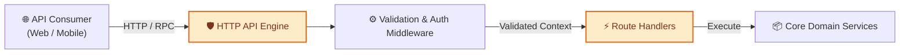
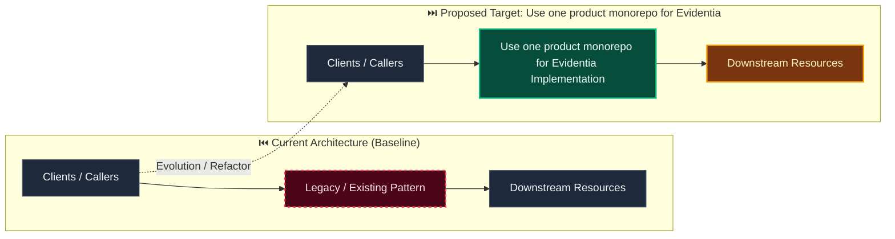

# Decision: Use one product monorepo for Evidentia

**ID**: CGT2WV3E3VQDP8EX8B4K8BWMMK
**Status**: accepted
**Category**: architecture
**Date**: 2026-10-01T17:22:08.291Z
**Author**: AI Agent + Human
**Governed Standards**: REQ-009, REQ-012, REQ-013, REQ-014, NFR-004, NFR-008, CON-001, CON-002, STD-ARCH-001

## Context

Evidentia's API, workers, frontend, contracts, SDKs, tests, fixtures, infrastructure, and documentation evolve together. Splitting them into repositories now would add coordination and compatibility overhead without separate product ownership, while an unstructured repository would weaken module and generated-artifact boundaries.

**Project Type**: Web Application

**Profile**: web-app

**Relevant Tech Stack**:
- Language: Python 
- Language: TypeScript 
- Frontend Framework: React 
- API: REST with OpenAPI 

## Decision

Adopt the repository topology in docs/architecture/repository-structure.md. Keep the Python backend, independently runnable API and worker entry points, React frontend, language-neutral contracts, supported Python and TypeScript SDKs, tests, permission-safe fixtures, infrastructure, CI scripts, and documentation in one Evidentia repository. Preserve bounded contexts inside the backend and independent deployability of API, worker, and web artifacts. Treat checked public contracts as interoperability boundaries and generated files as reproducible outputs. Keep Delibera in a separate repository and include only Evidentia-owned ports, adapter code, public compatibility fixtures, and version-pinned integration examples.

This decision was made based on:

- Project requirements and constraints
- Team expertise and preferences
- Industry best practices
- Long-term maintainability

## Architecture Diagram

## Architecture Mutation (Before vs After)

## Governing Standards

- **REQ-009**
- **REQ-012**
- **REQ-013**
- **REQ-014**
- **NFR-004**
- **NFR-008**
- **CON-001**
- **CON-002**
- **STD-ARCH-001**

## Consequences

### Positive
- Improves system modularity and maintainability
- Enables independent scaling of components

### Negative
- Increased operational complexity
- Network latency between services

### Neutral / Risks
- Requires robust observability and monitoring
- Distributed tracing and debugging complexity

## Alternatives Considered

| Alternative | Description | Pros | Cons |
|-------------|-------------|------|------|
| Alternative | No description | (Add pros) | (Add cons) |
| Alternative | No description | (Add pros) | (Add cons) |
| Alternative | No description | (Add pros) | (Add cons) |
| Alternative | No description | (Add pros) | (Add cons) |
| Vercel | Optimized for Next.js | Zero config; Edge network; Preview deploys | Vendor lock-in; Cost at scale |
| Netlify | Static + functions | Generous free tier; Forms; Edge functions | Less Next.js optimization |
| AWS (ECS/Lambda) | Full control on AWS | Full control; Integrated services | Complexity; Ops burden |
| Docker + VPS | Self-hosted containers | Full control; Cost predictable | Ops burden; No preview deploys |
| Fly.io / Railway / Render | Modern PaaS | Simple; Global; Good DX | Newer; Less enterprise features |

## Related Requirements

No directly related requirements documented.

## Related Decisions

- **9M0TE8Z5N6VWW459X5N1P7EG95**: Plan the complete Evidentia platform through capability gates (accepted)
- **74P7E9CAH91FZZ6PNFYNZPJ93T**: Use a pluggable approval boundary with optional Delibera integration (accepted)
- **QQAK9DE77WFYENB2474V7XJW8W**: Adopt an accessibility-first dense review interface (accepted)
- **4SWENJ85M4CKNH60Q071BFK2WW**: Use a bounded invoice benchmark with extensible document processing (accepted)
- **GNCDV7AB7331S5JN3FXTGB6QZJ**: Use schema-driven dynamic records with reproducible context resolution (superseded)

## Implementation Notes

### Suggested Implementation Steps

1. Create module/service boundaries
2. Define interfaces/contracts
3. Implement communication layer
4. Add observability (logging, metrics, tracing)
5. Update deployment configuration

## Validation Criteria

- [ ] Decision reviewed by team
- [ ] Alternatives documented and evaluated
- [ ] Consequences understood and accepted
- [ ] Related requirements linked
- [ ] Implementation plan created

---

*Generated by Skyhook Auto-ADR on 2026-10-01T17:22:08.291Z*
*Review and update before marking as "accepted"*
