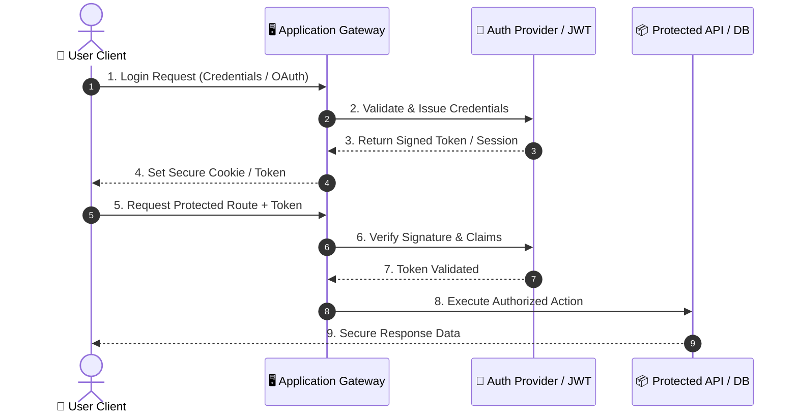
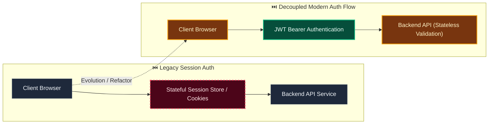

# Decision: Generate a framework-neutral typed TypeScript API client from OpenAPI

**ID**: G1NEKECAE2MSH73WGGZVSY43JM
**Status**: accepted
**Category**: frontend-api
**Date**: 2026-10-07T16:03:04.427Z
**Author**: AI Agent + Human
**Governed Standards**: STD-ARCH-004, STD-SOFT-003, STD-DEV-001

## Context

TASK-030 must replace the current operation-ID-only TypeScript output with a durable browser-to-API boundary. Evidentia requires deterministic OpenAPI generation, checked generated artifacts, compile-time request and response types, secure cookie and CSRF handling, and a client that remains usable outside React.

**Project Type**: Web Application

**Profile**: web-app

**Relevant Tech Stack**:
- Language: TypeScript 
- Frontend Framework: React 
- API: REST with OpenAPI 

## Decision

Generate TypeScript path and schema types from the checked OpenAPI 3.1 document with openapi-typescript, use openapi-fetch as the framework-neutral transport in sdks/typescript, keep authentication and correlation middleware centralized, and prohibit ad-hoc application fetch calls. React-specific query integration belongs in frontend rather than the SDK.

This decision was made based on:

- Project requirements and constraints
- Team expertise and preferences
- Industry best practices
- Long-term maintainability

## Architecture Diagram

## Architecture Mutation (Before vs After)

## Governing Standards

- **STD-ARCH-004**
- **STD-SOFT-003**
- **STD-DEV-001**

## Consequences

### Positive
- (None documented)

### Negative
- (None documented)

### Neutral / Risks
- (None documented)

## Alternatives Considered

| Alternative | Description | Pros | Cons |
|-------------|-------------|------|------|
| Alternative | No description | (Add pros) | (Add cons) |
| Alternative | No description | (Add pros) | (Add cons) |
| Alternative | No description | (Add pros) | (Add cons) |

## Related Requirements

No directly related requirements documented.

## Related Decisions

No related decisions documented.

## Implementation Notes

### Suggested Implementation Steps

1. Define acceptance criteria
2. Create implementation plan
3. Implement with tests
4. Code review and merge
5. Update documentation

## Validation Criteria

- [ ] Decision reviewed by team
- [ ] Alternatives documented and evaluated
- [ ] Consequences understood and accepted
- [ ] Related requirements linked
- [ ] Implementation plan created

---

*Generated by Skyhook Auto-ADR on 2026-10-07T16:03:04.427Z*
*Review and update before marking as "accepted"*
