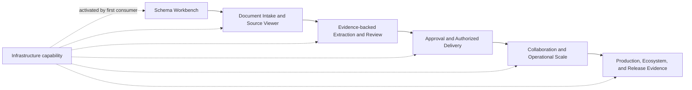

# Decision: Plan delivery through interaction-first vertical slices

**ID**: GC27J7X510394MDYVWSK5M14C2  
**Status**: accepted  
**Category**: architecture  
**Date**: 2026-10-03  
**Governed Standards**: STD-ARCH-001, STD-ARCH-004, STD-DEV-001

## Context

The capability-first roadmap preserved Evidentia's complete product scope, but it scheduled persistence, workers, queues, API infrastructure, security layers, and delivery operations before a user could exercise a real product workflow. It also decomposed distant work into implementation passes before the consuming capability and its constraints were known.

Evidentia must retain its full ambition without turning early delivery into either an infrastructure programme or a throwaway prototype.

## Decision

Organize remaining delivery around user-visible, production-shaped vertical slices. The first checkpoint is an interactive Schema Workbench that reuses the accepted dynamic-schema domain.

The complete product remains represented by requirements, epics, stories, acceptance criteria, and activation conditions. Detailed tasks and subtasks are created only for the active story and the immediately upcoming story when its decisions are stable.

Introduce technical capabilities at their first real consumer:

- choose the PostgreSQL development workflow before persistence implementation;
- add OCR when scanned documents enter the supported corpus;
- add durable jobs when measured processing or recovery requirements need them;
- choose Firebase or sockets when concurrent collaboration needs realtime behavior;
- add cloud storage when a deployment profile requires it;
- add enterprise identity when a production deployment and threat model require it;
- add Delibera only as an optional adapter after generic revision-bound approval works;
- publish public APIs, SDKs, and extension contracts after the product contracts stabilize.

Every slice must use the intended module boundaries and replaceable ports. Throwaway UI or fake product workflows are not substitutes for the final architecture.

## Consequences

### Positive

- meaningful user interaction arrives earlier without reducing the product scope;
- infrastructure decisions use real workload and deployment evidence;
- the backlog communicates product outcomes rather than internal layers;
- detailed tasks remain accurate and reviewable;
- completed work and superseded planning history remain traceable.

### Trade-offs and risks

- each vertical slice touches several modules and therefore requires policy verification and disciplined boundaries;
- some infrastructure choices remain deliberately unresolved until activation;
- future stories must be decomposed before they can move to `ready`;
- cancelled capability-first stories must be understood as superseded planning, not abandoned scope.

## Alternatives considered

1. **Finish all platform layers first.** Rejected because it delays real interaction and fixes infrastructure choices before their consumers are understood.
2. **Build a disposable UI prototype.** Rejected because it would create misleading feedback and rework outside the accepted architecture.
3. **Keep the capability catalog as the execution hierarchy.** Rejected because delivery checkpoints and sequencing would remain implicit.

## Validation criteria

- Skyhook contains outcome-based delivery epics with meaningful story names and observable acceptance criteria.
- Deferred infrastructure stories state their activation condition.
- Premature implementation passes are cancelled but retained in history.
- Only the active schema lifecycle and the next PostgreSQL decision gate have executable task detail.
- The compiled plan and planning documentation agree with this decision.
