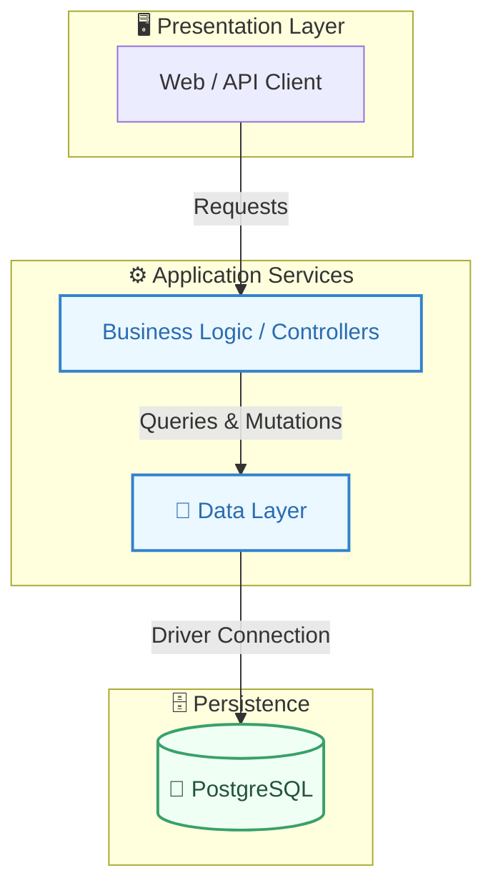
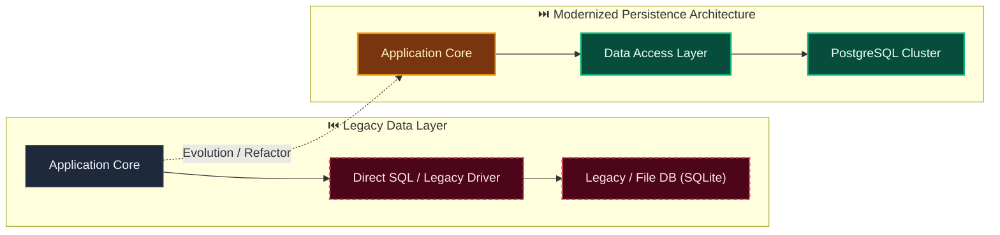

# Decision: Require explicit PostgreSQL runtime selection before persistence work

**ID**: HKSQBTGX2CZT36GCS8D3ZTM2PA
**Status**: accepted
**Category**: database
**Date**: 2026-10-03T06:47:06.706Z
**Author**: AI Agent + Human
**Governed Standards**: STD-DEV-001, STD-ARCH-004

## Context

Evidentia has PostgreSQL 16.3 installed locally through Homebrew, but it is not currently accepting connections. The governed toolchain targets PostgreSQL 18.x, while the repository also contains a Docker Compose PostgreSQL 18 definition. Before STORY-010 or any other work creates migrations, database models, connection infrastructure, or PostgreSQL integration tests, the product owner wants to compare and explicitly approve native PostgreSQL versus Docker-managed PostgreSQL.

**Project Type**: Web Application

**Profile**: web-app

**Relevant Tech Stack**:
- Database: PostgreSQL 18.x
- Deployment: Docker Compose 

## Decision

Do not begin migrations or any PostgreSQL-dependent implementation until the product owner is asked to choose the development database runtime. At that decision point, present the detected native PostgreSQL version and state, the repository's PostgreSQL 18 compatibility target, and the Docker alternative with their upgrade, reproducibility, resource, and maintenance tradeoffs. Preserve provider-neutral application and migration code regardless of the selected local runtime.

This decision was made based on:

- Project requirements and constraints
- Team expertise and preferences
- Industry best practices
- Long-term maintainability

## Architecture Diagram

## Architecture Mutation (Before vs After)

## Governing Standards

- **STD-DEV-001**
- **STD-ARCH-004**

## Consequences

### Positive
- Prevents migrations and integration tests from silently assuming the wrong PostgreSQL runtime or major version.
- Allows native and containerized development to be compared when persistence work actually begins.
- Keeps application and migration design portable across either local execution choice.

### Negative
- PostgreSQL-dependent work cannot begin until the runtime choice is reviewed with the product owner.
- Supporting both native and Docker workflows later would add maintenance and verification cost.

### Neutral / Risks
- The installed native PostgreSQL 16.3 differs from the governed PostgreSQL 18.x target and is not currently accepting connections.
- Deferring Docker is acceptable for domain-only work but postpones container and PostgreSQL integration evidence.

## Alternatives Considered

| Alternative | Description | Pros | Cons |
|-------------|-------------|------|------|
| Native Homebrew PostgreSQL | Use the existing local installation, upgrading it if PostgreSQL 18 compatibility is required | No container VM; low overhead; familiar native tooling | Current installation is PostgreSQL 16.3 and stopped; machine-specific setup is less reproducible |
| Docker-managed PostgreSQL 18 | Use the repository's pinned Compose database service | Matches the governed target; isolated and reproducible | Requires a Docker-compatible runtime and its macOS VM resources |
| Hybrid workflow | Use native PostgreSQL for daily work and Docker PostgreSQL for integration verification | Fast daily development plus reproducible acceptance evidence | Maintains two paths and can hide version-specific differences until integration runs |
| Alternative | No description | (Add pros) | (Add cons) |

## Related Requirements

- **NFR-004**: Secure configuration and secret handling
- **NFR-007**: Tenant-safe relational persistence
- **CON-005**: Trusted tenant scope across persistence paths

## Related Decisions

- **MQNYQK5TQMSTJPFV7RYG5B9Q15**: Use module-owned persistence in one PostgreSQL database (accepted)

## Implementation Notes

### Suggested Implementation Steps

1. Before STORY-010 or any PostgreSQL-dependent task, inspect the native server version, service state, data directory, and upgrade constraints.
2. Present native, Docker, and hybrid choices with resource, reproducibility, version, and maintenance tradeoffs.
3. Obtain explicit product-owner approval for the development and integration-test runtime arrangement.
4. Record any resulting version or workflow change in Skyhook before migrations are created.
5. Keep database ports and module-owned migrations independent of how PostgreSQL is launched.

## Validation Criteria

- [x] Product owner established the mandatory decision gate
- [x] Native, Docker, and hybrid alternatives are documented
- [x] Current native PostgreSQL version and state are recorded
- [x] Related persistence and configuration constraints are linked
- [ ] PostgreSQL development runtime selected before persistence implementation

---

*Generated by Skyhook Auto-ADR on 2026-10-03T06:47:06.706Z*
*Review and update before marking as "accepted"*
