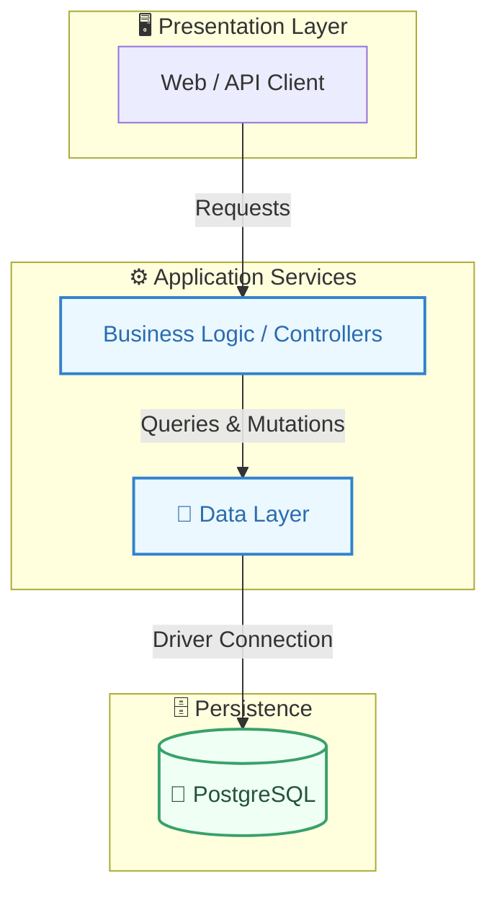
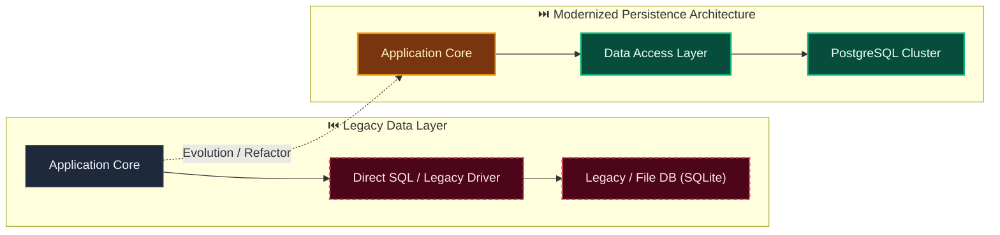

# Decision: Adopt the Evidentia application and deployment baseline

**ID**: M71RADRBCJCY0VBD3KEG9FA020
**Status**: accepted
**Category**: technology
**Date**: 2026-10-01T16:40:39.190Z
**Author**: AI Agent + Human
**Governed Standards**: REQ-002, REQ-004, REQ-012, REQ-014, NFR-003, NFR-004, NFR-008, CON-004

## Context

Evidentia needs a self-hostable document-processing platform with a typed web interface, durable relational state, stable public contracts, replaceable storage, and deployment portability. Parser, inference, and job-runner products require evidence from representative documents and recovery tests before selection.

**Project Type**: Web Application

**Profile**: web-app

**Relevant Tech Stack**:
- Language: Python 
- Backend Framework: FastAPI 
- Language: TypeScript 
- Frontend Framework: React 
- Frontend Build Tool: Vite 
- Database: PostgreSQL 
- API: REST with OpenAPI 
- Deployment: Docker Compose 
- Identity: OIDC 

## Decision

Use Python with FastAPI for the backend; React with TypeScript and Vite for the frontend; PostgreSQL for durable relational state; versioned REST APIs with OpenAPI; local-filesystem and S3-compatible document-storage adapters; Docker Compose as the first supported deployment; and local authentication with optional OIDC. Keep parsing/OCR, extraction inference, and durable background execution behind stable interfaces. Select their default implementations only after documented quality, licensing, resource, and recovery evaluations.

This decision was made based on:

- Project requirements and constraints
- Team expertise and preferences
- Industry best practices
- Long-term maintainability

## Architecture Diagram

## Architecture Mutation (Before vs After)

## Governing Standards

- **REQ-002**
- **REQ-004**
- **REQ-012**
- **REQ-014**
- **NFR-003**
- **NFR-004**
- **NFR-008**
- **CON-004**

## Consequences

### Positive
- Standardizes technology stack across team
- Enables consistent tooling and practices

### Negative
- Team learning curve for new technology
- Migration cost if switching later

### Neutral / Risks
- Vendor/tool lock-in risk
- Community support and hiring pool considerations

## Alternatives Considered

| Alternative | Description | Pros | Cons |
|-------------|-------------|------|------|
| Alternative | No description | (Add pros) | (Add cons) |
| Alternative | No description | (Add pros) | (Add cons) |
| Alternative | No description | (Add pros) | (Add cons) |
| Alternative | No description | (Add pros) | (Add cons) |
| PostgreSQL | Robust, ACID-compliant, great JSON support | Mature; JSONB; Extensions | Operational overhead |
| MySQL | Wide adoption, good performance | Familiar; Good tooling | Weaker JSON |
| SQLite | Embedded, zero-config | Simple; Portable | No concurrency; No network |
| MongoDB | Document database, flexible schema | Flexible; Scales horizontally | No ACID (historically); Memory |
| NextAuth.js | Full-featured auth for Next.js | Built-in providers; Type-safe; Secure defaults | Next.js only; Learning curve |

## Related Requirements

No directly related requirements documented.

## Related Decisions

No related decisions documented.

## Implementation Notes

### Suggested Implementation Steps

1. Add dependency to package.json
2. Configure in application
3. Update CI/CD pipeline if needed
4. Document in team onboarding
5. Add to architecture decision log

## Validation Criteria

- [ ] Decision reviewed by team
- [ ] Alternatives documented and evaluated
- [ ] Consequences understood and accepted
- [ ] Related requirements linked
- [ ] Implementation plan created
- [ ] Dependency added to package.json
- [ ] TypeScript types available (if applicable)
- [ ] CI/CD updated if needed
- [ ] Security audit passed (if new dependency)

---

*Generated by Skyhook Auto-ADR on 2026-10-01T16:40:39.190Z*
*Review and update before marking as "accepted"*
