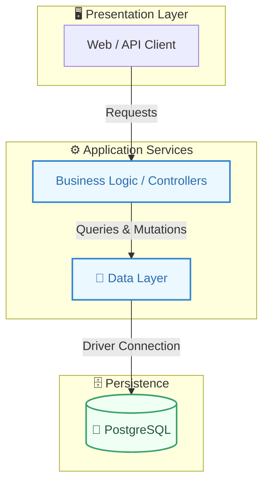
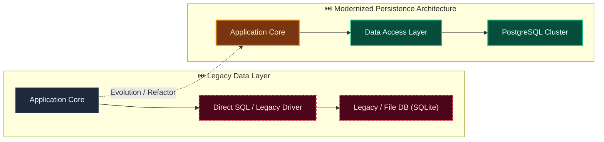

# Decision: Use module-owned persistence in one PostgreSQL database

**ID**: MQNYQK5TQMSTJPFV7RYG5B9Q15
**Status**: accepted
**Category**: database
**Date**: 2026-10-01T17:00:35.338Z
**Author**: AI Agent + Human
**Governed Standards**: NFR-002, NFR-003, NFR-008, CON-005

## Context

The modular monolith benefits from one operational database and local transactions, but shared repositories, cross-module queries, and ORM relationships would erase bounded-context ownership and make later extraction difficult.

**Project Type**: Web Application

**Profile**: web-app

**Relevant Tech Stack**:
- Database: PostgreSQL 

## Decision

Use one PostgreSQL database initially. Each bounded-context module owns its tables, persistence models, repositories, and migration history. A module may access another module only through its public application ports or durable integration events, never through direct table queries, foreign repositories, or cross-module ORM relationships. Cross-module references use tenant-scoped opaque identifiers and validated snapshots where needed. Database transactions remain within one module's ownership boundary; multi-module workflows use orchestration, state machines, and outbox/inbox delivery. Application authorization and tenant predicates are mandatory. PostgreSQL row-level security may be added and tested as defense-in-depth but is never the sole authorization control.

This decision was made based on:

- Project requirements and constraints
- Team expertise and preferences
- Industry best practices
- Long-term maintainability

## Architecture Diagram

## Architecture Mutation (Before vs After)

## Governing Standards

- **NFR-002**
- **NFR-003**
- **NFR-008**
- **CON-005**

## Consequences

### Positive
- (None documented)

### Negative
- (None documented)

### Neutral / Risks
- (None documented)

## Alternatives Considered

| Alternative | Description | Pros | Cons |
|-------------|-------------|------|------|
| Alternative | No description | (Add pros) | (Add cons) |
| Alternative | No description | (Add pros) | (Add cons) |
| Alternative | No description | (Add pros) | (Add cons) |
| Alternative | No description | (Add pros) | (Add cons) |

## Related Requirements

No directly related requirements documented.

## Related Decisions

No related decisions documented.

## Implementation Notes

### Suggested Implementation Steps

1. Define acceptance criteria
2. Create implementation plan
3. Implement with tests
4. Code review and merge
5. Update documentation

## Validation Criteria

- [ ] Decision reviewed by team
- [ ] Alternatives documented and evaluated
- [ ] Consequences understood and accepted
- [ ] Related requirements linked
- [ ] Implementation plan created

---

*Generated by Skyhook Auto-ADR on 2026-10-01T17:00:35.338Z*
*Review and update before marking as "accepted"*
