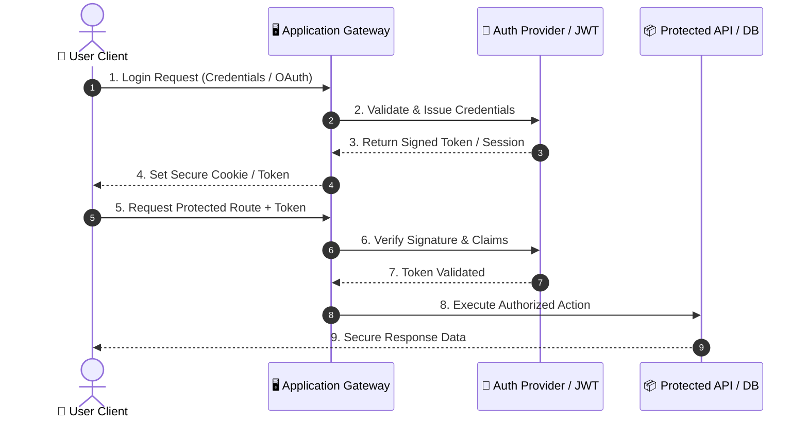
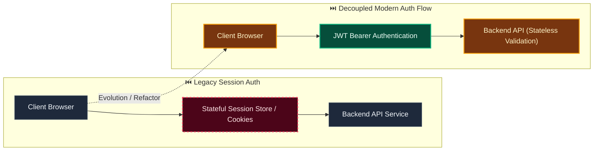

# Decision: Model Evidentia workflows as independent guarded state machines

**ID**: QGTPMDGB117NT61PNHNE4BFNK4
**Status**: accepted
**Category**: architecture
**Date**: 2026-10-01T17:12:33.275Z
**Author**: AI Agent + Human
**Governed Standards**: REQ-001, REQ-004, REQ-007, REQ-008, REQ-009, REQ-010, REQ-014, REQ-018, NFR-001, NFR-003, NFR-008

## Context

A single combined record status would conflate document custody, processing, review, authorization, event handling, and delivery. That would obscure failures, encourage illegal transitions, and make recovery behavior ambiguous.

**Project Type**: Web Application

**Profile**: web-app

## Decision

Adopt the independent lifecycle state machines and cross-lifecycle invariants documented in docs/architecture/lifecycle-state-machines.md. Persist each transition with prior and next state, aggregate version, tenant, actor or system principal, reason, correlation, causation, and server time. Enforce transitions through owning-module application ports with transactional compare-and-set or locking. Terminal recovery creates linked attempts, jobs, revisions, requests, or delivery operations instead of rewriting history. Rejection and changes-requested terminate the immutable approval request; corrected content creates a new linked record revision and approval submission. UI summaries are derived attention views and never replace the underlying states.

This decision was made based on:

- Project requirements and constraints
- Team expertise and preferences
- Industry best practices
- Long-term maintainability

## Architecture Diagram

## Architecture Mutation (Before vs After)

## Governing Standards

- **REQ-001**
- **REQ-004**
- **REQ-007**
- **REQ-008**
- **REQ-009**
- **REQ-010**
- **REQ-014**
- **REQ-018**
- **NFR-001**
- **NFR-003**
- **NFR-008**

## Consequences

### Positive
- Improves system modularity and maintainability
- Enables independent scaling of components

### Negative
- Increased operational complexity
- Network latency between services

### Neutral / Risks
- Requires robust observability and monitoring
- Distributed tracing and debugging complexity

## Alternatives Considered

| Alternative | Description | Pros | Cons |
|-------------|-------------|------|------|
| Alternative | No description | (Add pros) | (Add cons) |
| Alternative | No description | (Add pros) | (Add cons) |
| Alternative | No description | (Add pros) | (Add cons) |
| Alternative | No description | (Add pros) | (Add cons) |
| NextAuth.js | Full-featured auth for Next.js | Built-in providers; Type-safe; Secure defaults | Next.js only; Learning curve |
| Clerk | Managed auth service | Drop-in; MFA built-in; Admin dashboard | Cost; Vendor lock-in |
| Supabase Auth | Open-source auth with Postgres | Integrated with DB; Open source | Self-host complexity |
| Custom JWT | Roll your own with jsonwebtoken | Full control; No deps | Security risk; Maintenance burden |

## Related Requirements

No directly related requirements documented.

## Related Decisions

- **9M0TE8Z5N6VWW459X5N1P7EG95**: Plan the complete Evidentia platform through capability gates (accepted)
- **74P7E9CAH91FZZ6PNFYNZPJ93T**: Use a pluggable approval boundary with optional Delibera integration (accepted)
- **QQAK9DE77WFYENB2474V7XJW8W**: Adopt an accessibility-first dense review interface (accepted)
- **4SWENJ85M4CKNH60Q071BFK2WW**: Use a bounded invoice benchmark with extensible document processing (accepted)
- **GNCDV7AB7331S5JN3FXTGB6QZJ**: Use schema-driven dynamic records with reproducible context resolution (superseded)

## Implementation Notes

### Suggested Implementation Steps

1. Create module/service boundaries
2. Define interfaces/contracts
3. Implement communication layer
4. Add observability (logging, metrics, tracing)
5. Update deployment configuration

## Validation Criteria

- [ ] Decision reviewed by team
- [ ] Alternatives documented and evaluated
- [ ] Consequences understood and accepted
- [ ] Related requirements linked
- [ ] Implementation plan created

---

*Generated by Skyhook Auto-ADR on 2026-10-01T17:12:33.275Z*
*Review and update before marking as "accepted"*
