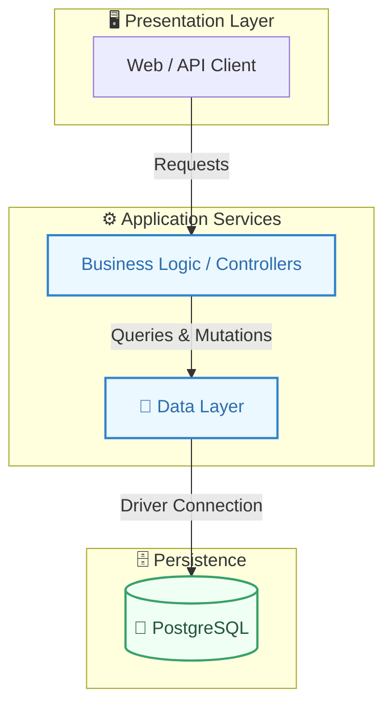
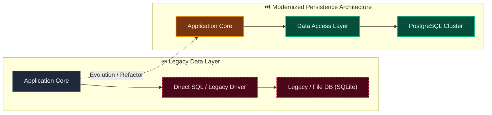

# Decision: Keep realtime delivery replaceable and durable state authoritative

**ID**: RKA75WM1ER5MRE3WGWWN161PVC
**Status**: accepted
**Category**: architecture
**Date**: 2026-10-01T17:00:56.006Z
**Author**: AI Agent + Human
**Governed Standards**: REQ-007, REQ-014, REQ-018, NFR-002, NFR-003, NFR-008, CON-005

## Context

Review collaboration and long-running workflows may need realtime updates. The final transport depends on measured interaction patterns, deployment constraints, scale, and operational preferences. Firebase and socket-based delivery have different hosting and coupling tradeoffs.

**Project Type**: Web Application

**Profile**: web-app

**Relevant Tech Stack**:
- Database: PostgreSQL 
- API: REST with OpenAPI 
- Deployment: Docker Compose 
- Identity: OIDC 

## Decision

Define a transport-neutral realtime publication and subscription port fed only by committed domain or integration events. Enforce tenant and action authorization at subscription and message delivery. Keep PostgreSQL and durable module state authoritative; realtime messages are hints containing resource identity and version, and clients recover gaps through normal API reads. Defer selection among WebSockets, Server-Sent Events, or optional managed adapters such as Firebase until a focused evaluation task. No realtime provider may own canonical Evidentia records or bypass module application ports.

This decision was made based on:

- Project requirements and constraints
- Team expertise and preferences
- Industry best practices
- Long-term maintainability

## Architecture Diagram

## Architecture Mutation (Before vs After)

## Governing Standards

- **REQ-007**
- **REQ-014**
- **REQ-018**
- **NFR-002**
- **NFR-003**
- **NFR-008**
- **CON-005**

## Consequences

### Positive
- Improves system modularity and maintainability
- Enables independent scaling of components

### Negative
- Increased operational complexity
- Network latency between services

### Neutral / Risks
- Requires robust observability and monitoring
- Distributed tracing and debugging complexity

## Alternatives Considered

| Alternative | Description | Pros | Cons |
|-------------|-------------|------|------|
| Alternative | No description | (Add pros) | (Add cons) |
| Alternative | No description | (Add pros) | (Add cons) |
| Alternative | No description | (Add pros) | (Add cons) |
| Alternative | No description | (Add pros) | (Add cons) |
| PostgreSQL | Robust, ACID-compliant, great JSON support | Mature; JSONB; Extensions | Operational overhead |
| MySQL | Wide adoption, good performance | Familiar; Good tooling | Weaker JSON |
| SQLite | Embedded, zero-config | Simple; Portable | No concurrency; No network |
| MongoDB | Document database, flexible schema | Flexible; Scales horizontally | No ACID (historically); Memory |
| NextAuth.js | Full-featured auth for Next.js | Built-in providers; Type-safe; Secure defaults | Next.js only; Learning curve |

## Related Requirements

No directly related requirements documented.

## Related Decisions

- **9M0TE8Z5N6VWW459X5N1P7EG95**: Plan the complete Evidentia platform through capability gates (accepted)
- **74P7E9CAH91FZZ6PNFYNZPJ93T**: Use a pluggable approval boundary with optional Delibera integration (accepted)
- **QQAK9DE77WFYENB2474V7XJW8W**: Adopt an accessibility-first dense review interface (accepted)
- **4SWENJ85M4CKNH60Q071BFK2WW**: Use a bounded invoice benchmark with extensible document processing (accepted)
- **GNCDV7AB7331S5JN3FXTGB6QZJ**: Use schema-driven dynamic records with reproducible context resolution (superseded)

## Implementation Notes

### Suggested Implementation Steps

1. Create module/service boundaries
2. Define interfaces/contracts
3. Implement communication layer
4. Add observability (logging, metrics, tracing)
5. Update deployment configuration

## Validation Criteria

- [ ] Decision reviewed by team
- [ ] Alternatives documented and evaluated
- [ ] Consequences understood and accepted
- [ ] Related requirements linked
- [ ] Implementation plan created

---

*Generated by Skyhook Auto-ADR on 2026-10-01T17:00:56.006Z*
*Review and update before marking as "accepted"*
