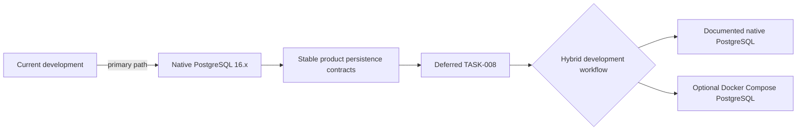

# Decision: Use native PostgreSQL now and add a hybrid Docker profile before release

**ID**: SW33NV9PVTRT60GMH1497PZD62  
**Status**: accepted  
**Category**: database  
**Date**: 2026-10-03  
**Governed Standards**: STD-ARCH-001, STD-DEV-001

## Context

The development Mac cannot update its operating system and already has Homebrew PostgreSQL 16.3 installed. Docker is not needed for the current domain work and should not block ordinary development. Evidentia will nevertheless need a reproducible container-backed option for contributors and release verification before product development is considered complete.

The previous target stack listed PostgreSQL 18.x even though that major version is not available in the approved native workflow. Claiming support for one major version while developing and testing against another would create avoidable compatibility risk.

## Decision

Use native PostgreSQL 16.x as the supported database line for the current development phase. Application configuration remains environment-driven, and database access remains behind module-owned adapters so runtime packaging never enters domain code.

Do not require Docker for ordinary local development now. Before release, activate `TASK-008` to create and verify a hybrid workflow offering both:

- the documented native PostgreSQL path; and
- an equivalent, resource-conscious Docker Compose PostgreSQL profile.

At hybrid-profile activation, reassess the supported PostgreSQL major version against the completed product, host compatibility, CI, extensions, and deployment targets. Native development, container-based integration tests, and the Docker profile must then use the same supported major line.

The installed Homebrew service currently reports an error state. `TASK-009` will diagnose it non-destructively before changing configuration or creating databases.

## Consequences

### Positive

- development can proceed on the available machine without Docker or an OS upgrade;
- the current supported database version matches the database actually used for development;
- future container support is explicit, testable work rather than an implicit promise;
- domain and application contracts remain independent of database packaging.

### Trade-offs and risks

- contributors do not yet have a supported Docker database path;
- the native Homebrew service error must be diagnosed before persistence implementation;
- a later PostgreSQL major upgrade may require compatibility testing and migration rehearsal;
- CI container tests must not claim a different supported major version.

## Alternatives considered

1. **Require Docker immediately.** Rejected because it blocks current work and is unnecessary for the present phase.
2. **Keep PostgreSQL 18.x as the declared line while using 16.x locally.** Rejected because the development and test contract would be inconsistent.
3. **Use SQLite locally.** Rejected because it cannot establish PostgreSQL migration, isolation, concurrency, and JSON behavior.
4. **Support native PostgreSQL only forever.** Rejected because contributors and release verification benefit from a reproducible optional container profile.

## Validation criteria

- Skyhook declares PostgreSQL 16.x for the current phase.
- `TASK-009` configures and verifies the native workflow before migrations.
- `TASK-008` remains deferred under the deployment story.
- No Docker service is required for current ordinary development.
- Hybrid activation includes a fresh major-version decision and parity tests across both workflows.
