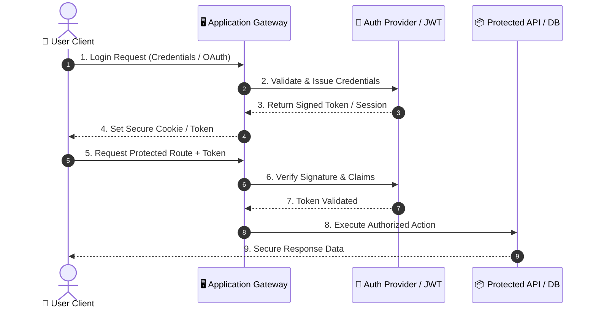
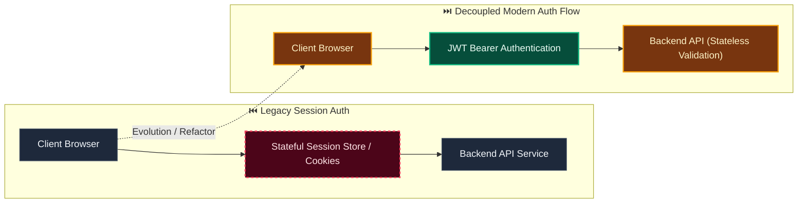

# Decision: Use replaceable bounded authentication throttling

**ID**: TXEQ9J0ARXYKS7CMQ0V1Z9FT5R
**Status**: accepted
**Category**: security
**Date**: 2026-10-07T10:19:33.133Z
**Author**: AI Agent + Human
**Governed Standards**: STD-ARCH-001, STD-SEC-001, STD-SEC-003, STD-SOFT-001

## Context

Local authentication needs bounded brute-force resistance now, while the current native development runtime is single-process. A permanent account lockout would enable denial of service, and introducing Redis or another shared service before multi-instance deployment would add infrastructure before it is operationally required.

**Project Type**: Web Application

**Profile**: web-app

**Relevant Tech Stack**:
- API: REST with OpenAPI 
- Deployment: Docker Compose 

## Decision

Define authentication throttling as an application port. Use a process-local exponential-backoff adapter with finite delay and automatic reset for the current single-process runtime. Before multi-instance API deployment, implement a shared durable adapter with the same port so attempts are coordinated across instances. Never use permanent account lockout as the primary control.

This decision was made based on:

- Project requirements and constraints
- Team expertise and preferences
- Industry best practices
- Long-term maintainability

## Architecture Diagram

## Architecture Mutation (Before vs After)

## Governing Standards

- **STD-ARCH-001**
- **STD-SEC-001**
- **STD-SEC-003**
- **STD-SOFT-001**

## Consequences

### Positive
- Reduces attack surface
- Compliance with security standards

### Negative
- May impact user experience (MFA, session timeouts)
- Implementation and maintenance overhead

### Neutral / Risks
- Regular security audits required
- Key rotation and secret management complexity

## Alternatives Considered

| Alternative | Description | Pros | Cons |
|-------------|-------------|------|------|
| Alternative | No description | (Add pros) | (Add cons) |
| Alternative | No description | (Add pros) | (Add cons) |
| Alternative | No description | (Add pros) | (Add cons) |
| Alternative | No description | (Add pros) | (Add cons) |

## Related Requirements

No directly related requirements documented.

## Related Decisions

- **8BXHCC2GBDHS6939MV0GTA4AR3**: Use versioned JCS snapshots and SHA-256 for authorization binding (accepted)
- **VVWYJKD93R4A9A7B5009H07F73**: Use provider-neutral local identity with opaque server-side sessions (accepted)

## Implementation Notes

### Suggested Implementation Steps

1. Define acceptance criteria
2. Create implementation plan
3. Implement with tests
4. Code review and merge
5. Update documentation

## Validation Criteria

- [ ] Decision reviewed by team
- [ ] Alternatives documented and evaluated
- [ ] Consequences understood and accepted
- [ ] Related requirements linked
- [ ] Implementation plan created
- [ ] Threat model updated
- [ ] Penetration test scheduled (if major change)
- [ ] Compliance requirements verified

---

*Generated by Skyhook Auto-ADR on 2026-10-07T10:19:33.133Z*
*Review and update before marking as "accepted"*
