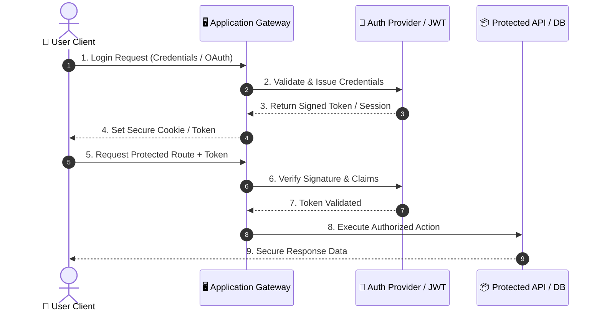
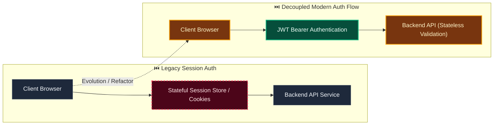

# Decision: Govern dynamic schema composition and schema discovery

**ID**: VPCJJY62YNW6VXJ80S7BRK9447
**Status**: accepted
**Category**: architecture
**Date**: 2026-10-01T16:50:28.413Z
**Author**: AI Agent + Human
**Supersedes**: [Use schema-driven dynamic records with reproducible context resolution](GNCDV7AB7331S5JN3FXTGB6QZJ.md)
**Governed Standards**: REQ-003, REQ-015, REQ-016, REQ-017, NFR-001, NFR-008, CON-003

## Context

Evidentia must accommodate highly variable documents and external requirements without fixed domain columns. At the same time, arbitrary fields introduced during processing would make validation, UI behavior, authorization hashes, destination mappings, and historical interpretation unstable.

**Project Type**: Web Application

**Profile**: web-app

## Decision

Keep the core record lifecycle document-neutral and allow published schemas to define arbitrary typed fields, nested structures, tables, evidence expectations, normalization, and rules. Resolve production schemas only by deterministically selecting or composing administrator-published immutable modules from versioned governed context. Preserve unexpected provider output as raw output or unmapped field candidates. Authorized users may promote candidates into a draft schema, test the draft on representative documents, and publish a new immutable version. Only fields in the resolved published schema enter an authoritative record. Persist all schema, module, rule, and relevant external-context versions with extraction runs and record revisions.

This decision was made based on:

- Project requirements and constraints
- Team expertise and preferences
- Industry best practices
- Long-term maintainability

## Architecture Diagram

## Architecture Mutation (Before vs After)

## Governing Standards

- **REQ-003**
- **REQ-015**
- **REQ-016**
- **REQ-017**
- **NFR-001**
- **NFR-008**
- **CON-003**

## Consequences

### Positive
- Improves system modularity and maintainability
- Enables independent scaling of components

### Negative
- Increased operational complexity
- Network latency between services

### Neutral / Risks
- Requires robust observability and monitoring
- Distributed tracing and debugging complexity

## Alternatives Considered

| Alternative | Description | Pros | Cons |
|-------------|-------------|------|------|
| Alternative | No description | (Add pros) | (Add cons) |
| Alternative | No description | (Add pros) | (Add cons) |
| Alternative | No description | (Add pros) | (Add cons) |
| Alternative | No description | (Add pros) | (Add cons) |
| NextAuth.js | Full-featured auth for Next.js | Built-in providers; Type-safe; Secure defaults | Next.js only; Learning curve |
| Clerk | Managed auth service | Drop-in; MFA built-in; Admin dashboard | Cost; Vendor lock-in |
| Supabase Auth | Open-source auth with Postgres | Integrated with DB; Open source | Self-host complexity |
| Custom JWT | Roll your own with jsonwebtoken | Full control; No deps | Security risk; Maintenance burden |

## Related Requirements

No directly related requirements documented.

## Related Decisions

- **9M0TE8Z5N6VWW459X5N1P7EG95**: Plan the complete Evidentia platform through capability gates (accepted)
- **74P7E9CAH91FZZ6PNFYNZPJ93T**: Use a pluggable approval boundary with optional Delibera integration (accepted)
- **QQAK9DE77WFYENB2474V7XJW8W**: Adopt an accessibility-first dense review interface (accepted)
- **4SWENJ85M4CKNH60Q071BFK2WW**: Use a bounded invoice benchmark with extensible document processing (accepted)
- **GNCDV7AB7331S5JN3FXTGB6QZJ**: Use schema-driven dynamic records with reproducible context resolution (accepted)

## Implementation Notes

### Suggested Implementation Steps

1. Create module/service boundaries
2. Define interfaces/contracts
3. Implement communication layer
4. Add observability (logging, metrics, tracing)
5. Update deployment configuration

## Validation Criteria

- [ ] Decision reviewed by team
- [ ] Alternatives documented and evaluated
- [ ] Consequences understood and accepted
- [ ] Related requirements linked
- [ ] Implementation plan created

---

*Generated by Skyhook Auto-ADR on 2026-10-01T16:50:28.413Z*
*Review and update before marking as "accepted"*
