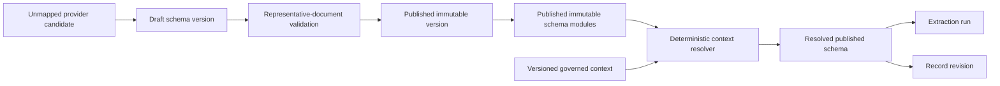
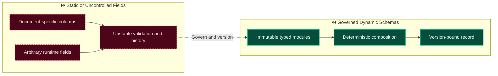

# Decision: Govern dynamic schema composition and schema discovery

**ID**: VPCJJY62YNW6VXJ80S7BRK9447
**Status**: accepted
**Category**: architecture
**Date**: 2026-10-01T16:50:28.413Z
**Author**: AI Agent + Human
**Supersedes**: [Use schema-driven dynamic records with reproducible context resolution](GNCDV7AB7331S5JN3FXTGB6QZJ.md)
**Governed Standards**: REQ-003, REQ-015, REQ-016, REQ-017, NFR-001, NFR-008, CON-003

## Context

Evidentia must accommodate highly variable documents and external requirements without fixed domain columns. At the same time, arbitrary fields introduced during processing would make validation, UI behavior, authorization hashes, destination mappings, and historical interpretation unstable.

**Project Type**: Web Application

**Profile**: web-app

## Decision

Keep the core record lifecycle document-neutral and allow published schemas to define arbitrary typed fields, nested structures, tables, evidence expectations, normalization, and rules. Resolve production schemas only by deterministically selecting or composing administrator-published immutable modules from versioned governed context. Preserve unexpected provider output as raw output or unmapped field candidates. Authorized users may promote candidates into a draft schema, test the draft on representative documents, and publish a new immutable version. Only fields in the resolved published schema enter an authoritative record. Persist all schema, module, rule, and relevant external-context versions with extraction runs and record revisions.

This decision was made based on:

- Project requirements and constraints
- Team expertise and preferences
- Industry best practices
- Long-term maintainability

## Architecture Diagram

## Architecture Mutation (Before vs After)

## Governing Standards

- **REQ-003**
- **REQ-015**
- **REQ-016**
- **REQ-017**
- **NFR-001**
- **NFR-008**
- **CON-003**

## Consequences

### Positive
- Supports document-, tenant-, jurisdiction-, workflow-, and destination-specific fields without hard-coded record columns.
- Keeps historical records reproducible by retaining immutable schema and context versions.
- Allows controlled discovery of new fields without admitting unreviewed provider output into authoritative records.

### Negative
- Schema publication, compatibility, composition, and migration require explicit governance.
- Administrators must manage versions and resolve module conflicts rather than editing published schemas in place.

### Neutral / Risks
- Poorly designed module boundaries could create excessive variants or ambiguous resolution.
- Import/export and canonical value rules must remain compatible across API, SDK, authorization, and persistence layers.

## Alternatives Considered

| Alternative | Description | Pros | Cons |
|-------------|-------------|------|------|
| Static fields per document type | Add domain columns whenever a document changes | Simple queries for one fixed format | Cannot support variable documents without schema and migration proliferation |
| Arbitrary runtime JSON fields | Accept any provider-produced key directly into records | Maximum short-term flexibility | Breaks validation, authorization, mappings, UI behavior, and historical meaning |
| One monolithic schema per tenant | Publish complete standalone schemas without reusable modules | Straightforward resolution | Duplicates common definitions and makes coordinated evolution difficult |
| Immutable composable schema modules | Resolve governed modules into a retained published schema | Extensible, reusable, deterministic, and historically reproducible | Requires conflict rules, compatibility analysis, and publication governance |

## Related Requirements

- **REQ-003**: Immutable, versioned, schema-defined dynamic records
- **REQ-015**: Extensibility beyond the initial invoice benchmark
- **REQ-016**: Deterministic contextual schema composition
- **REQ-017**: Governed schema discovery and evolution
- **NFR-001**: Immutable or explicitly superseded traceability
- **NFR-008**: Versioned public contracts and stored state
- **CON-003**: Canonical monetary and arbitrary-precision representations

## Related Decisions

- **9M0TE8Z5N6VWW459X5N1P7EG95**: Plan the complete Evidentia platform through capability gates (accepted)
- **74P7E9CAH91FZZ6PNFYNZPJ93T**: Use a pluggable approval boundary with optional Delibera integration (accepted)
- **QQAK9DE77WFYENB2474V7XJW8W**: Adopt an accessibility-first dense review interface (accepted)
- **4SWENJ85M4CKNH60Q071BFK2WW**: Use a bounded invoice benchmark with extensible document processing (accepted)
- **GNCDV7AB7331S5JN3FXTGB6QZJ**: Use schema-driven dynamic records with reproducible context resolution (accepted)

## Implementation Notes

### Suggested Implementation Steps

1. Define schema identity, version, lifecycle, field, constraint, and composition domain contracts.
2. Keep data definitions separate from validation, presentation, and extraction hints while linking each artifact by version.
3. Enforce publication immutability and explicit compatibility classification.
4. Define deterministic import/export, composition, migration, and reprocessing semantics.
5. Add representative nested, table, precision, conflict, and historical-reproduction tests before persistence adapters.

## Validation Criteria

- [x] Product owner approved dynamic, schema-defined fields
- [x] Published schemas and modules are immutable and versioned
- [x] Arbitrary provider output is excluded from authoritative records until governed
- [x] Alternatives, consequences, and related requirements are documented
- [ ] Remaining schema lifecycle and composition details approved before implementation

---

*Generated by Skyhook Auto-ADR on 2026-10-01T16:50:28.413Z*
*Review and update before marking as "accepted"*
