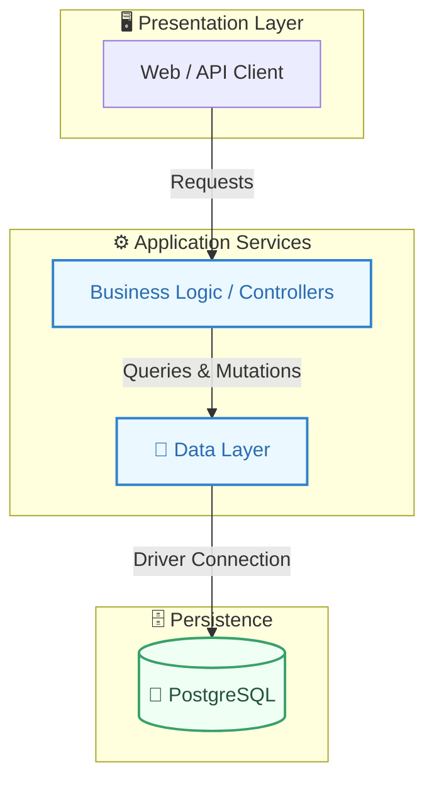
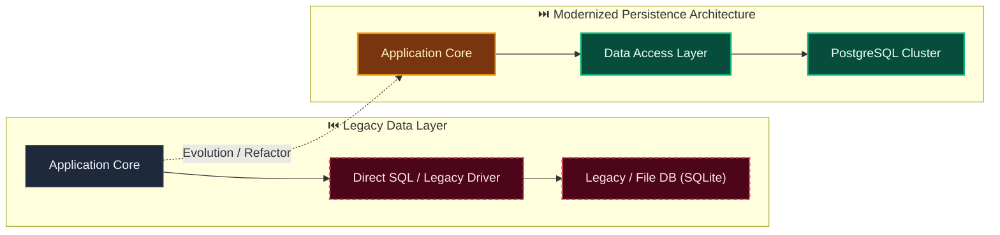

# Decision: Use provider-neutral local identity with opaque server-side sessions

**ID**: VVWYJKD93R4A9A7B5009H07F73
**Status**: accepted
**Category**: security
**Date**: 2026-10-07T09:18:07.081Z
**Author**: AI Agent + Human
**Governed Standards**: STD-ARCH-001, STD-SEC-001, STD-SEC-002, STD-SEC-003, STD-SOFT-001, STD-SOFT-003, STD-TEST-001, STD-TEST-002, STD-DEV-001

## Context

The Interactive Schema Workbench needs attributable, tenant-isolated browser access before schema APIs and UI can be safely exposed. Evidentia must support a secure self-hosted local mode now without coupling domain modules to local passwords, JWTs, or a future enterprise identity provider. Tenant context must be derived from verified membership rather than client-supplied identifiers, and bootstrap credentials must not become a permanent runtime backdoor.

**Project Type**: Web Application

**Profile**: web-app

**Relevant Tech Stack**:
- API: REST with OpenAPI
- Identity: OIDC
- Database: PostgreSQL 16.x

## Decision

The access bounded context will own operators, tenants, memberships, capability grants, credentials, and sessions behind public application ports. Local authentication will use normalized login identifiers and Argon2id password hashes. Browser authentication will use high-entropy opaque session tokens delivered only in HttpOnly SameSite cookies; only token digests are persisted, with expiry, rotation, revocation, and last-use metadata. A trusted request context will contain operator, active tenant, granted capabilities, session, and correlation identifiers and will be constructed only after session and membership validation. Initial administration will be created by an explicit idempotent bootstrap command using centrally validated environment secrets; normal API startup will never recreate or overwrite it. Provider-specific authentication will implement a replaceable identity-provider port, allowing OIDC to be added later without changing tenant membership, authorization, or downstream module contracts. Native PostgreSQL is the current persistence runtime; the already-planned hybrid Docker profile remains deferred.

This decision was made based on:

- Project requirements and constraints
- Team expertise and preferences
- Industry best practices
- Long-term maintainability

## Architecture Diagram

## Architecture Mutation (Before vs After)

## Governing Standards

- **STD-ARCH-001**
- **STD-SEC-001**
- **STD-SEC-002**
- **STD-SEC-003**
- **STD-SOFT-001**
- **STD-SOFT-003**
- **STD-TEST-001**
- **STD-TEST-002**
- **STD-DEV-001**

## Consequences

### Positive
- Reduces attack surface
- Compliance with security standards

### Negative
- May impact user experience (MFA, session timeouts)
- Implementation and maintenance overhead

### Neutral / Risks
- Regular security audits required
- Key rotation and secret management complexity

## Alternatives Considered

| Alternative | Description | Pros | Cons |
|-------------|-------------|------|------|
| Alternative | No description | (Add pros) | (Add cons) |
| Alternative | No description | (Add pros) | (Add cons) |
| Alternative | No description | (Add pros) | (Add cons) |
| Alternative | No description | (Add pros) | (Add cons) |
| Alternative | No description | (Add pros) | (Add cons) |

## Related Requirements

No directly related requirements documented.

## Related Decisions

- **8BXHCC2GBDHS6939MV0GTA4AR3**: Use versioned JCS snapshots and SHA-256 for authorization binding (accepted)

## Implementation Notes

### Suggested Implementation Steps

1. Define acceptance criteria
2. Create implementation plan
3. Implement with tests
4. Code review and merge
5. Update documentation

## Validation Criteria

- [ ] Decision reviewed by team
- [ ] Alternatives documented and evaluated
- [ ] Consequences understood and accepted
- [ ] Related requirements linked
- [ ] Implementation plan created
- [ ] Threat model updated
- [ ] Penetration test scheduled (if major change)
- [ ] Compliance requirements verified

---

*Generated by Skyhook Auto-ADR on 2026-10-07T09:18:07.081Z*
*Review and update before marking as "accepted"*
