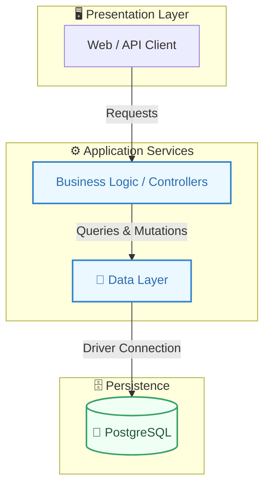
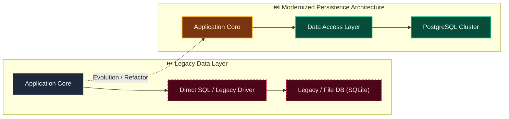

# Decision: Preserve originals through a replaceable local artifact storage port

**ID**: W1YPD1S7FZC6BDFHBZ3BCMHMXF
**Status**: accepted
**Category**: architecture
**Date**: 2026-10-08T07:54:45.648Z
**Author**: AI Agent + Human
**Governed Standards**: STD-ARCH-001, STD-ARCH-002, STD-SEC-004, STD-SOFT-003

## Context

The first document-intake pass must preserve untrusted originals without requiring Docker or prematurely coupling custody to a cloud provider, parser, OCR system, or database blob representation.

**Project Type**: Web Application

**Profile**: web-app

**Relevant Tech Stack**:
- API: REST with OpenAPI
- Database: PostgreSQL 16.x

## Decision

Store document custody metadata and SHA-256 integrity evidence in module-owned PostgreSQL tables while storing original bytes in a tenant-isolated content-addressed local filesystem adapter behind a Documents-owned port. Accept browser/API multipart uploads in this pass. Derive storage keys server-side, write artifacts atomically, validate configured size and media-type policy, and defer resumable or direct-to-object-storage transfer plus parsing, OCR, and classification execution to their dedicated stories.

This decision was made based on:

- Project requirements and constraints
- Team expertise and preferences
- Industry best practices
- Long-term maintainability

## Architecture Diagram

## Architecture Mutation (Before vs After)

## Governing Standards

- **STD-ARCH-001**
- **STD-ARCH-002**
- **STD-SEC-004**
- **STD-SOFT-003**

## Consequences

### Positive
- Improves system modularity and maintainability
- Enables independent scaling of components

### Negative
- Increased operational complexity
- Network latency between services

### Neutral / Risks
- Requires robust observability and monitoring
- Distributed tracing and debugging complexity

## Alternatives Considered

| Alternative | Description | Pros | Cons |
|-------------|-------------|------|------|
| Alternative | No description | (Add pros) | (Add cons) |
| Alternative | No description | (Add pros) | (Add cons) |
| Alternative | No description | (Add pros) | (Add cons) |
| PostgreSQL | Robust, ACID-compliant, great JSON support | Mature; JSONB; Extensions | Operational overhead |
| MySQL | Wide adoption, good performance | Familiar; Good tooling | Weaker JSON |
| SQLite | Embedded, zero-config | Simple; Portable | No concurrency; No network |
| MongoDB | Document database, flexible schema | Flexible; Scales horizontally | No ACID (historically); Memory |

## Related Requirements

No directly related requirements documented.

## Related Decisions

- **9M0TE8Z5N6VWW459X5N1P7EG95**: Plan the complete Evidentia platform through capability gates (accepted)
- **74P7E9CAH91FZZ6PNFYNZPJ93T**: Use a pluggable approval boundary with optional Delibera integration (accepted)
- **QQAK9DE77WFYENB2474V7XJW8W**: Adopt an accessibility-first dense review interface (accepted)
- **4SWENJ85M4CKNH60Q071BFK2WW**: Use a bounded invoice benchmark with extensible document processing (accepted)
- **GNCDV7AB7331S5JN3FXTGB6QZJ**: Use schema-driven dynamic records with reproducible context resolution (superseded)

## Implementation Notes

### Suggested Implementation Steps

1. Create module/service boundaries
2. Define interfaces/contracts
3. Implement communication layer
4. Add observability (logging, metrics, tracing)
5. Update deployment configuration

## Validation Criteria

- [ ] Decision reviewed by team
- [ ] Alternatives documented and evaluated
- [ ] Consequences understood and accepted
- [ ] Related requirements linked
- [ ] Implementation plan created

---

*Generated by Skyhook Auto-ADR on 2026-10-08T07:54:45.648Z*
*Review and update before marking as "accepted"*
