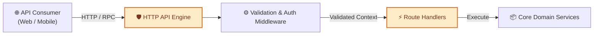
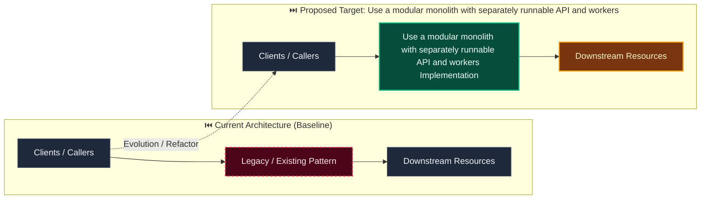

# Decision: Use a modular monolith with separately runnable API and workers

**ID**: WZ962PPJQM5XMCCAW75SDYF9AX
**Status**: accepted
**Category**: architecture
**Date**: 2026-10-01T16:58:40.152Z
**Author**: AI Agent + Human
**Governed Standards**: REQ-001, REQ-004, REQ-008, REQ-009, REQ-010, REQ-014, NFR-003, NFR-004, NFR-008, CON-001, CON-002

## Context

Evidentia contains several strong domain boundaries and substantial asynchronous processing, but premature service decomposition would increase deployment, transaction, observability, and local-development burden. The product must remain approachable for self-hosting while preserving boundaries that allow future extraction.

**Project Type**: Web Application

**Profile**: web-app

**Relevant Tech Stack**:
- Frontend Framework: React 
- API: REST with OpenAPI 
- Deployment: Docker Compose 
- Identity: OIDC 

## Decision

Implement Evidentia as a modular monolith. Maintain one backend source tree organized into explicit bounded-context modules with private domain, application, and persistence internals and narrow public ports. Run the HTTP API and background workers as separately scalable processes built from the same backend packages. Use in-process application calls for synchronous workflows and durable jobs, outbox/inbox events, and idempotent handlers for asynchronous work. Keep the React frontend as a separate application consuming the versioned OpenAPI contract. Adapters for storage, parsing, inference, identity, approval, and destinations remain at infrastructure edges. A module may become an independent service only after measured scaling, isolation, release, or ownership needs justify the operational cost. Delibera remains an external system behind ApprovalAdapter.

This decision was made based on:

- Project requirements and constraints
- Team expertise and preferences
- Industry best practices
- Long-term maintainability

## Architecture Diagram

## Architecture Mutation (Before vs After)

## Governing Standards

- **REQ-001**
- **REQ-004**
- **REQ-008**
- **REQ-009**
- **REQ-010**
- **REQ-014**
- **NFR-003**
- **NFR-004**
- **NFR-008**
- **CON-001**
- **CON-002**

## Consequences

### Positive
- Improves system modularity and maintainability
- Enables independent scaling of components

### Negative
- Increased operational complexity
- Network latency between services

### Neutral / Risks
- Requires robust observability and monitoring
- Distributed tracing and debugging complexity

## Alternatives Considered

| Alternative | Description | Pros | Cons |
|-------------|-------------|------|------|
| Alternative | No description | (Add pros) | (Add cons) |
| Alternative | No description | (Add pros) | (Add cons) |
| Alternative | No description | (Add pros) | (Add cons) |
| Alternative | No description | (Add pros) | (Add cons) |
| Vercel | Optimized for Next.js | Zero config; Edge network; Preview deploys | Vendor lock-in; Cost at scale |
| Netlify | Static + functions | Generous free tier; Forms; Edge functions | Less Next.js optimization |
| AWS (ECS/Lambda) | Full control on AWS | Full control; Integrated services | Complexity; Ops burden |
| Docker + VPS | Self-hosted containers | Full control; Cost predictable | Ops burden; No preview deploys |
| Fly.io / Railway / Render | Modern PaaS | Simple; Global; Good DX | Newer; Less enterprise features |

## Related Requirements

No directly related requirements documented.

## Related Decisions

- **9M0TE8Z5N6VWW459X5N1P7EG95**: Plan the complete Evidentia platform through capability gates (accepted)
- **74P7E9CAH91FZZ6PNFYNZPJ93T**: Use a pluggable approval boundary with optional Delibera integration (accepted)
- **QQAK9DE77WFYENB2474V7XJW8W**: Adopt an accessibility-first dense review interface (accepted)
- **4SWENJ85M4CKNH60Q071BFK2WW**: Use a bounded invoice benchmark with extensible document processing (accepted)
- **GNCDV7AB7331S5JN3FXTGB6QZJ**: Use schema-driven dynamic records with reproducible context resolution (superseded)

## Implementation Notes

### Suggested Implementation Steps

1. Create module/service boundaries
2. Define interfaces/contracts
3. Implement communication layer
4. Add observability (logging, metrics, tracing)
5. Update deployment configuration

## Validation Criteria

- [ ] Decision reviewed by team
- [ ] Alternatives documented and evaluated
- [ ] Consequences understood and accepted
- [ ] Related requirements linked
- [ ] Implementation plan created

---

*Generated by Skyhook Auto-ADR on 2026-10-01T16:58:40.152Z*
*Review and update before marking as "accepted"*
