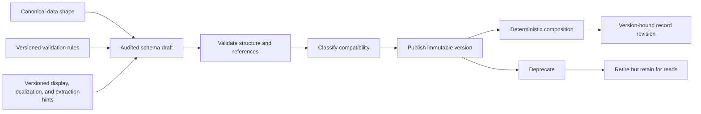
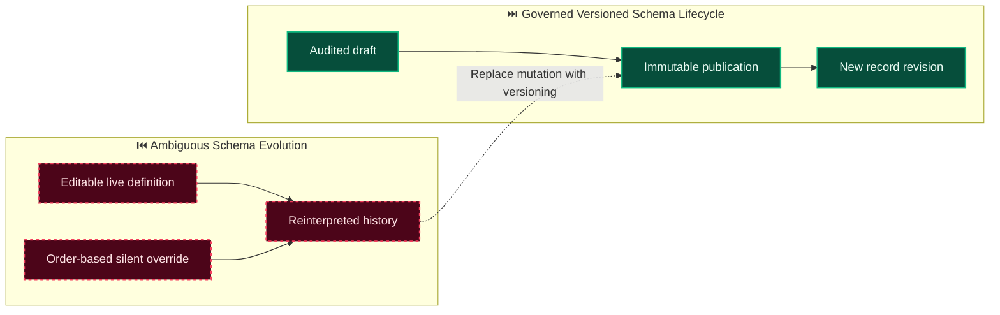

# Decision: Define the dynamic schema lifecycle, type system, and compatibility contract

**ID**: X5BHHCAWFJ2SZKPBCP5ECENB97
**Status**: accepted
**Category**: architecture
**Date**: 2026-10-03T07:01:38.875Z
**Author**: AI Agent + Human
**Governed Standards**: STD-ARCH-001, STD-ARCH-002

## Context

Evidentia must support document structures that vary by document class, tenant, jurisdiction, workflow, destination, and governed external context. The previously accepted dynamic-schema decision establishes immutable published schemas and deterministic composition, but implementation requires precise contracts for identity, lifecycle, field types, separation of concerns, conflict handling, compatibility, migration, and localization.

**Project Type**: Web Application

**Profile**: web-app

**Relevant Tech Stack**:
- Language: Python 3.14.x
- Language: TypeScript 
- Identity: OIDC 

## Decision

Use stable opaque schema and module identifiers with monotonic integer versions and optional human release labels. Govern versions through draft, published, deprecated, and retired states: drafts are editable with an audit trail, while published versions are immutable and all historical versions remain readable. Provide a closed core type system covering string, boolean, integer, arbitrary-precision decimal, money, date, datetime, enum, identifier/reference, object, array, table, and artifact reference; future types require versioned extension namespaces and cannot execute arbitrary code. Keep canonical data shape separate from validation rules, display/localization hints, and extraction hints, linking each artifact by explicit version. Composition is deterministic and never silently overrides a field: duplicate paths and incompatible types fail publication unless resolved by an explicit governed alias, mapping, or replacement. Classify evolution as additive-compatible, behavior-changing, or breaking. Migration and reprocessing create new record revisions and never overwrite historical records. Machine keys remain stable and language-neutral while labels, descriptions, help text, and formatting instructions are separately localizable and versioned.

This decision was made based on:

- Project requirements and constraints
- Team expertise and preferences
- Industry best practices
- Long-term maintainability

## Architecture Diagram

## Architecture Mutation (Before vs After)

## Governing Standards

- **STD-ARCH-001**
- **STD-ARCH-002**

## Consequences

### Positive
- Gives every schema, module, field, and related artifact a reproducible identity and version.
- Supports variable documents without document-specific domain columns or uncontrolled runtime fields.
- Makes compatibility, composition conflicts, migrations, and localized presentation explicit and testable.

### Negative
- Administrators must publish new immutable versions instead of editing live schemas.
- The platform must retain old definitions and provide deliberate migration and reprocessing workflows.

### Neutral / Risks
- An overly broad core type system would be difficult to keep stable; extension types therefore require namespaces and versions.
- Excessive schema variants or poorly governed replacements could still make administration difficult.

## Alternatives Considered

| Alternative | Description | Pros | Cons |
|-------------|-------------|------|------|
| Editable published schemas | Update the active definition in place | Operationally simple | Destroys historical reproducibility and changes record meaning retroactively |
| Arbitrary executable custom types | Let deployments register unrestricted runtime code | Maximum local flexibility | Unsafe, non-portable, and impossible to validate consistently across APIs and SDKs |
| Monolithic schema documents | Combine shape, validation, UI, localization, and extraction details | One artifact to load | Couples unrelated change cycles and creates noisy incompatible versions |
| Order-based conflict resolution | Let the last module silently win | Easy composition algorithm | Ambiguous results and accidental field replacement |
| Immutable typed contracts with governed composition | Use this decision's lifecycle and compatibility rules | Deterministic, extensible, and auditable | Requires explicit publication and migration governance |

## Related Requirements

- **REQ-003**: Immutable, versioned, schema-defined dynamic records
- **REQ-005**: Structured evidence and explicit value origins
- **REQ-006**: Versioned explainable validation
- **REQ-015**: Extensibility beyond the initial invoice benchmark
- **REQ-016**: Deterministic contextual schema composition
- **REQ-017**: Governed schema discovery and evolution
- **NFR-001**: Immutable or explicitly superseded traceability
- **NFR-008**: Versioned public contracts and stored state
- **CON-003**: Canonical monetary and arbitrary-precision representations

## Related Decisions

- **VPCJJY62YNW6VXJ80S7BRK9447**: Govern dynamic schema composition and schema discovery (accepted)
- **8BXHCC2GBDHS6939MV0GTA4AR3**: Use versioned JCS snapshots and SHA-256 for authorization binding (accepted)
- **4SWENJ85M4CKNH60Q071BFK2WW**: Use a bounded invoice benchmark with extensible document processing (accepted)

## Implementation Notes

### Suggested Implementation Steps

1. Implement persistence-independent identity, lifecycle, and core field-type value objects.
2. Model versioned schema aggregates and separately versioned artifact references.
3. Implement deterministic composition with explicit conflict diagnostics and governed replacement declarations.
4. Add publication validation and compatibility classification before exposing interchange contracts.
5. Define migration and reprocessing plans that always target new record revisions.

## Validation Criteria

- [x] Product owner approved identity, lifecycle, field-type, composition, compatibility, and localization choices
- [x] Alternatives and consequences are documented
- [x] Related requirements and decisions are linked
- [x] Implementation is split into dependency-ordered Skyhook tasks
- [ ] Each implemented export includes Skyhook traceability annotations

---

*Generated by Skyhook Auto-ADR on 2026-10-03T07:01:38.875Z*
*Review and update before marking as "accepted"*
