# Project Plan: Evidentia

> **Project ID**: `GPNKKMYX2EHA0GZ82WDJASXKGX` | **Profile**: `web-app`
> **Compiled**: 2026-10-07T09:20:20.298Z by Skyhook Dynamic Plan Compiler

## Executive Summary

An open-source, self-hostable platform that converts documents into inspectable, correctable, validated, authorized, and traceable business records.

### 🎯 Delivery & Capacity Forecast

| Metric | Current Value | Notes |
|:-------|:--------------|:------|
| **Weekly Velocity** | **33.2 pts/wk** | Derived from 14-day rolling events |
| **Average Cycle Time** | **11.5 hours** | Average in-progress to done duration |
| **Backlog Work Remaining** | **118 pts** (35 stories) | Unfinished scope |
| **Expected Completion (P50)** | 📅 **2026-11-01** | Standard velocity projection (3.6 wks) |
| **Conservative Completion (P90)** | 📅 **2026-11-10** | Risk-adjusted delivery date (4.9 wks) |

> [!WARNING]
> **Scope Creep Alert**: Net backlog growth (+199 pts) exceeds recent completion rate. Delivery target may shift.

## 1. Visual Delivery Roadmap & Timeline

```mermaid
gantt
    title Project Delivery Roadmap
    dateFormat  YYYY-MM-DD
    axisFormat  %b %d

    section Domain contracts and lifecycle foundations
    Specify core aggregates and ownership :done, s_3JVEA7J60SSVDTK16VMMW1R6CY, 2026-10-01, 2026-10-01
    Specify independent lifecycle state machines :done, s_HYFDZB6CJS5YV2KZ216C77VD3H, 2026-10-01, 2026-10-01
    Define canonical revision snapshot contract :done, s_HKDJB0N3JTKZ2RRFRP5PT70PF9, 2026-10-01, 2026-10-01
    Define the Evidentia monorepo structure :done, s_STORY_005, 2026-10-01, 2026-10-01
    Select the Evidentia development toolchain :done, s_STORY_006, 2026-10-01, 2026-10-01

    section Document ingestion and durable storage
    Implement document and artifact storage adapters : s_KMC5EK26PXNT868PT6W97RX06A, 2026-10-01, 5d
    Implement interactive and asynchronous ingestion : s_D86X3Q727TBSXDQX5NRNNZEB63, 2026-10-01, 5d
    Add batch and connector ingestion channels : s_HFVVS2GASHC8W7HEMCW9VMP0TB, 2026-10-01, 5d

    section Parsing OCR and document classification
    Define parser and OCR adapter contracts : s_C37NZW5X9ASZRS7XHZ7W56MG8V, 2026-10-01, 5d
    Implement document classification and correction : s_RXAZEMKJVJNN58W029T397M3QN, 2026-10-01, 5d
    Evaluate difficult source qualities : s_1VED17WSNE77N7VVCZTXC2NAT5, 2026-10-01, 5d

    section Versioned schemas normalization and extraction providers
    Build versioned schema lifecycle :done, s_4PJTJVE73D2MN7GT64T48S05HT, 2026-10-03, 2026-10-03
    Build hosted and local extraction provider interface : s_BYNGTQS6SX4FB7HQ46D9FKTJR2, 2026-10-01, 5d
    Build reprocessing and comparison workflow : s_8PKADXET1MA10TAY9F6VBDYYAD, 2026-10-01, 5d
    Implement contextual schema resolution and composition : s_STORY_002, after s_4PJTJVE73D2MN7GT64T48S05HT, 2d
    Build governed schema discovery and evolution workflow : s_STORY_003, after s_4PJTJVE73D2MN7GT64T48S05HT, 2d

    section Source evidence validation and exception handling
    Model field and table evidence : s_XPNG59AKNVHXYMPRFWR71DSE0C, 2026-10-01, 5d
    Implement versioned validation engine : s_06SRF2HBM8APTGA5RP2D9XS3JP, 2026-10-01, 5d
    Build prioritized exception queues : s_WJN4QJFCJQ98V9Q35KDDVW0HGN, 2026-10-01, 5d

    section Collaborative review corrections and revisions
    Build document-and-record review workspace : s_ASQKQ6YH4S8G6SDQ6XN7BHYM8E, 2026-10-01, 5d
    Implement collaboration and conflict handling : s_3J2M9KAE9H8THGD2AR9DSKXYTC, 2026-10-01, 5d
    Implement immutable submission and supersession : s_B1B7G0DXYE4JSEGFSC2NT8MFD1, 2026-10-01, 5d
    Evaluate and implement the realtime subscription port : s_STORY_004, after s_ASQKQ6YH4S8G6SDQ6XN7BHYM8E, 2d

    section Authorization framework and optional Delibera integration
    Define ApprovalAdapter and authorization semantics : s_Q2840JNY2G50TCZHWY7MWRBKHT, 2026-10-01, 5d
    Implement secure local manual approval : s_NWMGM72BETT2BVW6DPW6APQCGR, 2026-10-01, 5d
    Implement optional Delibera adapter : s_0P37MDJCQKH1STANM151Q81NHH, 2026-10-01, 5d

    section Authorized delivery and destination integrations
    Define DestinationAdapter and mapping versions : s_FK5B70RZFH4QSTW7Y02R1D3E1N, 2026-10-01, 5d
    Implement idempotent delivery orchestration : s_XRS5S2GBBCPV9Q9CCN2DXBJ2G3, 2026-10-01, 5d
    Build delivery administration and recovery : s_0C4PR416ZZ5WCA73DMBZFK87CY, 2026-10-01, 5d

    section Bundles matching batches and advanced document capabilities
    Implement document bundles and relationships : s_GAAPXNG7SK2X48CW2GDDG7MJ06, 2026-10-01, 5d
    Implement cross-document matching : s_KYSVD7PWKX5ZAZW4FN67NXA26E, 2026-10-01, 5d
    Expand tables languages and batch operations : s_5DGKC77RV9C2GWTKWK49788S1B, 2026-10-01, 5d

    section Public API SDKs and extension ecosystem
    Publish versioned REST and OpenAPI contracts : s_75J1CS4ZFVG3RSXH2GDF7W82ME, 2026-10-01, 5d
    Publish Python and JavaScript SDKs : s_89ZWE45CMH2MKH116P992C3BDS, 2026-10-01, 5d
    Publish adapter development interfaces : s_NGSBE5Q1QVXJG649C8FQ7JM41Y, 2026-10-01, 5d

    section Identity tenant security and privacy controls
    Implement tenant and action authorization model : s_J53MR4BTE1N2XJHRYXHV4Z87JG, 2026-10-01, 5d
    Secure untrusted document processing : s_36P0MN74XTPQ943H6EVXGDX1WE, 2026-10-01, 5d
    Implement retention privacy and audit controls : s_00B1KJ2YM4P1PBKNQTM3AWSPSP, 2026-10-01, 5d

    section Durable jobs observability and operational recovery
    Select and implement durable job execution : s_DC2ZQWDS83EVZ95JRJERYN90RP, 2026-10-01, 5d
    Implement outbox inbox and reconciliation patterns : s_BNPAYSRAD7TJQ56MBQRP1BAHJQ, 2026-10-01, 5d
    Build observability and recovery console : s_WKW6R599VZYZS7J7V8MXGDXWZX, 2026-10-01, 5d

    section Evaluation release evidence and open-source operations
    Build permission-cleared evaluation program : s_JY8T325XB4VZ2F6DZRPYY7XEHD, 2026-10-01, 5d
    Create deployment backup and upgrade profiles : s_99JY71R6GRKG8SXDWD92357XNV, 2026-10-01, 5d
    Publish release and contributor evidence : s_7EGC5PWY8MQB5BKQKTR05DWBPQ, 2026-10-01, 5d
    Establish the first invoice benchmark and extension conformance suite : s_STORY_001, after s_C37NZW5X9ASZRS7XHZ7W56MG8V, 2d

    section Executable platform foundation
    Bootstrap the governed monorepo and locked toolchains :crit, done, s_STORY_007, 2026-10-01, 2026-10-02
    Create bounded-context package skeletons and executable boundary tests :crit, done, s_STORY_008, 2026-10-02, 2026-10-02
    Establish secure configuration and the local Compose runtime : s_STORY_009, after s_STORY_007, 8d
    Build module-owned migrations and tenant-safe persistence primitives :crit, s_STORY_010, after s_STORY_008, 12d
    Implement trusted identity, tenant context, and authorization hooks :crit, s_STORY_011, after s_STORY_010, 12d
    Establish versioned API, errors, correlation, and OpenAPI generation :crit, s_STORY_012, after s_STORY_008, 8d
    Build the accessible application shell and generated-client boundary :crit, s_STORY_013, after s_STORY_007, 8d
    Create the worker composition root and durable work port : s_STORY_014, after s_STORY_008, 8d
    Implement provider-neutral continuous quality and supply-chain gates :crit, s_STORY_015, after s_STORY_008, 12d
    Prove the tenant-aware API-worker-web walking skeleton :crit, s_STORY_016, after s_STORY_009, 8d

    section Interactive Schema Workbench
    Persist governed schemas for interactive use :done, s_0VJ9SHA39TA291D8QXB0TQS3HQ, 2026-10-03, 2026-10-07
    Establish the minimum trusted operator and tenant context : s_N1ZNPJWFZYPV0MVB8FP137GRJP, 2026-10-03, 5d
    Expose the governed schema lifecycle through a versioned API : s_X51S43NTMRW5ASYSKJBF7FW845, 2026-10-03, 5d
    Build the accessible Schema Workbench : s_H98W5WTJBWT8EY0Q10P3KPCEEB, 2026-10-03, 5d
    Prove the draft-to-published Schema Workbench journey : s_265YM4FNANJAH2J338BKAWFXDM, 2026-10-03, 5d

    section Document Intake and Source Viewer
    Upload and preserve an original document : s_XRSZ0A5WZEQB0PQYD34PYR8EW3, 2026-10-03, 5d
    Parse native document text and page structure : s_J2ZHMCR2DNQSHD1VZY7CECT2HT, 2026-10-03, 5d
    Activate OCR for scanned documents when needed : s_9M4MDW7FN1SGECW2X23WF01501, 2026-10-03, 5d
    Build the document intake and source viewer : s_AN2RM9JX2PBR6J1NQ1KSHBYHSQ, 2026-10-03, 5d

    section Evidence-backed Extraction and Review
    Resolve the applicable schema from document context : s_SHF26TB4C43PC4KD2W3PRZ3R78, 2026-10-03, 5d
    Extract a candidate record through a provider-neutral port : s_WN341EKS97VGCX76ZFR0KHX96Y, 2026-10-03, 5d
    Attach source evidence to every extracted value : s_QM5MGN4VTK1J9CWEXMC50RM00G, 2026-10-03, 5d
    Run versioned validation with explainable findings : s_YKQFD89QJYH87GQSMKCVQ104AK, 2026-10-03, 5d
    Review and correct a dynamic evidence-linked record : s_MAQPX7K4Z5MD3BNT93YFJBRZR5, 2026-10-03, 5d
    Submit an immutable reviewed record revision : s_ZSHX48Q9AHPEBJCDM0DAD8ED2H, 2026-10-03, 5d

    section Approval and Authorized Delivery
    Define revision-bound approval semantics : s_ACCCV50MZW87EEEPS6Y1HXGNAZ, 2026-10-03, 5d
    Approve a submitted revision locally : s_7GZK6H8HR3XKPQ94Q89N85WH0Q, 2026-10-03, 5d
    Configure versioned destination mappings : s_1A43QS6QGZ4YWH5FG25XZWYEH2, 2026-10-03, 5d
    Deliver only the exact authorized revision : s_CDSSWKJ0X91XHKD7X3Q8XHXKE5, 2026-10-03, 5d
    Add optional Delibera approval integration when selected : s_R26DFKYKFWHH981YK1QJEM18WN, 2026-10-03, 5d

    section Collaboration and Operational Scale
    Coordinate assignments, comments, and concurrent review : s_2BJ99DB0QWS3FE3J0F50N6EPW4, 2026-10-03, 5d
    Choose and add realtime transport when collaboration requires it : s_AV6YSSGTH46ET6J9NN0DDK7E6B, 2026-10-03, 5d
    Introduce durable background work when workloads require it : s_C29D8MCQWYGWY6FFSP4YW7MNX7, 2026-10-03, 5d
    Add outbox, inbox, and reconciliation at the first external reliability boundary : s_3F1QK0FAD4X03Q4CB5XKDC1BJH, 2026-10-03, 5d
    Add batch, connector, bundle, and matching workflows when demanded : s_44E3PFDX5EVQE4FRTAN1A5RMGC, 2026-10-03, 5d
    Build an operational recovery and observability workspace : s_PEE73AVQEAC75HKDMA3FA1S4YJ, 2026-10-03, 5d

    section Production, Ecosystem, and Release Evidence
    Harden identity, tenancy, privacy, and audit for production : s_M7ZMYQSYB6G0W2T5M7TYCCZNHH, 2026-10-03, 5d
    Publish stable public APIs and SDKs after contracts mature : s_5KENKXMX9EZDJ75R0JHJQ2KSSJ, 2026-10-03, 5d
    Publish extension contracts for providers and adapters : s_7D8Q1STZ5VEWBSAR6W87P4DH1W, 2026-10-03, 5d
    Create deployment, backup, restore, and upgrade profiles : s_ECMWWJT024W5QXBQ5G6C1YMHQQ, 2026-10-03, 5d
    Maintain evaluation and release evidence : s_4QGB75ND0XME0JVSYJN9K3PMTW, 2026-10-03, 5d

```

> [!IMPORTANT]
> **🔥 Critical Path Sequence**: STORY-007 ➔ STORY-008 ➔ STORY-010 ➔ STORY-011 ➔ STORY-012 ➔ STORY-013 ➔ STORY-015 ➔ STORY-016
> *Delays to stories on this path directly extend project completion date.*

## 2. Living Traceability Matrix

*Synchronizes requirements, backlog stories, architecture decisions, and active AST code symbols:*

| Req ID | Requirement Title | Category | Stories | Code Symbols | ADRs | Status |
|:-------|:------------------|:---------|:--------|:-------------|:-----|:-------|
| **REQ-001** | Untitled | `functional` | — | — | — | 🔴 Untraced |
| **REQ-002** | Untitled | `functional` | — | — | — | 🔴 Untraced |
| **REQ-003** | Untitled | `functional` | 4PJTJVE73D2MN7GT64T48S05HT (done) | `upgrade` `downgrade` `SchemaInterchangeEnvelope` | VPCJJY62YNW6VXJ80S7BRK9447 X5BHHCAWFJ2SZKPBCP5ECENB97 | 🟢 Implemented |
| **REQ-004** | Untitled | `functional` | — | — | — | 🔴 Untraced |
| **REQ-005** | Untitled | `functional` | 4PJTJVE73D2MN7GT64T48S05HT (done) | — | X5BHHCAWFJ2SZKPBCP5ECENB97 | 🔴 Untraced |
| **REQ-006** | Untitled | `functional` | 4PJTJVE73D2MN7GT64T48S05HT (done) | — | X5BHHCAWFJ2SZKPBCP5ECENB97 | 🔴 Untraced |
| **REQ-007** | Untitled | `functional` | — | — | — | 🔴 Untraced |
| **REQ-008** | Untitled | `functional` | — | — | — | 🔴 Untraced |
| **REQ-009** | Untitled | `functional` | — | — | — | 🔴 Untraced |
| **REQ-010** | Untitled | `functional` | — | — | — | 🔴 Untraced |
| **REQ-011** | Untitled | `functional` | — | — | — | 🔴 Untraced |
| **REQ-012** | Untitled | `functional` | STORY-007 (done) STORY-012 (cancelled) STORY-013 (backlog) STORY-015 (backlog) STORY-016 (backlog) | `main` `App` `sdk_version` | — | 🟢 Implemented |
| **REQ-013** | Untitled | `functional` | — | — | — | 🔴 Untraced |
| **REQ-014** | Untitled | `functional` | STORY-009 (in-review) STORY-014 (backlog) STORY-015 (backlog) STORY-016 (backlog) | `WorkerRuntimeSettings` `WorkerSettings` `load_worker_settings` | 8VC3FRAN1GRTK2F99NB459BWWJ | 🟢 Implemented |
| **REQ-015** | Untitled | `functional` | 4PJTJVE73D2MN7GT64T48S05HT (done) | — | VPCJJY62YNW6VXJ80S7BRK9447 X5BHHCAWFJ2SZKPBCP5ECENB97 | 🔴 Untraced |
| **REQ-016** | Untitled | `functional` | 4PJTJVE73D2MN7GT64T48S05HT (done) | `FieldSelector` `FieldAlias` `FieldMapping` | VPCJJY62YNW6VXJ80S7BRK9447 X5BHHCAWFJ2SZKPBCP5ECENB97 | 🟢 Implemented |
| **REQ-017** | Untitled | `functional` | 4PJTJVE73D2MN7GT64T48S05HT (done) | — | VPCJJY62YNW6VXJ80S7BRK9447 X5BHHCAWFJ2SZKPBCP5ECENB97 | 🔴 Untraced |
| **REQ-018** | Untitled | `functional` | — | — | — | 🔴 Untraced |
| **NFR-001** | Untitled | `functional` | 4PJTJVE73D2MN7GT64T48S05HT (done) | `PublicationProvenance` `StoredSchemaIntegrityError` | VPCJJY62YNW6VXJ80S7BRK9447 X5BHHCAWFJ2SZKPBCP5ECENB97 | 🟢 Implemented |
| **NFR-002** | Untitled | `functional` | STORY-010 (cancelled) STORY-011 (cancelled) STORY-014 (backlog) STORY-016 (backlog) | — | 8VC3FRAN1GRTK2F99NB459BWWJ | 🔴 Untraced |
| **NFR-003** | Untitled | `functional` | STORY-014 (backlog) STORY-016 (backlog) | — | — | 🔴 Untraced |
| **NFR-004** | Untitled | `functional` | STORY-007 (done) STORY-009 (in-review) STORY-015 (backlog) STORY-016 (backlog) | `RuntimeEnvironment` `DatabaseSettings` `StorageSettings` | 8VC3FRAN1GRTK2F99NB459BWWJ HKSQBTGX2CZT36GCS8D3ZTM2PA | 🟢 Implemented |
| **NFR-005** | Untitled | `functional` | STORY-013 (backlog) STORY-016 (backlog) | — | — | 🔴 Untraced |
| **NFR-006** | Untitled | `functional` | STORY-009 (in-review) STORY-012 (cancelled) STORY-014 (backlog) STORY-016 (backlog) | `LoggingSettings` `HealthReport` `as_dict` | 8VC3FRAN1GRTK2F99NB459BWWJ | 🟢 Implemented |
| **NFR-007** | Untitled | `functional` | STORY-010 (cancelled) | — | HKSQBTGX2CZT36GCS8D3ZTM2PA | 🔴 Untraced |
| **NFR-008** | Untitled | `functional` | 4PJTJVE73D2MN7GT64T48S05HT (done) STORY-007 (done) STORY-008 (done) STORY-010 (cancelled) STORY-012 (cancelled) STORY-015 (backlog) STORY-016 (backlog) | `test_real_contexts_are_importable_and_policy_compliant` `test_framework_import_from_domain_is_rejected` `test_private_cross_context_import_is_rejected` | VPCJJY62YNW6VXJ80S7BRK9447 X5BHHCAWFJ2SZKPBCP5ECENB97 | 🟢 Implemented |
| **NFR-009** | Untitled | `functional` | STORY-015 (backlog) | — | — | 🔴 Untraced |

## 3. Architecture Decisions (ADRs)

- **9M0TE8Z5N6VWW459X5N1P7EG95**: Plan the complete Evidentia platform through capability gates (Status: `accepted`, Category: `architecture`)
- **74P7E9CAH91FZZ6PNFYNZPJ93T**: Use a pluggable approval boundary with optional Delibera integration (Status: `accepted`, Category: `architecture`)
- **M71RADRBCJCY0VBD3KEG9FA020**: Adopt the Evidentia application and deployment baseline (Status: `accepted`, Category: `technology`)
- **QQAK9DE77WFYENB2474V7XJW8W**: Adopt an accessibility-first dense review interface (Status: `accepted`, Category: `architecture`)
- **4SWENJ85M4CKNH60Q071BFK2WW**: Use a bounded invoice benchmark with extensible document processing (Status: `accepted`, Category: `architecture`)
- **GNCDV7AB7331S5JN3FXTGB6QZJ**: Use schema-driven dynamic records with reproducible context resolution (Status: `superseded`, Category: `architecture`)
- **VPCJJY62YNW6VXJ80S7BRK9447**: Govern dynamic schema composition and schema discovery (Status: `accepted`, Category: `architecture`)
- **3XX5TEDNT51SVF6XSXDX6SJCRR**: Use uniform logical multi-tenancy across all deployment modes (Status: `accepted`, Category: `architecture`)
- **WZ962PPJQM5XMCCAW75SDYF9AX**: Use a modular monolith with separately runnable API and workers (Status: `accepted`, Category: `architecture`)
- **MQNYQK5TQMSTJPFV7RYG5B9Q15**: Use module-owned persistence in one PostgreSQL database (Status: `accepted`, Category: `database`)
- **RKA75WM1ER5MRE3WGWWN161PVC**: Keep realtime delivery replaceable and durable state authoritative (Status: `accepted`, Category: `architecture`)
- **340E8TW17RVJWGK419D1K59NWK**: Define Evidentia bounded contexts and aggregate ownership (Status: `accepted`, Category: `architecture`)
- **QGTPMDGB117NT61PNHNE4BFNK4**: Model Evidentia workflows as independent guarded state machines (Status: `accepted`, Category: `architecture`)
- **8BXHCC2GBDHS6939MV0GTA4AR3**: Use versioned JCS snapshots and SHA-256 for authorization binding (Status: `accepted`, Category: `security`)
- **CGT2WV3E3VQDP8EX8B4K8BWMMK**: Use one product monorepo for Evidentia (Status: `accepted`, Category: `architecture`)
- **2GQD4NWDSA1Q4J9TQYCW291KR9**: Adopt a reproducible contract-first development toolchain (Status: `accepted`, Category: `technology`)
- **8VC3FRAN1GRTK2F99NB459BWWJ**: Establish the configuration and local runtime baseline while deferring production adapters (Status: `accepted`, Category: `architecture`)
- **HKSQBTGX2CZT36GCS8D3ZTM2PA**: Require explicit PostgreSQL runtime selection before persistence work (Status: `accepted`, Category: `database`)
- **X5BHHCAWFJ2SZKPBCP5ECENB97**: Define the dynamic schema lifecycle, type system, and compatibility contract (Status: `accepted`, Category: `architecture`)
- **GC27J7X510394MDYVWSK5M14C2**: Plan delivery through interaction-first vertical slices (Status: `accepted`, Category: `architecture`)
- **SW33NV9PVTRT60GMH1497PZD62**: Use native PostgreSQL now and add a hybrid Docker profile before release (Status: `accepted`, Category: `database`)
- **VVWYJKD93R4A9A7B5009H07F73**: Use provider-neutral local identity with opaque server-side sessions (Status: `accepted`, Category: `security`)

## 4. Declared Tech Stack

- **Python** (`Language`)
- **FastAPI** (`Backend Framework`)
- **TypeScript** (`Language`)
- **React** (`Frontend Framework`)
- **Vite** (`Frontend Build Tool`)
- **REST with OpenAPI** (`API`)
- **Docker Compose** (`Deployment`)
- **Local filesystem storage adapter** (`Document Storage`)
- **S3-compatible storage adapter** (`Document Storage`)
- **OIDC** (`Identity`)
- **Tailwind CSS** (`Styling`)
- **Radix UI** (`Component Primitives`)
- **Modular monolith with separate API and worker processes** (`Architecture Pattern`)
- **Module-owned PostgreSQL tables and migrations** (`Architecture Pattern`)
- **Evidentia product monorepo** (`Repository Pattern`)
- **Node.js** (`Language Runtime`)
- **uv** (`Python Package Management`)
- **pnpm** (`TypeScript Package Management`)
- **Pydantic** (`Backend Framework`)
- **SQLAlchemy** (`Database & ORM`)
- **psycopg** (`Database Driver`)
- **Alembic** (`Database Migration`)
- **Ruff** (`Backend Quality`)
- **mypy** (`Backend Quality`)
- **pytest and pytest-asyncio** (`Testing`)
- **Testcontainers for Python** (`Testing`)
- **Import Linter** (`Architecture Testing`)
- **ESLint and typescript-eslint** (`Frontend Quality`)
- **Prettier** (`Frontend Quality`)
- **Vitest and React Testing Library** (`Testing`)
- **Playwright** (`Testing`)
- **openapi-typescript and openapi-fetch** (`SDK Generation`)
- **openapi-python-client** (`SDK Generation`)
- **oasdiff** (`API Contract Testing`)
- **PostgreSQL** (`Database`)

## 5. Granular Scoped Plans

To inspect deep-dive necessity, user stories, and execution checklists for individual items:

- **Requirement Plans**: Available in `.skyhook/plan/requirements/*.md` (run `skyhook plan --req <ID>`)
- **Epic Plans**: Available in `.skyhook/plan/epics/*.md` (run `skyhook plan --epic <ID>`)
- **Compile All Plans**: Run `skyhook plan --all`

## 6. Execution Waves & Milestones

| Wave | Parallel Execution Stories | Prerequisite |
|:-----|:---------------------------|:-------------|
| Wave 1 | 3JVEA7J60SSVDTK16VMMW1R6CY, HYFDZB6CJS5YV2KZ216C77VD3H, HKDJB0N3JTKZ2RRFRP5PT70PF9, KMC5EK26PXNT868PT6W97RX06A, D86X3Q727TBSXDQX5NRNNZEB63, HFVVS2GASHC8W7HEMCW9VMP0TB, C37NZW5X9ASZRS7XHZ7W56MG8V, RXAZEMKJVJNN58W029T397M3QN, 1VED17WSNE77N7VVCZTXC2NAT5, 4PJTJVE73D2MN7GT64T48S05HT, BYNGTQS6SX4FB7HQ46D9FKTJR2, 8PKADXET1MA10TAY9F6VBDYYAD, XPNG59AKNVHXYMPRFWR71DSE0C, 06SRF2HBM8APTGA5RP2D9XS3JP, WJN4QJFCJQ98V9Q35KDDVW0HGN, ASQKQ6YH4S8G6SDQ6XN7BHYM8E, 3J2M9KAE9H8THGD2AR9DSKXYTC, B1B7G0DXYE4JSEGFSC2NT8MFD1, Q2840JNY2G50TCZHWY7MWRBKHT, NWMGM72BETT2BVW6DPW6APQCGR, 0P37MDJCQKH1STANM151Q81NHH, FK5B70RZFH4QSTW7Y02R1D3E1N, XRS5S2GBBCPV9Q9CCN2DXBJ2G3, 0C4PR416ZZ5WCA73DMBZFK87CY, GAAPXNG7SK2X48CW2GDDG7MJ06, KYSVD7PWKX5ZAZW4FN67NXA26E, 5DGKC77RV9C2GWTKWK49788S1B, 75J1CS4ZFVG3RSXH2GDF7W82ME, 89ZWE45CMH2MKH116P992C3BDS, NGSBE5Q1QVXJG649C8FQ7JM41Y, J53MR4BTE1N2XJHRYXHV4Z87JG, 36P0MN74XTPQ943H6EVXGDX1WE, 00B1KJ2YM4P1PBKNQTM3AWSPSP, DC2ZQWDS83EVZ95JRJERYN90RP, BNPAYSRAD7TJQ56MBQRP1BAHJQ, WKW6R599VZYZS7J7V8MXGDXWZX, JY8T325XB4VZ2F6DZRPYY7XEHD, 99JY71R6GRKG8SXDWD92357XNV, 7EGC5PWY8MQB5BKQKTR05DWBPQ, STORY-005, STORY-006, STORY-007, 0VJ9SHA39TA291D8QXB0TQS3HQ, N1ZNPJWFZYPV0MVB8FP137GRJP, X51S43NTMRW5ASYSKJBF7FW845, H98W5WTJBWT8EY0Q10P3KPCEEB, 265YM4FNANJAH2J338BKAWFXDM, XRSZ0A5WZEQB0PQYD34PYR8EW3, J2ZHMCR2DNQSHD1VZY7CECT2HT, 9M4MDW7FN1SGECW2X23WF01501, AN2RM9JX2PBR6J1NQ1KSHBYHSQ, SHF26TB4C43PC4KD2W3PRZ3R78, WN341EKS97VGCX76ZFR0KHX96Y, QM5MGN4VTK1J9CWEXMC50RM00G, YKQFD89QJYH87GQSMKCVQ104AK, MAQPX7K4Z5MD3BNT93YFJBRZR5, ZSHX48Q9AHPEBJCDM0DAD8ED2H, ACCCV50MZW87EEEPS6Y1HXGNAZ, 7GZK6H8HR3XKPQ94Q89N85WH0Q, 1A43QS6QGZ4YWH5FG25XZWYEH2, CDSSWKJ0X91XHKD7X3Q8XHXKE5, R26DFKYKFWHH981YK1QJEM18WN, 2BJ99DB0QWS3FE3J0F50N6EPW4, AV6YSSGTH46ET6J9NN0DDK7E6B, C29D8MCQWYGWY6FFSP4YW7MNX7, 3F1QK0FAD4X03Q4CB5XKDC1BJH, 44E3PFDX5EVQE4FRTAN1A5RMGC, PEE73AVQEAC75HKDMA3FA1S4YJ, M7ZMYQSYB6G0W2T5M7TYCCZNHH, 5KENKXMX9EZDJ75R0JHJQ2KSSJ, 7D8Q1STZ5VEWBSAR6W87P4DH1W, ECMWWJT024W5QXBQ5G6C1YMHQQ, 4QGB75ND0XME0JVSYJN9K3PMTW | None (Start Immediately) |
| Wave 2 | STORY-002, STORY-001, STORY-004, STORY-008, STORY-009 | Wave 1 Completion |
| Wave 3 | STORY-003, STORY-010 | Wave 2 Completion |
| Wave 4 | STORY-011 | Wave 3 Completion |
| Wave 5 | STORY-012, STORY-014 | Wave 4 Completion |
| Wave 6 | STORY-013 | Wave 5 Completion |
| Wave 7 | STORY-015 | Wave 6 Completion |
| Wave 8 | STORY-016 | Wave 7 Completion |

---
*Generated by Skyhook Dynamic Project Plan Compiler (v1.7.0).*
