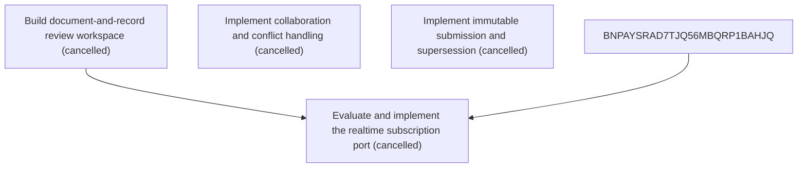

# Epic Plan: 0CVR0SEFHTXKEBZRPF89A9RBXV — Collaborative review corrections and revisions

> **Status**: `backlog` | **Target Date**: `TBD`
> **Generated**: 2026-10-07T09:20:20.437Z

---

## 1. High-Level Outcome & Goal

Provide an efficient, accessible workspace for evidence-led correction and controlled submission.

## 2. Child Stories & Work Breakdown

| Story ID | Title | Status | Priority | Estimate | Dependencies |
|:---------|:------|:-------|:---------|:---------|:-------------|
| **ASQKQ6YH4S8G6SDQ6XN7BHYM8E** | Build document-and-record review workspace | `cancelled` | critical | — | None |
| **3J2M9KAE9H8THGD2AR9DSKXYTC** | Implement collaboration and conflict handling | `cancelled` | high | — | None |
| **B1B7G0DXYE4JSEGFSC2NT8MFD1** | Implement immutable submission and supersession | `cancelled` | critical | — | None |
| **STORY-004** | Evaluate and implement the realtime subscription port | `cancelled` | medium | 1 pts | ASQKQ6YH4S8G6SDQ6XN7BHYM8E, BNPAYSRAD7TJQ56MBQRP1BAHJQ |

## 3. Dependency Structure (Mermaid DAG)

## 4. Execution Guidance for AI Agents & Engineers

1. **Task Checkout**: Request ready tasks via `skyhook get-next-task --agent <your-id> --lease 30`.
2. **State Progression**: Advance status via `skyhook update-status --storyId <ID> --status <status>`.
3. **Completion**: When all child stories are marked `done`, Epic `0CVR0SEFHTXKEBZRPF89A9RBXV` will automatically transition to `done`.

---
*Generated by Skyhook Scoped Plan Generator.*
