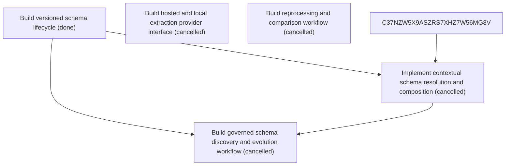

# Epic Plan: 0QDXE9R7PY4N4E743SZ1NHH6Z4 — Versioned schemas normalization and extraction providers

> **Status**: `backlog` | **Target Date**: `TBD`
> **Generated**: 2026-10-07T08:55:08.204Z

---

## 1. High-Level Outcome & Goal

Support configurable document structures and interchangeable hosted or local extraction.

## 2. Child Stories & Work Breakdown

| Story ID | Title | Status | Priority | Estimate | Dependencies |
|:---------|:------|:-------|:---------|:---------|:-------------|
| **4PJTJVE73D2MN7GT64T48S05HT** | Build versioned schema lifecycle | `done` | critical | — | None |
| **BYNGTQS6SX4FB7HQ46D9FKTJR2** | Build hosted and local extraction provider interface | `cancelled` | critical | — | None |
| **8PKADXET1MA10TAY9F6VBDYYAD** | Build reprocessing and comparison workflow | `cancelled` | high | — | None |
| **STORY-002** | Implement contextual schema resolution and composition | `cancelled` | critical | 1 pts | 4PJTJVE73D2MN7GT64T48S05HT, C37NZW5X9ASZRS7XHZ7W56MG8V |
| **STORY-003** | Build governed schema discovery and evolution workflow | `cancelled` | high | 1 pts | 4PJTJVE73D2MN7GT64T48S05HT, STORY-002 |

## 3. Dependency Structure (Mermaid DAG)

## 4. Execution Guidance for AI Agents & Engineers

1. **Task Checkout**: Request ready tasks via `skyhook get-next-task --agent <your-id> --lease 30`.
2. **State Progression**: Advance status via `skyhook update-status --storyId <ID> --status <status>`.
3. **Completion**: When all child stories are marked `done`, Epic `0QDXE9R7PY4N4E743SZ1NHH6Z4` will automatically transition to `done`.

---
*Generated by Skyhook Scoped Plan Generator.*
