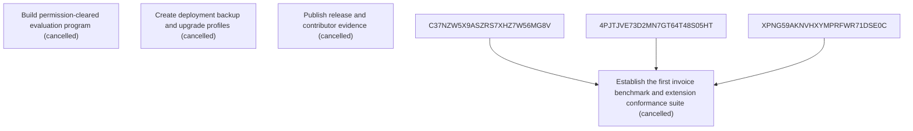

# Epic Plan: 25Y3EMKGPZBZEHKRC5STM8Z2JC — Evaluation release evidence and open-source operations

> **Status**: `backlog` | **Target Date**: `TBD`
> **Generated**: 2026-10-07T15:53:49.869Z

---

## 1. High-Level Outcome & Goal

Prove quality, portability, and maintainability with reproducible evidence and independent setup.

## 2. Child Stories & Work Breakdown

| Story ID | Title | Status | Priority | Estimate | Dependencies |
|:---------|:------|:-------|:---------|:---------|:-------------|
| **JY8T325XB4VZ2F6DZRPYY7XEHD** | Build permission-cleared evaluation program | `cancelled` | critical | — | None |
| **99JY71R6GRKG8SXDWD92357XNV** | Create deployment backup and upgrade profiles | `cancelled` | high | — | None |
| **7EGC5PWY8MQB5BKQKTR05DWBPQ** | Publish release and contributor evidence | `cancelled` | high | — | None |
| **STORY-001** | Establish the first invoice benchmark and extension conformance suite | `cancelled` | critical | 1 pts | C37NZW5X9ASZRS7XHZ7W56MG8V, 4PJTJVE73D2MN7GT64T48S05HT, XPNG59AKNVHXYMPRFWR71DSE0C |

## 3. Dependency Structure (Mermaid DAG)

## 4. Execution Guidance for AI Agents & Engineers

1. **Task Checkout**: Request ready tasks via `skyhook get-next-task --agent <your-id> --lease 30`.
2. **State Progression**: Advance status via `skyhook update-status --storyId <ID> --status <status>`.
3. **Completion**: When all child stories are marked `done`, Epic `25Y3EMKGPZBZEHKRC5STM8Z2JC` will automatically transition to `done`.

---
*Generated by Skyhook Scoped Plan Generator.*
