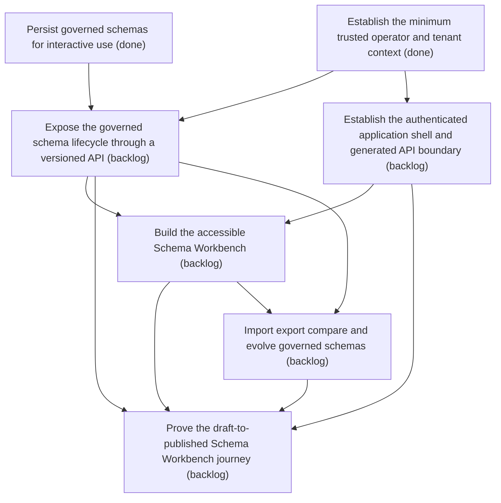

# Epic Plan: 37GEDS1AHPKD75TVFA4TGN1VD4 — Interactive Schema Workbench

> **Status**: `backlog` | **Target Date**: `TBD`
> **Generated**: 2026-10-07T15:24:22.513Z

---

## 1. High-Level Outcome & Goal

Let an administrator govern dynamic schemas through a real browser workflow.

## 2. Child Stories & Work Breakdown

| Story ID | Title | Status | Priority | Estimate | Dependencies |
|:---------|:------|:-------|:---------|:---------|:-------------|
| **0VJ9SHA39TA291D8QXB0TQS3HQ** | Persist governed schemas for interactive use | `done` | high | — | None |
| **N1ZNPJWFZYPV0MVB8FP137GRJP** | Establish the minimum trusted operator and tenant context | `done` | high | — | None |
| **X51S43NTMRW5ASYSKJBF7FW845** | Expose the governed schema lifecycle through a versioned API | `backlog` | high | — | 0VJ9SHA39TA291D8QXB0TQS3HQ, N1ZNPJWFZYPV0MVB8FP137GRJP |
| **H98W5WTJBWT8EY0Q10P3KPCEEB** | Build the accessible Schema Workbench | `backlog` | high | — | STORY-017, X51S43NTMRW5ASYSKJBF7FW845 |
| **265YM4FNANJAH2J338BKAWFXDM** | Prove the draft-to-published Schema Workbench journey | `backlog` | high | — | STORY-017, X51S43NTMRW5ASYSKJBF7FW845, H98W5WTJBWT8EY0Q10P3KPCEEB, STORY-018 |
| **STORY-017** | Establish the authenticated application shell and generated API boundary | `backlog` | critical | 8 pts | N1ZNPJWFZYPV0MVB8FP137GRJP |
| **STORY-018** | Import export compare and evolve governed schemas | `backlog` | high | 8 pts | X51S43NTMRW5ASYSKJBF7FW845, H98W5WTJBWT8EY0Q10P3KPCEEB |

## 3. Dependency Structure (Mermaid DAG)

## 4. Execution Guidance for AI Agents & Engineers

1. **Task Checkout**: Request ready tasks via `skyhook get-next-task --agent <your-id> --lease 30`.
2. **State Progression**: Advance status via `skyhook update-status --storyId <ID> --status <status>`.
3. **Completion**: When all child stories are marked `done`, Epic `37GEDS1AHPKD75TVFA4TGN1VD4` will automatically transition to `done`.

---
*Generated by Skyhook Scoped Plan Generator.*
