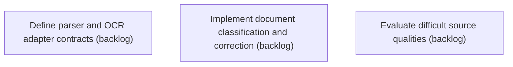

# Epic Plan: 4SW4N0JFACNY6DTXECMKEKKKYR — Parsing OCR and document classification

> **Status**: `backlog` | **Target Date**: `TBD`
> **Generated**: 2026-10-02T03:13:10.715Z

---

## 1. High-Level Outcome & Goal

Produce reliable source representations with page, layout, table, and classification context.

## 2. Child Stories & Work Breakdown

| Story ID | Title | Status | Priority | Estimate | Dependencies |
|:---------|:------|:-------|:---------|:---------|:-------------|
| **C37NZW5X9ASZRS7XHZ7W56MG8V** | Define parser and OCR adapter contracts | `backlog` | critical | — | None |
| **RXAZEMKJVJNN58W029T397M3QN** | Implement document classification and correction | `backlog` | critical | — | None |
| **1VED17WSNE77N7VVCZTXC2NAT5** | Evaluate difficult source qualities | `backlog` | high | — | None |

## 3. Dependency Structure (Mermaid DAG)

## 4. Execution Guidance for AI Agents & Engineers

1. **Task Checkout**: Request ready tasks via `skyhook get-next-task --agent <your-id> --lease 30`.
2. **State Progression**: Advance status via `skyhook update-status --storyId <ID> --status <status>`.
3. **Completion**: When all child stories are marked `done`, Epic `4SW4N0JFACNY6DTXECMKEKKKYR` will automatically transition to `done`.

---
*Generated by Skyhook Scoped Plan Generator.*
