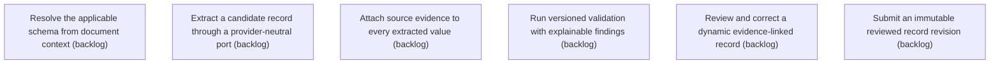

# Epic Plan: 78QQ2PHQ2E1QHQV03FFBCXYRQD — Evidence-backed Extraction and Review

> **Status**: `backlog` | **Target Date**: `TBD`
> **Generated**: 2026-10-07T09:44:12.887Z

---

## 1. High-Level Outcome & Goal

Turn a document into an evidence-linked record a reviewer can correct and submit.

## 2. Child Stories & Work Breakdown

| Story ID | Title | Status | Priority | Estimate | Dependencies |
|:---------|:------|:-------|:---------|:---------|:-------------|
| **SHF26TB4C43PC4KD2W3PRZ3R78** | Resolve the applicable schema from document context | `backlog` | high | — | None |
| **WN341EKS97VGCX76ZFR0KHX96Y** | Extract a candidate record through a provider-neutral port | `backlog` | high | — | None |
| **QM5MGN4VTK1J9CWEXMC50RM00G** | Attach source evidence to every extracted value | `backlog` | high | — | None |
| **YKQFD89QJYH87GQSMKCVQ104AK** | Run versioned validation with explainable findings | `backlog` | high | — | None |
| **MAQPX7K4Z5MD3BNT93YFJBRZR5** | Review and correct a dynamic evidence-linked record | `backlog` | high | — | None |
| **ZSHX48Q9AHPEBJCDM0DAD8ED2H** | Submit an immutable reviewed record revision | `backlog` | high | — | None |

## 3. Dependency Structure (Mermaid DAG)

## 4. Execution Guidance for AI Agents & Engineers

1. **Task Checkout**: Request ready tasks via `skyhook get-next-task --agent <your-id> --lease 30`.
2. **State Progression**: Advance status via `skyhook update-status --storyId <ID> --status <status>`.
3. **Completion**: When all child stories are marked `done`, Epic `78QQ2PHQ2E1QHQV03FFBCXYRQD` will automatically transition to `done`.

---
*Generated by Skyhook Scoped Plan Generator.*
