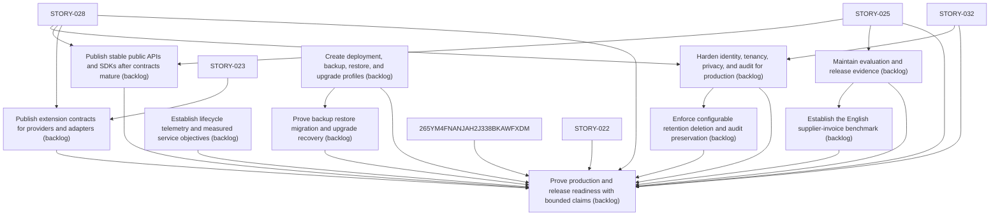

# Epic Plan: 89QP3HS2PDE09EJ9X86P5QRFWM — Production, Ecosystem, and Release Evidence

> **Status**: `backlog` | **Target Date**: `TBD`
> **Generated**: 2026-10-07T15:24:22.537Z

---

## 1. High-Level Outcome & Goal

Harden stable capabilities for deployment, integration, evaluation, and release.

## 2. Child Stories & Work Breakdown

| Story ID | Title | Status | Priority | Estimate | Dependencies |
|:---------|:------|:-------|:---------|:---------|:-------------|
| **M7ZMYQSYB6G0W2T5M7TYCCZNHH** | Harden identity, tenancy, privacy, and audit for production | `backlog` | high | — | STORY-028, STORY-032 |
| **5KENKXMX9EZDJ75R0JHJQ2KSSJ** | Publish stable public APIs and SDKs after contracts mature | `backlog` | high | — | STORY-025, STORY-028 |
| **7D8Q1STZ5VEWBSAR6W87P4DH1W** | Publish extension contracts for providers and adapters | `backlog` | high | — | STORY-023, STORY-028 |
| **ECMWWJT024W5QXBQ5G6C1YMHQQ** | Create deployment, backup, restore, and upgrade profiles | `backlog` | high | — | None |
| **4QGB75ND0XME0JVSYJN9K3PMTW** | Maintain evaluation and release evidence | `backlog` | high | — | STORY-025 |
| **STORY-033** | Enforce configurable retention deletion and audit preservation | `backlog` | critical | 13 pts | M7ZMYQSYB6G0W2T5M7TYCCZNHH |
| **STORY-034** | Establish lifecycle telemetry and measured service objectives | `backlog` | high | 8 pts | None |
| **STORY-035** | Establish the English supplier-invoice benchmark | `backlog` | critical | 13 pts | 4QGB75ND0XME0JVSYJN9K3PMTW |
| **STORY-036** | Prove backup restore migration and upgrade recovery | `backlog` | critical | 13 pts | ECMWWJT024W5QXBQ5G6C1YMHQQ |
| **STORY-037** | Prove production and release readiness with bounded claims | `backlog` | critical | 13 pts | M7ZMYQSYB6G0W2T5M7TYCCZNHH, 5KENKXMX9EZDJ75R0JHJQ2KSSJ, 7D8Q1STZ5VEWBSAR6W87P4DH1W, ECMWWJT024W5QXBQ5G6C1YMHQQ, 4QGB75ND0XME0JVSYJN9K3PMTW, STORY-033, STORY-034, STORY-035, STORY-036, 265YM4FNANJAH2J338BKAWFXDM, STORY-022, STORY-025, STORY-028, STORY-032 |

## 3. Dependency Structure (Mermaid DAG)

## 4. Execution Guidance for AI Agents & Engineers

1. **Task Checkout**: Request ready tasks via `skyhook get-next-task --agent <your-id> --lease 30`.
2. **State Progression**: Advance status via `skyhook update-status --storyId <ID> --status <status>`.
3. **Completion**: When all child stories are marked `done`, Epic `89QP3HS2PDE09EJ9X86P5QRFWM` will automatically transition to `done`.

---
*Generated by Skyhook Scoped Plan Generator.*
