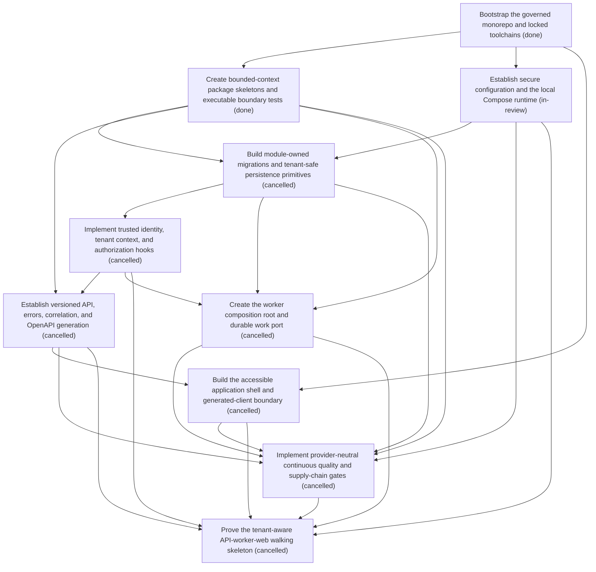

# Epic Plan: CG7VFRWAF177CMZK333E19YND1 — Executable platform foundation

> **Status**: `backlog` | **Target Date**: `TBD`
> **Generated**: 2026-10-07T16:00:34.426Z

---

## 1. High-Level Outcome & Goal

Produce a locally runnable, tested, tenant-aware API, worker, and web walking skeleton whose architecture, contracts, migrations, and quality gates are executable rather than documentary.

## 2. Child Stories & Work Breakdown

| Story ID | Title | Status | Priority | Estimate | Dependencies |
|:---------|:------|:-------|:---------|:---------|:-------------|
| **STORY-007** | Bootstrap the governed monorepo and locked toolchains | `done` | critical | 5 pts | None |
| **STORY-008** | Create bounded-context package skeletons and executable boundary tests | `done` | critical | 5 pts | STORY-007 |
| **STORY-009** | Establish secure configuration and the local Compose runtime | `in-review` | critical | 5 pts | STORY-007 |
| **STORY-010** | Build module-owned migrations and tenant-safe persistence primitives | `cancelled` | critical | 8 pts | STORY-008, STORY-009 |
| **STORY-011** | Implement trusted identity, tenant context, and authorization hooks | `cancelled` | critical | 8 pts | STORY-010 |
| **STORY-012** | Establish versioned API, errors, correlation, and OpenAPI generation | `cancelled` | critical | 5 pts | STORY-008, STORY-011 |
| **STORY-013** | Build the accessible application shell and generated-client boundary | `cancelled` | high | 5 pts | STORY-007, STORY-012 |
| **STORY-014** | Create the worker composition root and durable work port | `cancelled` | critical | 5 pts | STORY-008, STORY-010, STORY-011 |
| **STORY-015** | Implement provider-neutral continuous quality and supply-chain gates | `cancelled` | critical | 8 pts | STORY-008, STORY-009, STORY-010, STORY-012, STORY-013, STORY-014 |
| **STORY-016** | Prove the tenant-aware API-worker-web walking skeleton | `cancelled` | critical | 5 pts | STORY-009, STORY-011, STORY-012, STORY-013, STORY-014, STORY-015 |

## 3. Dependency Structure (Mermaid DAG)

## 4. Execution Guidance for AI Agents & Engineers

1. **Task Checkout**: Request ready tasks via `skyhook get-next-task --agent <your-id> --lease 30`.
2. **State Progression**: Advance status via `skyhook update-status --storyId <ID> --status <status>`.
3. **Completion**: When all child stories are marked `done`, Epic `CG7VFRWAF177CMZK333E19YND1` will automatically transition to `done`.

---
*Generated by Skyhook Scoped Plan Generator.*
