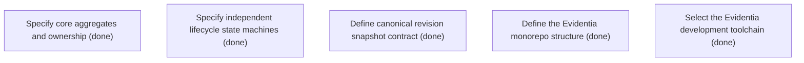

# Epic Plan: CP8QDFDKKC659SR1GFMDBPCHG6 — Domain contracts and lifecycle foundations

> **Status**: `done` | **Target Date**: `TBD`
> **Generated**: 2026-10-07T16:00:34.313Z

---

## 1. High-Level Outcome & Goal

Establish the complete document-to-delivery domain model and its independent state machines.

## 2. Child Stories & Work Breakdown

| Story ID | Title | Status | Priority | Estimate | Dependencies |
|:---------|:------|:-------|:---------|:---------|:-------------|
| **3JVEA7J60SSVDTK16VMMW1R6CY** | Specify core aggregates and ownership | `done` | critical | — | None |
| **HYFDZB6CJS5YV2KZ216C77VD3H** | Specify independent lifecycle state machines | `done` | critical | — | None |
| **HKDJB0N3JTKZ2RRFRP5PT70PF9** | Define canonical revision snapshot contract | `done` | critical | — | None |
| **STORY-005** | Define the Evidentia monorepo structure | `done` | critical | 1 pts | None |
| **STORY-006** | Select the Evidentia development toolchain | `done` | critical | 1 pts | None |

## 3. Dependency Structure (Mermaid DAG)

## 4. Execution Guidance for AI Agents & Engineers

1. **Task Checkout**: Request ready tasks via `skyhook get-next-task --agent <your-id> --lease 30`.
2. **State Progression**: Advance status via `skyhook update-status --storyId <ID> --status <status>`.
3. **Completion**: When all child stories are marked `done`, Epic `CP8QDFDKKC659SR1GFMDBPCHG6` will automatically transition to `done`.

---
*Generated by Skyhook Scoped Plan Generator.*
