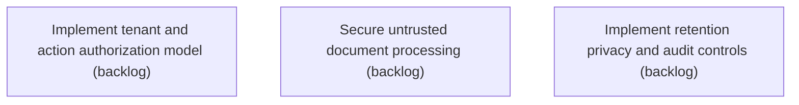

# Epic Plan: DGKPHK7KW42128GM4XAZMKN7WF — Identity tenant security and privacy controls

> **Status**: `backlog` | **Target Date**: `TBD`
> **Generated**: 2026-10-02T03:13:10.725Z

---

## 1. High-Level Outcome & Goal

Protect documents and records across users, clients, workers, and integrations.

## 2. Child Stories & Work Breakdown

| Story ID | Title | Status | Priority | Estimate | Dependencies |
|:---------|:------|:-------|:---------|:---------|:-------------|
| **J53MR4BTE1N2XJHRYXHV4Z87JG** | Implement tenant and action authorization model | `backlog` | critical | — | None |
| **36P0MN74XTPQ943H6EVXGDX1WE** | Secure untrusted document processing | `backlog` | critical | — | None |
| **00B1KJ2YM4P1PBKNQTM3AWSPSP** | Implement retention privacy and audit controls | `backlog` | high | — | None |

## 3. Dependency Structure (Mermaid DAG)

## 4. Execution Guidance for AI Agents & Engineers

1. **Task Checkout**: Request ready tasks via `skyhook get-next-task --agent <your-id> --lease 30`.
2. **State Progression**: Advance status via `skyhook update-status --storyId <ID> --status <status>`.
3. **Completion**: When all child stories are marked `done`, Epic `DGKPHK7KW42128GM4XAZMKN7WF` will automatically transition to `done`.

---
*Generated by Skyhook Scoped Plan Generator.*
