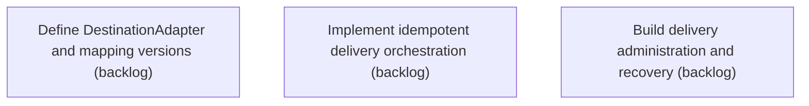

# Epic Plan: EFY7ZB4SPHCZ2ENT9CC2JE72RH — Authorized delivery and destination integrations

> **Status**: `backlog` | **Target Date**: `TBD`
> **Generated**: 2026-10-02T03:13:10.722Z

---

## 1. High-Level Outcome & Goal

Deliver the authorized revision safely and independently of approval status.

## 2. Child Stories & Work Breakdown

| Story ID | Title | Status | Priority | Estimate | Dependencies |
|:---------|:------|:-------|:---------|:---------|:-------------|
| **FK5B70RZFH4QSTW7Y02R1D3E1N** | Define DestinationAdapter and mapping versions | `backlog` | critical | — | None |
| **XRS5S2GBBCPV9Q9CCN2DXBJ2G3** | Implement idempotent delivery orchestration | `backlog` | critical | — | None |
| **0C4PR416ZZ5WCA73DMBZFK87CY** | Build delivery administration and recovery | `backlog` | high | — | None |

## 3. Dependency Structure (Mermaid DAG)

## 4. Execution Guidance for AI Agents & Engineers

1. **Task Checkout**: Request ready tasks via `skyhook get-next-task --agent <your-id> --lease 30`.
2. **State Progression**: Advance status via `skyhook update-status --storyId <ID> --status <status>`.
3. **Completion**: When all child stories are marked `done`, Epic `EFY7ZB4SPHCZ2ENT9CC2JE72RH` will automatically transition to `done`.

---
*Generated by Skyhook Scoped Plan Generator.*
