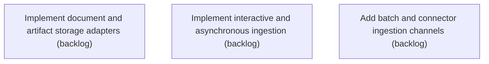

# Epic Plan: ESXRMFV8AMRPA4EM9907RP91G0 — Document ingestion and durable storage

> **Status**: `backlog` | **Target Date**: `TBD`
> **Generated**: 2026-10-02T03:13:10.714Z

---

## 1. High-Level Outcome & Goal

Receive, identify, preserve, secure, and queue documents from all supported ingestion channels.

## 2. Child Stories & Work Breakdown

| Story ID | Title | Status | Priority | Estimate | Dependencies |
|:---------|:------|:-------|:---------|:---------|:-------------|
| **KMC5EK26PXNT868PT6W97RX06A** | Implement document and artifact storage adapters | `backlog` | critical | — | None |
| **D86X3Q727TBSXDQX5NRNNZEB63** | Implement interactive and asynchronous ingestion | `backlog` | critical | — | None |
| **HFVVS2GASHC8W7HEMCW9VMP0TB** | Add batch and connector ingestion channels | `backlog` | high | — | None |

## 3. Dependency Structure (Mermaid DAG)

## 4. Execution Guidance for AI Agents & Engineers

1. **Task Checkout**: Request ready tasks via `skyhook get-next-task --agent <your-id> --lease 30`.
2. **State Progression**: Advance status via `skyhook update-status --storyId <ID> --status <status>`.
3. **Completion**: When all child stories are marked `done`, Epic `ESXRMFV8AMRPA4EM9907RP91G0` will automatically transition to `done`.

---
*Generated by Skyhook Scoped Plan Generator.*
