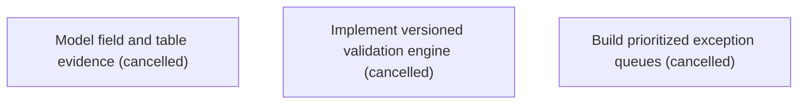

# Epic Plan: G2T8V1PT0VBT62KQZX322TK77E — Source evidence validation and exception handling

> **Status**: `backlog` | **Target Date**: `TBD`
> **Generated**: 2026-10-07T16:00:34.345Z

---

## 1. High-Level Outcome & Goal

Make every important value inspectable and every validation outcome explainable.

## 2. Child Stories & Work Breakdown

| Story ID | Title | Status | Priority | Estimate | Dependencies |
|:---------|:------|:-------|:---------|:---------|:-------------|
| **XPNG59AKNVHXYMPRFWR71DSE0C** | Model field and table evidence | `cancelled` | critical | — | None |
| **06SRF2HBM8APTGA5RP2D9XS3JP** | Implement versioned validation engine | `cancelled` | critical | — | None |
| **WJN4QJFCJQ98V9Q35KDDVW0HGN** | Build prioritized exception queues | `cancelled` | high | — | None |

## 3. Dependency Structure (Mermaid DAG)

## 4. Execution Guidance for AI Agents & Engineers

1. **Task Checkout**: Request ready tasks via `skyhook get-next-task --agent <your-id> --lease 30`.
2. **State Progression**: Advance status via `skyhook update-status --storyId <ID> --status <status>`.
3. **Completion**: When all child stories are marked `done`, Epic `G2T8V1PT0VBT62KQZX322TK77E` will automatically transition to `done`.

---
*Generated by Skyhook Scoped Plan Generator.*
