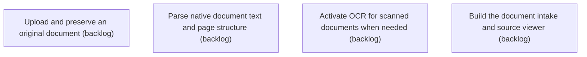

# Epic Plan: JA6EY894YZ69F5JN40GG143M2S — Document Intake and Source Viewer

> **Status**: `backlog` | **Target Date**: `TBD`
> **Generated**: 2026-10-07T09:20:20.469Z

---

## 1. High-Level Outcome & Goal

Let a user upload, preserve, process, and inspect a document.

## 2. Child Stories & Work Breakdown

| Story ID | Title | Status | Priority | Estimate | Dependencies |
|:---------|:------|:-------|:---------|:---------|:-------------|
| **XRSZ0A5WZEQB0PQYD34PYR8EW3** | Upload and preserve an original document | `backlog` | high | — | None |
| **J2ZHMCR2DNQSHD1VZY7CECT2HT** | Parse native document text and page structure | `backlog` | high | — | None |
| **9M4MDW7FN1SGECW2X23WF01501** | Activate OCR for scanned documents when needed | `backlog` | high | — | None |
| **AN2RM9JX2PBR6J1NQ1KSHBYHSQ** | Build the document intake and source viewer | `backlog` | high | — | None |

## 3. Dependency Structure (Mermaid DAG)

## 4. Execution Guidance for AI Agents & Engineers

1. **Task Checkout**: Request ready tasks via `skyhook get-next-task --agent <your-id> --lease 30`.
2. **State Progression**: Advance status via `skyhook update-status --storyId <ID> --status <status>`.
3. **Completion**: When all child stories are marked `done`, Epic `JA6EY894YZ69F5JN40GG143M2S` will automatically transition to `done`.

---
*Generated by Skyhook Scoped Plan Generator.*
