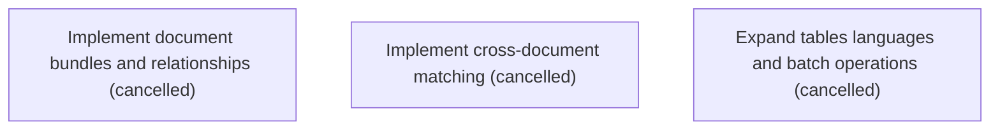

# Epic Plan: JF0TVVT32B765KVE6X97AVP3P9 — Bundles matching batches and advanced document capabilities

> **Status**: `backlog` | **Target Date**: `TBD`
> **Generated**: 2026-10-07T16:00:34.378Z

---

## 1. High-Level Outcome & Goal

Support complex operational workloads across related documents, languages, and large queues.

## 2. Child Stories & Work Breakdown

| Story ID | Title | Status | Priority | Estimate | Dependencies |
|:---------|:------|:-------|:---------|:---------|:-------------|
| **GAAPXNG7SK2X48CW2GDDG7MJ06** | Implement document bundles and relationships | `cancelled` | high | — | None |
| **KYSVD7PWKX5ZAZW4FN67NXA26E** | Implement cross-document matching | `cancelled` | high | — | None |
| **5DGKC77RV9C2GWTKWK49788S1B** | Expand tables languages and batch operations | `cancelled` | medium | — | None |

## 3. Dependency Structure (Mermaid DAG)

## 4. Execution Guidance for AI Agents & Engineers

1. **Task Checkout**: Request ready tasks via `skyhook get-next-task --agent <your-id> --lease 30`.
2. **State Progression**: Advance status via `skyhook update-status --storyId <ID> --status <status>`.
3. **Completion**: When all child stories are marked `done`, Epic `JF0TVVT32B765KVE6X97AVP3P9` will automatically transition to `done`.

---
*Generated by Skyhook Scoped Plan Generator.*
