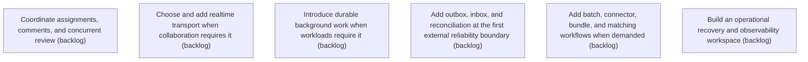

# Epic Plan: MGTBBJH7794WRYSFBFE6ZYWXCV — Collaboration and Operational Scale

> **Status**: `backlog` | **Target Date**: `TBD`
> **Generated**: 2026-10-03T11:45:38.146Z

---

## 1. High-Level Outcome & Goal

Support teams, larger workloads, and safe recovery when usage requires them.

## 2. Child Stories & Work Breakdown

| Story ID | Title | Status | Priority | Estimate | Dependencies |
|:---------|:------|:-------|:---------|:---------|:-------------|
| **2BJ99DB0QWS3FE3J0F50N6EPW4** | Coordinate assignments, comments, and concurrent review | `backlog` | high | — | None |
| **AV6YSSGTH46ET6J9NN0DDK7E6B** | Choose and add realtime transport when collaboration requires it | `backlog` | high | — | None |
| **C29D8MCQWYGWY6FFSP4YW7MNX7** | Introduce durable background work when workloads require it | `backlog` | high | — | None |
| **3F1QK0FAD4X03Q4CB5XKDC1BJH** | Add outbox, inbox, and reconciliation at the first external reliability boundary | `backlog` | high | — | None |
| **44E3PFDX5EVQE4FRTAN1A5RMGC** | Add batch, connector, bundle, and matching workflows when demanded | `backlog` | high | — | None |
| **PEE73AVQEAC75HKDMA3FA1S4YJ** | Build an operational recovery and observability workspace | `backlog` | high | — | None |

## 3. Dependency Structure (Mermaid DAG)

## 4. Execution Guidance for AI Agents & Engineers

1. **Task Checkout**: Request ready tasks via `skyhook get-next-task --agent <your-id> --lease 30`.
2. **State Progression**: Advance status via `skyhook update-status --storyId <ID> --status <status>`.
3. **Completion**: When all child stories are marked `done`, Epic `MGTBBJH7794WRYSFBFE6ZYWXCV` will automatically transition to `done`.

---
*Generated by Skyhook Scoped Plan Generator.*
