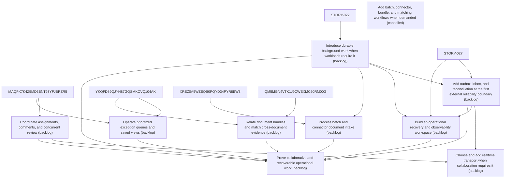

# Epic Plan: MGTBBJH7794WRYSFBFE6ZYWXCV — Collaboration and Operational Scale

> **Status**: `backlog` | **Target Date**: `TBD`
> **Generated**: 2026-10-08T07:27:11.541Z

---

## 1. High-Level Outcome & Goal

Support teams, larger workloads, and safe recovery when usage requires them.

## 2. Child Stories & Work Breakdown

| Story ID | Title | Status | Priority | Estimate | Dependencies |
|:---------|:------|:-------|:---------|:---------|:-------------|
| **2BJ99DB0QWS3FE3J0F50N6EPW4** | Coordinate assignments, comments, and concurrent review | `backlog` | high | — | MAQPX7K4Z5MD3BNT93YFJBRZR5 |
| **AV6YSSGTH46ET6J9NN0DDK7E6B** | Choose and add realtime transport when collaboration requires it | `backlog` | high | — | 2BJ99DB0QWS3FE3J0F50N6EPW4, 3F1QK0FAD4X03Q4CB5XKDC1BJH |
| **C29D8MCQWYGWY6FFSP4YW7MNX7** | Introduce durable background work when workloads require it | `backlog` | high | — | STORY-022 |
| **3F1QK0FAD4X03Q4CB5XKDC1BJH** | Add outbox, inbox, and reconciliation at the first external reliability boundary | `backlog` | high | — | C29D8MCQWYGWY6FFSP4YW7MNX7, STORY-027 |
| **44E3PFDX5EVQE4FRTAN1A5RMGC** | Add batch, connector, bundle, and matching workflows when demanded | `cancelled` | high | — | None |
| **PEE73AVQEAC75HKDMA3FA1S4YJ** | Build an operational recovery and observability workspace | `backlog` | high | — | C29D8MCQWYGWY6FFSP4YW7MNX7, 3F1QK0FAD4X03Q4CB5XKDC1BJH, STORY-027 |
| **STORY-029** | Operate prioritized exception queues and saved views | `backlog` | high | 8 pts | YKQFD89QJYH87GQSMKCVQ104AK, MAQPX7K4Z5MD3BNT93YFJBRZR5 |
| **STORY-030** | Process batch and connector document intake | `backlog` | high | 13 pts | C29D8MCQWYGWY6FFSP4YW7MNX7, XRSZ0A5WZEQB0PQYD34PYR8EW3 |
| **STORY-031** | Relate document bundles and match cross-document evidence | `backlog` | high | 13 pts | QM5MGN4VTK1J9CWEXMC50RM00G, YKQFD89QJYH87GQSMKCVQ104AK |
| **STORY-032** | Prove collaborative and recoverable operational work | `backlog` | high | 13 pts | 2BJ99DB0QWS3FE3J0F50N6EPW4, PEE73AVQEAC75HKDMA3FA1S4YJ, STORY-029, STORY-030, STORY-031, C29D8MCQWYGWY6FFSP4YW7MNX7, 3F1QK0FAD4X03Q4CB5XKDC1BJH |

## 3. Dependency Structure (Mermaid DAG)

## 4. Execution Guidance for AI Agents & Engineers

1. **Task Checkout**: Request ready tasks via `skyhook get-next-task --agent <your-id> --lease 30`.
2. **State Progression**: Advance status via `skyhook update-status --storyId <ID> --status <status>`.
3. **Completion**: When all child stories are marked `done`, Epic `MGTBBJH7794WRYSFBFE6ZYWXCV` will automatically transition to `done`.

---
*Generated by Skyhook Scoped Plan Generator.*
