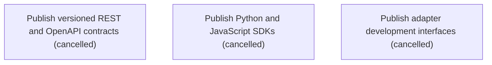

# Epic Plan: MNJPP3JA9GHKAMKNAT0H3DSVR2 — Public API SDKs and extension ecosystem

> **Status**: `backlog` | **Target Date**: `TBD`
> **Generated**: 2026-10-03T16:57:40.928Z

---

## 1. High-Level Outcome & Goal

Make every core workflow integrable through stable contracts and supported extension points.

## 2. Child Stories & Work Breakdown

| Story ID | Title | Status | Priority | Estimate | Dependencies |
|:---------|:------|:-------|:---------|:---------|:-------------|
| **75J1CS4ZFVG3RSXH2GDF7W82ME** | Publish versioned REST and OpenAPI contracts | `cancelled` | critical | — | None |
| **89ZWE45CMH2MKH116P992C3BDS** | Publish Python and JavaScript SDKs | `cancelled` | high | — | None |
| **NGSBE5Q1QVXJG649C8FQ7JM41Y** | Publish adapter development interfaces | `cancelled` | high | — | None |

## 3. Dependency Structure (Mermaid DAG)

## 4. Execution Guidance for AI Agents & Engineers

1. **Task Checkout**: Request ready tasks via `skyhook get-next-task --agent <your-id> --lease 30`.
2. **State Progression**: Advance status via `skyhook update-status --storyId <ID> --status <status>`.
3. **Completion**: When all child stories are marked `done`, Epic `MNJPP3JA9GHKAMKNAT0H3DSVR2` will automatically transition to `done`.

---
*Generated by Skyhook Scoped Plan Generator.*
