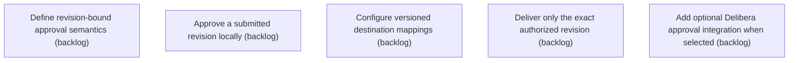

# Epic Plan: NNEY4EH15NKW1PZK4G75T8CJ99 — Approval and Authorized Delivery

> **Status**: `backlog` | **Target Date**: `TBD`
> **Generated**: 2026-10-07T08:56:29.862Z

---

## 1. High-Level Outcome & Goal

Approve and deliver only an exact immutable revision.

## 2. Child Stories & Work Breakdown

| Story ID | Title | Status | Priority | Estimate | Dependencies |
|:---------|:------|:-------|:---------|:---------|:-------------|
| **ACCCV50MZW87EEEPS6Y1HXGNAZ** | Define revision-bound approval semantics | `backlog` | high | — | None |
| **7GZK6H8HR3XKPQ94Q89N85WH0Q** | Approve a submitted revision locally | `backlog` | high | — | None |
| **1A43QS6QGZ4YWH5FG25XZWYEH2** | Configure versioned destination mappings | `backlog` | high | — | None |
| **CDSSWKJ0X91XHKD7X3Q8XHXKE5** | Deliver only the exact authorized revision | `backlog` | high | — | None |
| **R26DFKYKFWHH981YK1QJEM18WN** | Add optional Delibera approval integration when selected | `backlog` | high | — | None |

## 3. Dependency Structure (Mermaid DAG)

## 4. Execution Guidance for AI Agents & Engineers

1. **Task Checkout**: Request ready tasks via `skyhook get-next-task --agent <your-id> --lease 30`.
2. **State Progression**: Advance status via `skyhook update-status --storyId <ID> --status <status>`.
3. **Completion**: When all child stories are marked `done`, Epic `NNEY4EH15NKW1PZK4G75T8CJ99` will automatically transition to `done`.

---
*Generated by Skyhook Scoped Plan Generator.*
