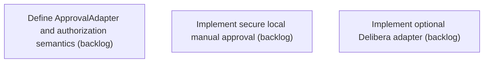

# Epic Plan: WABR3N79SKBQ915Y0KCN0HVK7S — Authorization framework and optional Delibera integration

> **Status**: `backlog` | **Target Date**: `TBD`
> **Generated**: 2026-10-02T03:13:10.720Z

---

## 1. High-Level Outcome & Goal

Bind authorization to exact revisions while preserving independent Evidentia operation.

## 2. Child Stories & Work Breakdown

| Story ID | Title | Status | Priority | Estimate | Dependencies |
|:---------|:------|:-------|:---------|:---------|:-------------|
| **Q2840JNY2G50TCZHWY7MWRBKHT** | Define ApprovalAdapter and authorization semantics | `backlog` | critical | — | None |
| **NWMGM72BETT2BVW6DPW6APQCGR** | Implement secure local manual approval | `backlog` | critical | — | None |
| **0P37MDJCQKH1STANM151Q81NHH** | Implement optional Delibera adapter | `backlog` | high | — | None |

## 3. Dependency Structure (Mermaid DAG)

## 4. Execution Guidance for AI Agents & Engineers

1. **Task Checkout**: Request ready tasks via `skyhook get-next-task --agent <your-id> --lease 30`.
2. **State Progression**: Advance status via `skyhook update-status --storyId <ID> --status <status>`.
3. **Completion**: When all child stories are marked `done`, Epic `WABR3N79SKBQ915Y0KCN0HVK7S` will automatically transition to `done`.

---
*Generated by Skyhook Scoped Plan Generator.*
