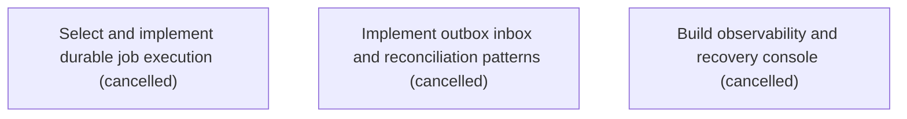

# Epic Plan: X9Q94XQS20PNPHN9F0WAFB042Z — Durable jobs observability and operational recovery

> **Status**: `backlog` | **Target Date**: `TBD`
> **Generated**: 2026-10-07T09:21:50.818Z

---

## 1. High-Level Outcome & Goal

Make asynchronous processing and integrations diagnosable and recoverable under failure.

## 2. Child Stories & Work Breakdown

| Story ID | Title | Status | Priority | Estimate | Dependencies |
|:---------|:------|:-------|:---------|:---------|:-------------|
| **DC2ZQWDS83EVZ95JRJERYN90RP** | Select and implement durable job execution | `cancelled` | critical | — | None |
| **BNPAYSRAD7TJQ56MBQRP1BAHJQ** | Implement outbox inbox and reconciliation patterns | `cancelled` | critical | — | None |
| **WKW6R599VZYZS7J7V8MXGDXWZX** | Build observability and recovery console | `cancelled` | high | — | None |

## 3. Dependency Structure (Mermaid DAG)

## 4. Execution Guidance for AI Agents & Engineers

1. **Task Checkout**: Request ready tasks via `skyhook get-next-task --agent <your-id> --lease 30`.
2. **State Progression**: Advance status via `skyhook update-status --storyId <ID> --status <status>`.
3. **Completion**: When all child stories are marked `done`, Epic `X9Q94XQS20PNPHN9F0WAFB042Z` will automatically transition to `done`.

---
*Generated by Skyhook Scoped Plan Generator.*
