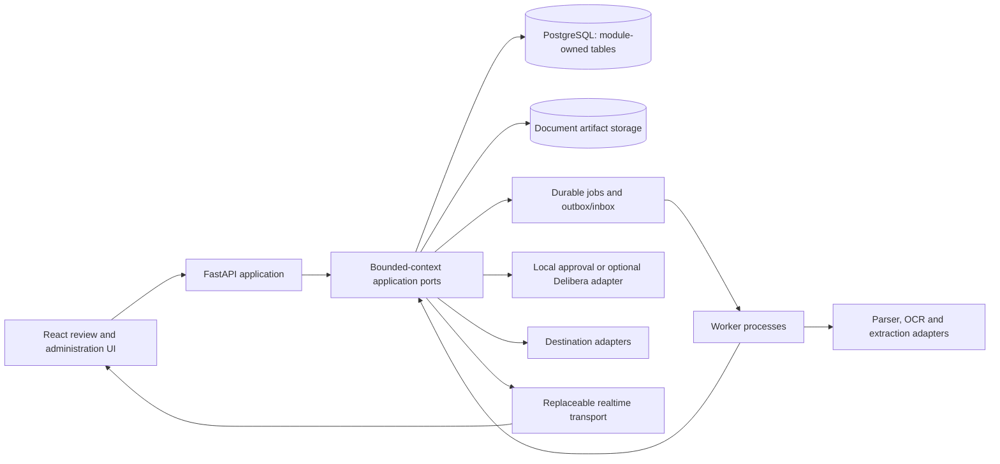

# Evidentia Domain Boundaries

Status: Accepted  
Skyhook story: `3JVEA7J60SSVDTK16VMMW1R6CY`  
Related requirements: `REQ-001`–`REQ-018`, `NFR-001`–`NFR-009`, `CON-001`–`CON-005`

## Purpose

Evidentia is a modular monolith with separately runnable API and worker processes. This document defines its bounded contexts, aggregate ownership, allowed collaboration paths, and invariants. It is intended to prevent a convenient shared database or shared Python package from turning into an unstructured monolith.

## Runtime topology

- The React application communicates only through versioned public API and realtime contracts.
- The FastAPI process authenticates requests and invokes module application ports.
- Worker processes invoke the same module application ports for durable jobs and event handling.
- Modules share a PostgreSQL deployment initially but own separate tables, repositories, and migrations.
- Original and derived document artifacts are accessed through storage ports with local-filesystem and S3-compatible adapters.
- Parsing, OCR, inference, identity, approval, realtime, and destination providers are infrastructure adapters.
- PostgreSQL and module-owned durable state are authoritative. Caches, search indexes, and realtime messages are projections.

## Bounded contexts and aggregate ownership

### 1. Access and Tenancy

Owns:

- `Tenant`
- `Membership`
- `RoleBinding`
- `ServiceClient`
- `IdentityMapping`
- tenant security and authentication configuration

Responsibilities:

- Resolve trusted tenant and actor context from local authentication, service credentials, or OIDC mappings.
- Evaluate action permissions and separation-of-duties rules.
- Provision single-tenant and multi-tenant deployments through the same domain model.

Does not own documents, workflow assignments, approval decisions, or provider credentials belonging to another module.

### 2. Documents

Owns:

- `Document`
- `DocumentArtifact`
- `IngestionReceipt`
- `DuplicateCandidate`
- `DocumentBundle`
- document-to-document relationships

Responsibilities:

- Preserve original bytes, checksum, source metadata, receipt time, detected type, limits, and retention state.
- Distinguish originals from derived text, page images, OCR output, and previews.
- Control authorized artifact access through storage ports.

The original artifact is immutable. Derived artifacts never replace it.

### 3. Schema Registry

Owns:

- `SchemaDefinition`
- immutable `SchemaVersion`
- `SchemaModule`
- `SchemaResolutionPolicy`
- `SchemaDraft`
- `UnmappedFieldCandidate`

Responsibilities:

- Define dynamic typed fields, nested structures, tables, evidence expectations, normalization, and applicable rules.
- Deterministically select or compose published schema modules from governed context.
- Evaluate and publish schema drafts without reinterpreting historical records.

Only published immutable schema versions may govern authoritative records.

### 4. Processing

Owns:

- `ProcessingJob`
- `ParseRun`
- `ClassificationRun`
- `ExtractionRun`
- `ProviderConfiguration`
- processing attempt and resource-usage history

Responsibilities:

- Coordinate parsing, OCR, classification, extraction, retry, fallback, cancellation, and reprocessing.
- Invoke provider adapters without granting document content tool authority.
- Produce immutable candidate results tied to document, schema, parser, provider, model, prompt, and attempt versions.

Processing never overwrites a record revision or silently adopts a reprocessed result.

### 5. Record Lifecycle

Owns:

- `Record`
- immutable `RecordRevision`
- `FieldValue`
- `EvidenceReference`
- `Correction`
- `RevisionSnapshot`
- canonical material-content hash

Responsibilities:

- Convert candidate extraction results and human corrections into typed record revisions.
- Preserve value origin, source representation, normalized representation, evidence, author, parent revision, and schema version.
- Produce canonical immutable snapshots for authorization and delivery.

Submitted or superseded revisions cannot be edited. Reprocessing, correction, or schema change creates a new proposed revision.

### 6. Validation

Owns:

- `RuleDefinition`
- immutable `RuleVersion`
- `ValidationRun`
- `Finding`
- `FindingOverride`

Responsibilities:

- Evaluate structural, arithmetic, business, duplicate, and cross-document rules against an immutable record revision and versioned context.
- Distinguish blocking errors from advisory warnings.
- Record authorized overrides with actor, reason, affected finding, and resulting revision.

Validation reports facts and policy outcomes; it never modifies record values to make them pass.

### 7. Review

Owns:

- `ReviewAssignment`
- `DraftWorkspace`
- `CommentThread`
- review queue, saved-filter, and handoff configuration

Responsibilities:

- Coordinate evidence-led review, draft preservation, assignments, comments, keyboard workflows, and conflict detection.
- Request new record revisions through the Record Lifecycle public port.
- Present findings through Validation read contracts.

Review does not mutate persisted record revisions or grant business authorization.

### 8. Authorization

Owns:

- `ApprovalSubmission`
- local `ApprovalRequest`
- local `ApprovalDecision`
- `AuthorizationGrant`
- adapter request, callback, reconciliation, expiry, cancellation, and revocation state

Responsibilities:

- Bind authorization to an exact tenant, record revision, canonical content hash, action, material scope, destination context, and policy reference.
- Provide secure local/manual approval.
- Integrate optionally with Delibera through `ApprovalAdapter`.

Authorization never changes record content. An unavailable external adapter leaves work waiting and never triggers silent fallback.

### 9. Delivery

Owns:

- `DestinationConfiguration`
- immutable `MappingVersion`
- `DeliveryOperation`
- `DeliveryAttempt`
- destination reconciliation state

Responsibilities:

- Revalidate authorization immediately before delivering an exact record revision.
- Invoke destination adapters with stable operation identities and versioned mappings.
- Track retry, ambiguous outcome, reconciliation, completion, and failure independently of approval.

Delivery cannot select a different revision from the one authorized and cannot infer approval from workflow state.

### 10. Operations

Owns:

- durable job leases and attempts
- module outbox messages and inbox receipts
- `AuditEvent`
- operational dead-letter and reconciliation records
- health, readiness, quota, and recovery projections

Responsibilities:

- Provide reusable durable execution, deduplication, event envelopes, correlation, metrics, and operator recovery capabilities.
- Invoke business operations only through the owning module's public application port.

Operations infrastructure does not make domain decisions or mutate another module's tables.

### 11. Evaluation

Owns:

- `EvaluationDataset`
- `EvaluationFixture`
- `GroundTruthAnnotation`
- `EvaluationRun`
- `MetricResult`
- benchmark and release-evidence reports

Responsibilities:

- Evaluate parsing, extraction, evidence, tables, languages, latency, cost, and correction effort reproducibly.
- Preserve permission and provenance for every fixture.
- Compare versioned providers, prompts, schemas, rules, and configurations.

Production documents or corrections enter an evaluation dataset only through explicit permission-controlled workflows.

## Shared kernel

The shared kernel is intentionally small and contains value types and protocol primitives only:

- tenant-scoped opaque identifiers
- `TenantId` and `ActorRef`
- UTC instants and durations
- fixed-precision decimal and currency primitives
- correlation and idempotency keys
- versioned event-envelope metadata
- stable application error categories

It contains no business entities, repositories, ORM models, workflow services, provider clients, or module-specific enums.

## Allowed collaboration

| Caller           | Allowed dependency                                                        |
| ---------------- | ------------------------------------------------------------------------- |
| Processing       | Documents and Schema Registry public ports or immutable snapshots         |
| Record Lifecycle | Published schema snapshots and accepted processing candidates             |
| Validation       | Immutable record, schema, rule, and external-context snapshots            |
| Review           | Documents, Record Lifecycle, and Validation public application/read ports |
| Authorization    | Immutable record snapshots plus Access and Tenancy permission checks      |
| Delivery         | Authorization verification plus immutable record snapshots                |
| Operations       | Public application ports and versioned events from every module           |
| Evaluation       | Permission-controlled snapshots and adapter contracts                     |

Access and Tenancy is consulted at application boundaries. Domain modules carry trusted tenant and actor value types but do not import identity-provider or session implementations.

## Forbidden dependencies

- No module imports another module's domain internals, ORM models, repositories, or migration code.
- No module directly queries or writes another module's tables.
- No cross-module ORM relationships or convenience joins.
- No cyclic module imports.
- Domain code does not import FastAPI, worker frameworks, provider SDKs, database clients, object storage clients, or realtime transports.
- API routes and worker handlers do not implement domain rules; they authenticate, validate transport data, and invoke application ports.
- Adapters do not bypass application ports to mutate domain persistence.
- Realtime messages, caches, search indexes, and read projections are never authoritative.
- Delibera and destinations are never accessed through their databases.

## Cross-module consistency

- A transaction modifies state owned by one module.
- The owning module records durable outbound events in the same local transaction.
- Consumers deduplicate through inbox records and apply idempotent handlers.
- Multi-module workflows persist explicit orchestration state and compensate or reconcile failures; they do not use distributed database transactions.
- Synchronous calls are reserved for checks that require an immediate answer and do not create circular ownership.
- Events carry opaque identifiers, versions, and minimal immutable facts rather than another module's mutable entity model.

## Forbidden aggregate transitions

- A stored original document cannot be replaced by a derived artifact or later upload.
- A published schema, schema module, rule version, or destination mapping cannot be edited in place.
- A processing or extraction run cannot overwrite another run or directly replace an accepted record revision.
- A submitted, authorized, rejected, superseded, or delivered record revision cannot return to an editable draft state.
- A correction cannot mutate its parent revision; it contributes to a new revision.
- A validation finding cannot rewrite a field value or invent a balancing adjustment.
- A review action cannot create an authorization grant or delivery outcome.
- An authorization decision cannot be rebound to another revision, tenant, material hash, action, or destination scope.
- An external approval failure cannot transition to local approval unless an authorized administrator explicitly cancels or replaces the outstanding workflow under defined rules.
- A rejected, expired, cancelled, revoked, mismatched, or unverified authorization cannot transition into deliverable authority.
- A delivery operation cannot substitute a newer or older record revision for the authorized revision.
- An ambiguous destination outcome cannot transition directly to retry without reconciliation or destination-safe deduplication.
- An operations, projection, cache, search, or realtime component cannot transition authoritative business state except by invoking the owning module's application port.
- Production material cannot transition into an evaluation or training dataset without explicit permission and provenance.

## Tenant and authorization invariants

- Tenant identity comes from trusted authentication or persisted job context, never solely from a request field.
- Every aggregate, artifact, job, event, credential, cache key, and integration configuration preserves tenant scope.
- Cross-tenant references fail before domain state changes.
- Application permission checks are mandatory even when PostgreSQL row-level security is enabled.
- Background and reconciliation jobs re-establish tenant and actor/system context before invoking application ports.

## Questions deliberately deferred to execution stories

- Python ORM and migration implementation.
- PostgreSQL namespace and migration-runner mechanics.
- Durable job-runner selection.
- Parser, OCR, and extraction-provider defaults.
- Realtime default transport: WebSockets, Server-Sent Events, or an optional managed adapter.
- Search and analytics projection technology.

These choices may change adapters or infrastructure packages but must not weaken the ownership and dependency rules above.
