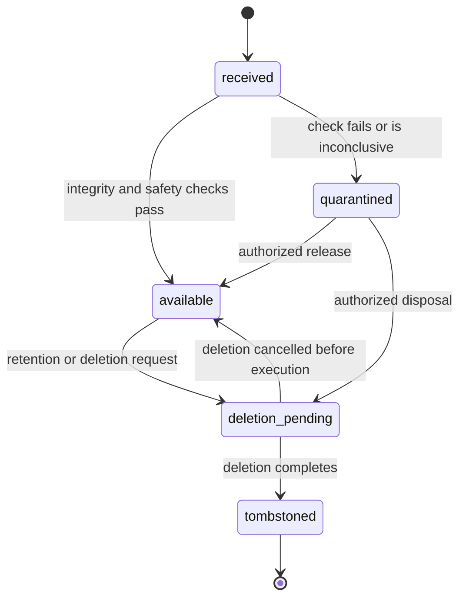
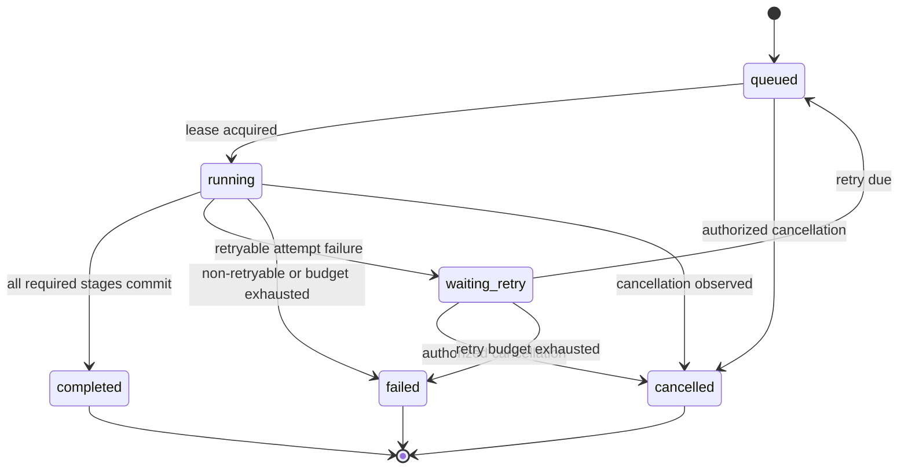
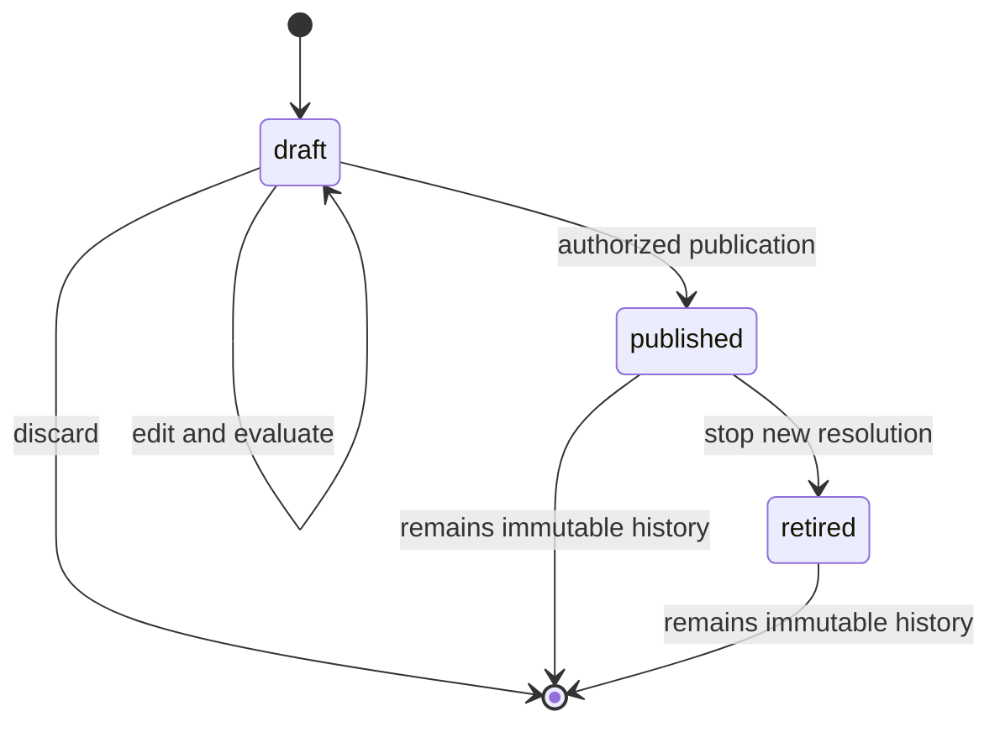
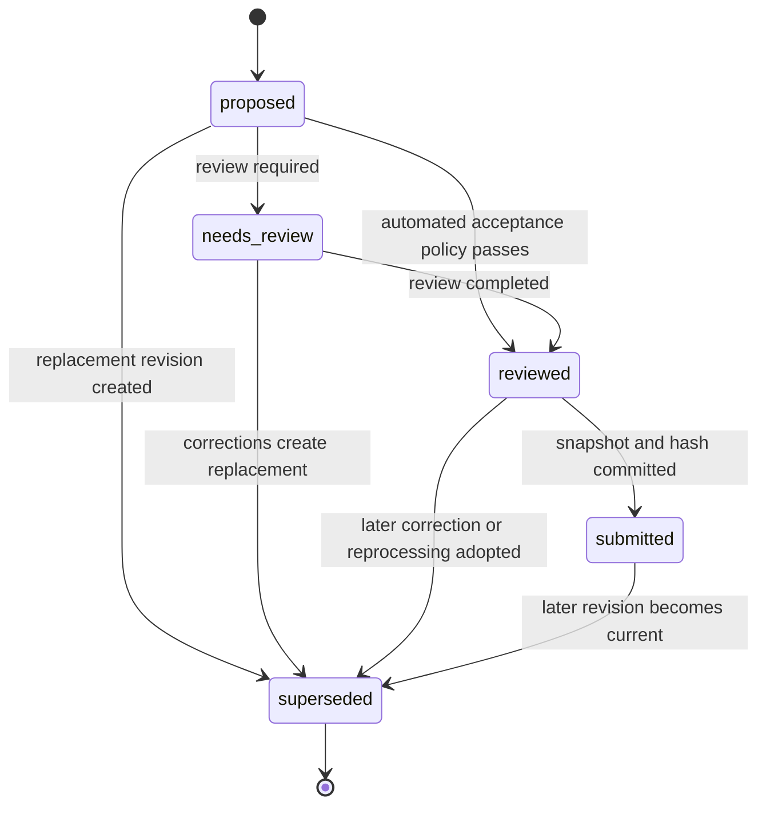
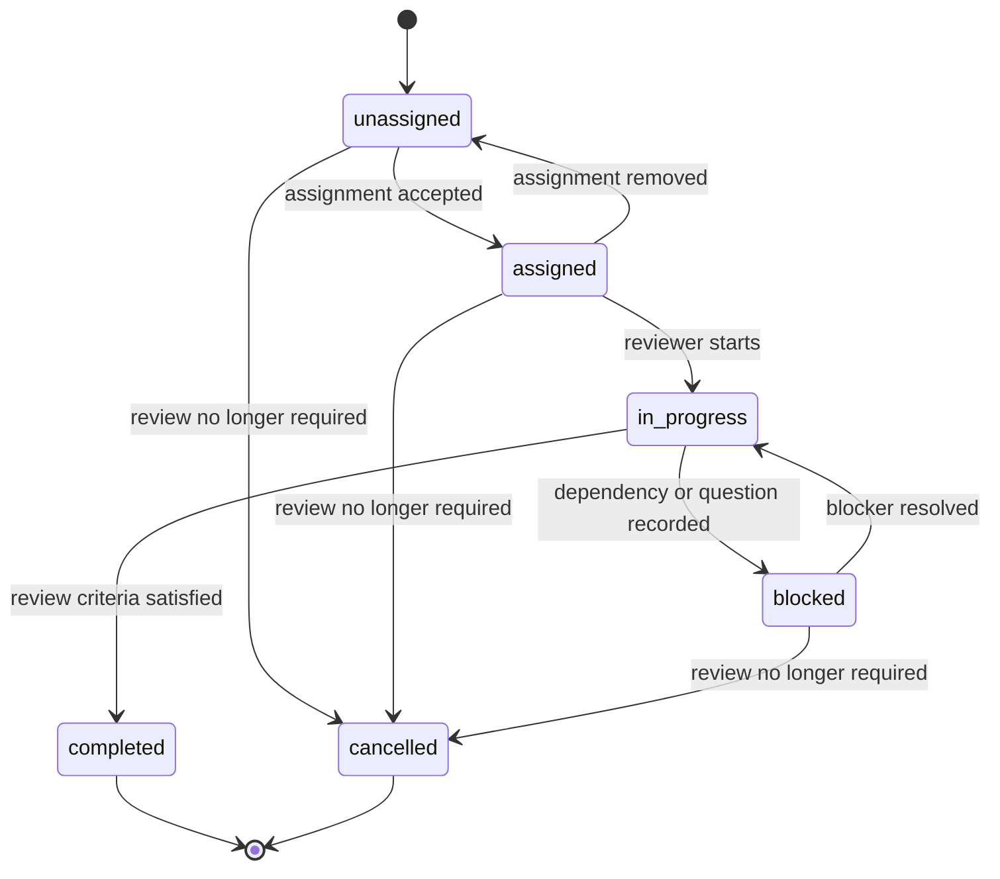
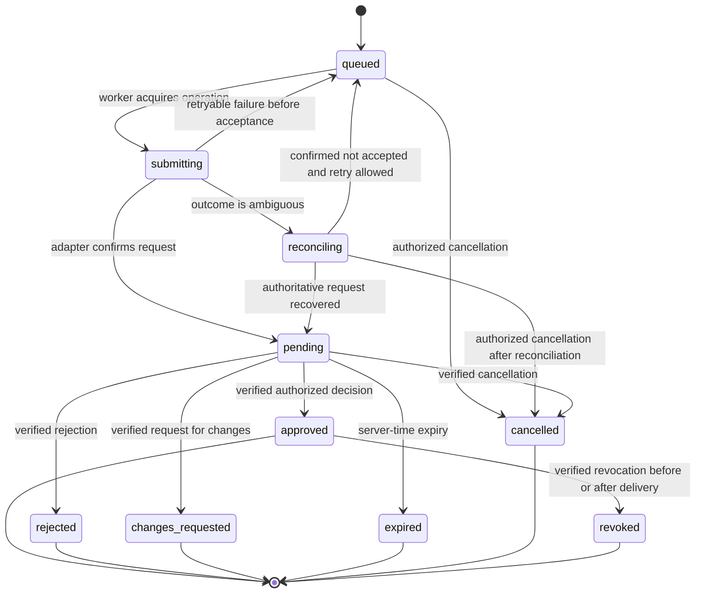
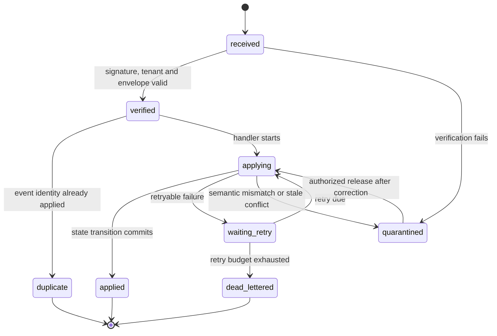
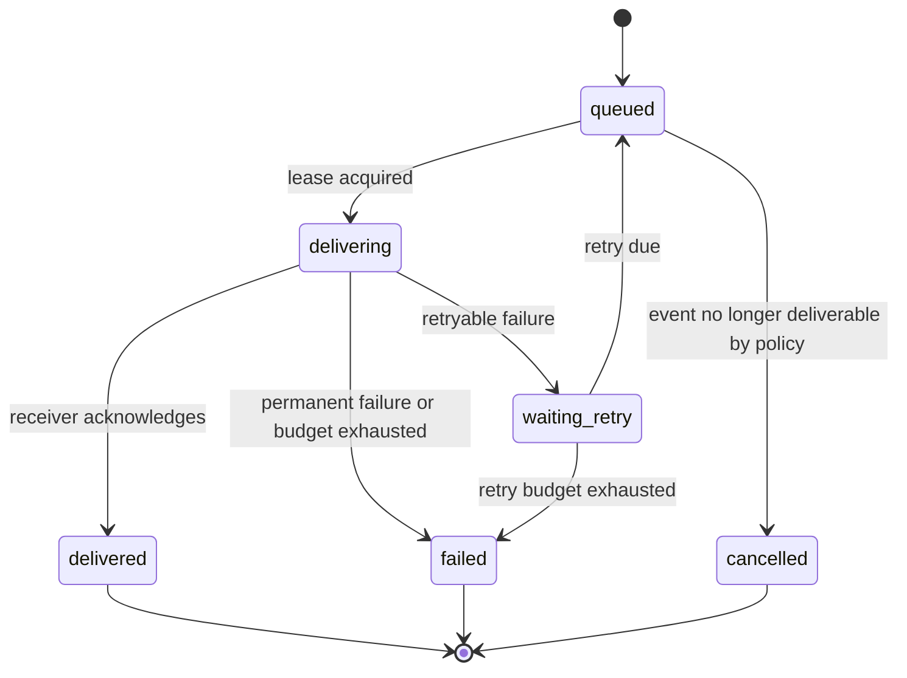
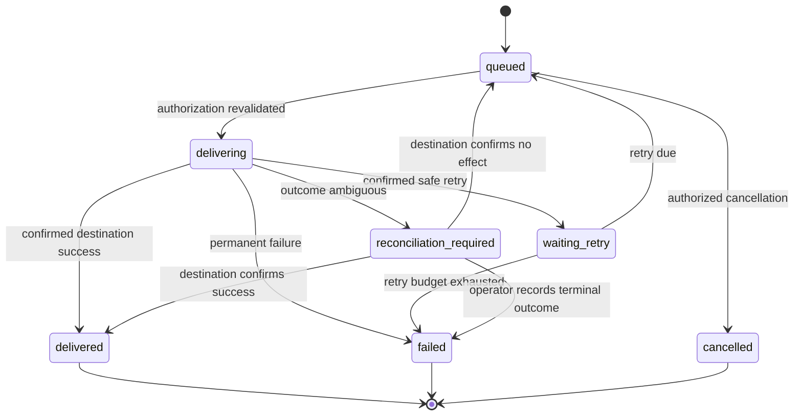

# Evidentia Lifecycle State Machines

Status: Draft for architecture review  
Skyhook story: `HYFDZB6CJS5YV2KZ216C77VD3H`

## Principle

Evidentia does not use one combined record status. Document custody, processing, record revision, review work, authorization, inbound events, outbound events, and destination delivery are independent state machines connected by guarded commands and versioned events. UI read models may present a combined summary, but they must retain the underlying dimensions and their histories.

Every transition records tenant, aggregate ID, prior state, next state, aggregate version, actor or system principal, reason, correlation ID, causation ID, and occurrence time. State transitions use server time and optimistic concurrency or row locking as appropriate.

## 1. Document custody

States:

- `received`: metadata and original bytes were durably accepted.
- `available`: safety checks passed and the original may be processed by authorized workflows.
- `quarantined`: safety, type, integrity, or policy checks require intervention.
- `deletion_pending`: deletion was authorized and downstream retention checks are running.
- `tombstoned`: removable artifacts were deleted and the intentional historical marker remains.

Guards and recovery:

- Quarantined artifacts cannot be parsed, previewed unsafely, or sent to providers.
- Tombstoning does not erase required audit, checksum, decision, or delivery history.
- A replacement upload creates a new `Document`; it never returns a tombstoned document to `available`.

## 2. Processing job and attempts

`ProcessingJob` states:

- `queued`
- `running`
- `waiting_retry`
- `completed`
- `failed`
- `cancelled`

The job carries a separate current stage: `parse`, `classify`, `resolve_schema`, `extract`, `normalize`, `validate`, or `finalize`. Each provider or worker invocation is a separate immutable attempt with `running`, `succeeded`, `failed`, `timed_out`, or `cancelled` outcome.

Guards and recovery:

- A lease timeout returns unfinished work through recovery logic; it does not imply success or start an unbounded duplicate attempt.
- Retrying creates a new attempt under the same operation identity.
- Reprocessing creates a new `ProcessingJob` and proposed result; it never reopens a completed job or overwrites a record revision.
- A failed or cancelled job remains terminal. Recovery is represented by a linked replacement job.

## 3. Schema lifecycle

States:

- `draft`
- `published`
- `retired`

Guards:

- A published schema or module is immutable.
- Changes create a new draft and version.
- Retired versions remain readable for historical runs and revisions but cannot be selected for new work unless an explicit recovery policy allows it.

## 4. Record revision lifecycle

States:

- `proposed`: immutable candidate revision awaiting review.
- `needs_review`: policy or findings require review attention.
- `reviewed`: review requirements for this revision are satisfied.
- `submitted`: an immutable authorization submission was created from this exact revision.
- `superseded`: another revision became the current working or submitted revision.

An editable `DraftWorkspace` belongs to Review and is not a `RecordRevision`.

Guards:

- Persisted revisions are immutable; corrections create a child revision.
- Submission stores the exact canonical snapshot and material hash.
- Approval status is not a record-revision state.
- A rejected, expired, cancelled, or changes-requested authorization does not mutate the submitted revision; a correction produces a new revision and submission.

## 5. Review work

States:

- `unassigned`
- `assigned`
- `in_progress`
- `blocked`
- `completed`
- `cancelled`

Guards and recovery:

- Completion references a specific record revision and validation context.
- A new material revision creates or reopens review work under policy; it never silently changes the revision attached to a completed assignment.
- Concurrent draft saves use revision checks. Conflicts remain visible rather than last-write-wins.
- Review completion cannot create an approval decision.

## 6. Approval submission

States:

- `queued`
- `submitting`
- `reconciling`
- `pending`
- `approved`
- `rejected`
- `changes_requested`
- `expired`
- `cancelled`
- `revoked`

Guards and recovery:

- The same tenant, request, revision, schema version, canonicalization version, material hash, action, policy, and destination scope must be verified before applying a decision.
- `approved`, `rejected`, `changes_requested`, `expired`, and `cancelled` are competing terminal outcomes for the pending request and resolve through a transactional compare-and-set or lock.
- `changes_requested` and `rejected` terminate the immutable request. A corrected record uses a new linked revision and approval submission.
- Revocation never erases the historical approval. Before delivery it blocks authorization; after completed delivery it is recorded for destination-specific follow-up.
- Delibera unavailability or an invalid callback cannot create local approval or silent fallback.

## 7. Inbound integration event

States:

- `received`
- `verified`
- `applying`
- `applied`
- `duplicate`
- `quarantined`
- `waiting_retry`
- `dead_lettered`

Guards:

- Durable receipt occurs before transport acknowledgement.
- Unique event identity prevents logical duplicate application.
- Stale or reordered events cannot regress aggregate versions.
- Quarantine and dead-letter release are permission-controlled and audited.

## 8. Outbound event delivery

States:

- `queued`
- `delivering`
- `waiting_retry`
- `delivered`
- `failed`
- `cancelled`

Every attempt is retained. Redelivery from `failed` creates a linked delivery operation or explicitly resets under an audited administrative command; it does not erase prior attempts.

## 9. Destination delivery

States:

- `queued`
- `delivering`
- `waiting_retry`
- `reconciliation_required`
- `delivered`
- `failed`
- `cancelled`

Guards and recovery:

- Delivery starts only for the exact authorized tenant, revision, hash, action, mapping version, and destination scope.
- Approval is revalidated immediately before execution.
- A revoked, expired, rejected, cancelled, mismatched, or unverifiable authorization cannot enter `delivering`.
- An ambiguous outcome cannot be retried until destination reconciliation or proven idempotency makes retry safe.
- Delivery failure does not remove approval.

## Cross-lifecycle invariants

1. Document custody and processing are separate: a document can remain available while one processing job fails.
2. Processing and records are separate: a completed extraction is a candidate, not an automatically accepted revision.
3. Record revision and review are separate: review work references one immutable revision and corrections create another.
4. Review and authorization are separate: correcting or reviewing a record does not grant approval.
5. Authorization and delivery are separate: approved content may have queued, failed, reconciled, or completed delivery.
6. Historical authorization and current authority are separate: an older revision may remain historically approved while the current revision is unauthorized.
7. Event delivery and business state are separate: duplicate, delayed, missing, or reordered events are reconciled against authoritative aggregate state.
8. Realtime notification and durable state are separate: a missed notification never loses the underlying state transition.
9. Terminal history is append-only: recovery creates a linked attempt, job, revision, request, or delivery operation rather than rewriting terminal outcomes.
10. No combined UI status may hide a dimension requiring operator attention.

## Operator attention model

The UI derives attention reasons instead of inventing another authoritative lifecycle. Examples include:

- document quarantined
- processing retry scheduled or failed
- schema confirmation required
- blocking validation findings
- review unassigned, blocked, or conflicted
- approval submission reconciling or decision pending
- invalid or quarantined inbound event
- delivery reconciliation required or failed

Each attention reason links to the owning aggregate, its transition history, and an authorized recovery command.
